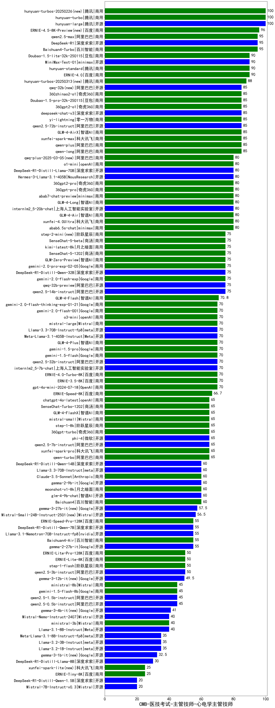

| 类别 | 大模型                         | CMB-医技考试-主管技师-心电学主管技师 | 排名 |
|-----|------------------------------|---------|----|
|商用|hunyuan-turbo|100.0|1|
|开源|hunyuan-large|100.0|2|
|商用|hunyuan-turbos-20250226(new)|100.0|3|
|商用|ERNIE-4.5-8K-Preview(new)|96.0|4|
|开源|DeepSeek-R1|95.0|5|
|商用|Baichuan4-Turbo|95.0|6|
|商用|qwen2.5-max|95.0|7|
|商用|ERNIE-4.0|90.0|8|
|开源|MiniMax-Text-01|90.0|9|
|商用|Doubao-1.5-lite-32k-250115|90.0|10|
|商用|hunyuan-standard|90.0|11|
|商用|hunyuan-turbos-20250313(new)|88.0|12|
|商用|qwen-plus|85.0|13|
|商用|qwen-long|85.0|14|
|开源|deepseek-chat-v3|85.0|15|
|开源|qwen2.5-72b-instruct|85.0|16|
|商用|GLM-4-AirX|85.0|17|
|商用|yi-lightning|85.0|18|
|商用|360zhinao2-o1|85.0|19|
|商用|360gpt2-o1|85.0|20|
|商用|Doubao-1.5-pro-32k-250115|85.0|21|
|开源|qwq-32b(new)|85.0|22|
|商用|xunfei-spark-max|85.0|23|
|商用|GLM-4-Long|80.0|24|
|商用|GLM-4-Air|80.0|25|
|开源|Hermes-3-Llama-3.1-405B|80.0|26|
|商用|abab7-chat-preview|80.0|27|
|商用|xunfei-4.0Ultra|80.0|28|
|商用|o1-mini|80.0|29|
|商用|qwq-plus-2025-03-05(new)|80.0|30|
|商用|360gpt-pro|80.0|31|
|商用|360gpt2-pro|80.0|32|
|开源|DeepSeek-R1-Distill-Llama-70B|80.0|33|
|开源|internlm2_5-20b-chat|80.0|34|
|商用|abab6.5s-chat|80.0|35|
|商用|step-2-mini(new)|75.0|36|
|开源|qwq-32b-preview|75.0|37|
|开源|qwen2.5-14b-instruct|75.0|38|
|商用|SenseChat-5-beta|75.0|39|
|商用|kimi-latest-8k|75.0|40|
|商用|GLM-Zero-Preview|75.0|41|
|商用|gemini-2.0-pro-exp-02-05|75.0|42|
|商用|SenseChat-5-1202|75.0|43|
|开源|DeepSeek-R1-Distill-Qwen-32B|75.0|44|
|商用|gemini-2.0-flash-exp|75.0|45|
|商用|GLM-4-Flash|70.8|46|
|商用|ERNIE-4.0-Turbo-8K|70.0|47|
|商用|ERNIE-3.5-8K|70.0|48|
|开源|internlm2_5-7b-chat|70.0|49|
|开源|Meta-Llama-3.1-405B-Instruct|70.0|50|
|商用|gemini-1.5-pro|70.0|51|
|商用|gemini-1.5-flash|70.0|52|
|商用|GLM-4-Plus|70.0|53|
|商用|gpt-4o-mini-2024-07-18|70.0|54|
|商用|gemini-2.0-flash-thinking-exp-01-21|70.0|55|
|开源|qwen2.5-32b-instruct|70.0|56|
|开源|Llama-3.3-70B-Instruct-fp8|70.0|57|
|商用|mistral-large|70.0|58|
|商用|o3-mini|70.0|59|
|商用|gemini-2.0-flash-001|70.0|60|
|商用|ERNIE-Speed-8K|66.7|61|
|商用|qwen-turbo|65.0|62|
|商用|360gpt-turbo|65.0|63|
|开源|phi-4|65.0|64|
|商用|step-1-8k|65.0|65|
|商用|chatgpt-4o-latest|65.0|66|
|商用|SenseChat-Turbo-1202|65.0|67|
|商用|GLM-4-FlashX|65.0|68|
|商用|xunfei-spark-pro|65.0|69|
|商用|mistral-small|65.0|70|
|开源|qwen2.5-7b-instruct|65.0|71|
|开源|gemma-2-9b-it|60.0|72|
|商用|Claude-3.5-Sonnet|60.0|73|
|商用|moonshot-v1-8k|60.0|74|
|商用|Baichuan4|60.0|75|
|开源|glm-4-9b-chat|60.0|76|
|开源|Llama-3.3-70B-Instruct|60.0|77|
|开源|DeepSeek-R1-Distill-Qwen-14B|60.0|78|
|开源|gemma-3-27b-it(new)|57.5|79|
|开源|Mistral-Small-24B-Instruct-2501(new)|56.5|80|
|商用|ERNIE-Speed-Pro-128K|55.0|81|
|开源|Llama-3.1-Nemotron-70B-Instruct-fp8|55.0|82|
|开源|DeepSeek-R1-Distill-Qwen-7B|55.0|83|
|商用|Baichuan4-Air|55.0|84|
|开源|gemma-2-27b-it|55.0|85|
|开源|qwen2.5-3b-instruct|50.0|86|
|商用|ERNIE-Lite-Pro-128K|50.0|87|
|商用|ERNIE-Lite-8K|50.0|88|
|商用|step-1-flash|50.0|89|
|开源|gemma-3-12b-it(new)|49.5|90|
|开源|qwen2.5-1.5b-instruct|45.0|91|
|开源|qwen2.5-0.5b-instruct|45.0|92|
|商用|ministral-8b|45.0|93|
|商用|gemini-1.5-flash-8b|45.0|94|
|开源|gemma-3-4b-it(new)|41.0|95|
|开源|Mistral-Nemo-Instruct-2407|40.0|96|
|商用|ministral-3b|40.0|97|
|开源|Llama-3.1-8B-Instruct|40.0|98|
|开源|Meta-Llama-3.1-8B-Instruct-fp8|35.0|99|
|开源|Llama-3.2-3B-Instruct|35.0|100|
|开源|Llama-3.2-1B-Instruct|35.0|101|
|开源|gemma-3-1b-it(new)|32.5|102|
|开源|DeepSeek-R1-Distill-Llama-8B|30.0|103|
|商用|ERNIE-Tiny-8K|25.0|104|
|商用|xunfei-spark-lite(new)|25.0|105|
|开源|DeepSeek-R1-Distill-Qwen-1.5B|20.0|106|
|开源|Mistral-7B-Instruct-v0.3|20.0|107|
|开源|qwen2.5-math-72b-instruct|/|108|
|开源|Yi-1.5-34B-Chat|/|109|
|开源|Yi-1.5-9B-Chat|/|110|

