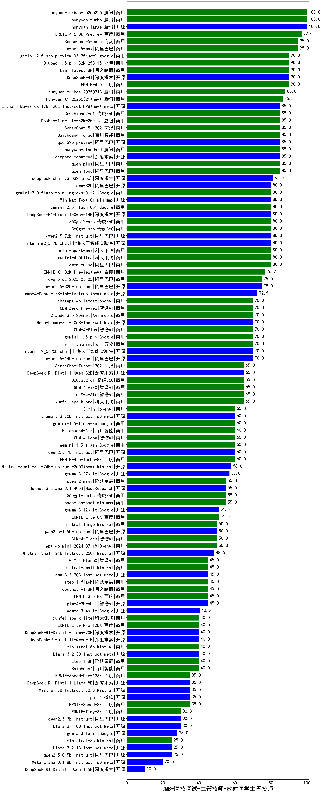

| 类别 | 大模型                         | CMB-医技考试-主管技师-放射医学主管技师 | 排名 |
|-----|------------------------------|---------|----|
|开源|hunyuan-large|100.0|1|
|商用|hunyuan-turbo|100.0|2|
|商用|hunyuan-turbos-20250226(new)|100.0|3|
|商用|SenseChat-5-beta|95.0|4|
|商用|gemini-2.0-pro-exp-02-05|95.0|5|
|商用|qwen2.5-max|95.0|6|
|商用|ERNIE-4.0|90.0|7|
|商用|kimi-latest-8k|90.0|8|
|开源|DeepSeek-R1|90.0|9|
|商用|Doubao-1.5-pro-32k-250115|90.0|10|
|开源|qwq-32b-preview|85.0|11|
|商用|qwen-plus|85.0|12|
|商用|360zhinao2-o1|85.0|13|
|商用|Doubao-1.5-lite-32k-250115|85.0|14|
|商用|Baichuan4-Turbo|85.0|15|
|商用|gemini-2.0-flash-exp|85.0|16|
|商用|SenseChat-5-1202|85.0|17|
|商用|hunyuan-standard|85.0|18|
|商用|qwen-long|85.0|19|
|开源|deepseek-chat-v3|85.0|20|
|商用|xunfei-spark-max|80.0|21|
|开源|qwen2.5-72b-instruct|80.0|22|
|开源|internlm2_5-7b-chat|80.0|23|
|开源|qwq-32b(new)|80.0|24|
|商用|gemini-2.0-flash-001|80.0|25|
|商用|360gpt2-pro|80.0|26|
|商用|360gpt-pro|80.0|27|
|商用|gemini-2.0-flash-thinking-exp-01-21|80.0|28|
|商用|qwen-turbo|80.0|29|
|开源|MiniMax-Text-01|80.0|30|
|开源|DeepSeek-R1-Distill-Qwen-14B|80.0|31|
|商用|xunfei-4.0Ultra|80.0|32|
|开源|qwen2.5-32b-instruct|75.0|33|
|商用|qwq-plus-2025-03-05(new)|75.0|34|
|商用|GLM-4-Plus|70.0|35|
|开源|Meta-Llama-3.1-405B-Instruct|70.0|36|
|商用|gemini-1.5-pro|70.0|37|
|商用|yi-lightning|70.0|38|
|商用|abab7-chat-preview|70.0|39|
|开源|qwen2.5-14b-instruct|70.0|40|
|开源|internlm2_5-20b-chat|70.0|41|
|商用|GLM-Zero-Preview|70.0|42|
|商用|chatgpt-4o-latest|70.0|43|
|商用|Claude-3.5-Sonnet|70.0|44|
|商用|GLM-4-Flash|65.5|45|
|商用|xunfei-spark-pro|65.0|46|
|开源|DeepSeek-R1-Distill-Qwen-32B|65.0|47|
|商用|GLM-4-Air|65.0|48|
|商用|GLM-4-AirX|65.0|49|
|商用|SenseChat-Turbo-1202|65.0|50|
|商用|360gpt2-o1|65.0|51|
|开源|Llama-3.1-Nemotron-70B-Instruct-fp8|65.0|52|
|商用|o3-mini|60.0|53|
|商用|o1-mini|60.0|54|
|开源|Llama-3.3-70B-Instruct-fp8|60.0|55|
|商用|ERNIE-4.0-Turbo-8K|60.0|56|
|商用|GLM-4-Long|60.0|57|
|商用|gemini-1.5-flash|60.0|58|
|开源|qwen2.5-7b-instruct|60.0|59|
|商用|gemini-1.5-flash-8b|60.0|60|
|商用|Baichuan4-Air|60.0|61|
|商用|xunfei-spark-lite(new)|58.6|62|
|开源|gemma-3-27b-it(new)|57.0|63|
|商用|ERNIE-Speed-8K|55.2|64|
|商用|step-2-mini(new)|55.0|65|
|商用|abab6.5s-chat|55.0|66|
|开源|Hermes-3-Llama-3.1-405B|55.0|67|
|商用|360gpt-turbo|55.0|68|
|商用|gpt-4o-mini-2024-07-18|50.0|69|
|开源|qwen2.5-1.5b-instruct|50.0|70|
|商用|mistral-large|50.0|71|
|开源|Mistral-Small-24B-Instruct-2501(new)|48.5|72|
|商用|ERNIE-3.5-8K|45.0|73|
|开源|glm-4-9b-chat|45.0|74|
|开源|Llama-3.3-70B-Instruct|45.0|75|
|商用|GLM-4-FlashX|45.0|76|
|开源|gemma-2-27b-it|45.0|77|
|商用|mistral-small|45.0|78|
|商用|step-1-flash|45.0|79|
|商用|moonshot-v1-8k|45.0|80|
|开源|gemma-2-9b-it|40.0|81|
|商用|ERNIE-Lite-Pro-128K|40.0|82|
|商用|ministral-8b|40.0|83|
|开源|Llama-3.2-3B-Instruct|40.0|84|
|开源|DeepSeek-R1-Distill-Llama-70B|40.0|85|
|商用|ERNIE-Lite-8K|40.0|86|
|商用|Baichuan4|40.0|87|
|商用|step-1-8k|40.0|88|
|开源|DeepSeek-R1-Distill-Qwen-7B|40.0|89|
|商用|ERNIE-Speed-Pro-128K|35.0|90|
|开源|phi-4|35.0|91|
|开源|Mistral-7B-Instruct-v0.3|35.0|92|
|开源|DeepSeek-R1-Distill-Llama-8B|35.0|93|
|开源|Llama-3.1-8B-Instruct|30.0|94|
|开源|Mistral-Nemo-Instruct-2407|30.0|95|
|商用|ERNIE-Tiny-8K|30.0|96|
|开源|qwen2.5-3b-instruct|30.0|97|
|商用|ministral-3b|25.0|98|
|开源|Llama-3.2-1B-Instruct|25.0|99|
|开源|qwen2.5-0.5b-instruct|25.0|100|
|开源|Meta-Llama-3.1-8B-Instruct-fp8|20.0|101|
|开源|DeepSeek-R1-Distill-Qwen-1.5B|10.0|102|
|开源|Yi-1.5-34B-Chat|/|103|
|开源|Yi-1.5-9B-Chat|/|104|
|开源|qwen2.5-math-72b-instruct|/|105|

