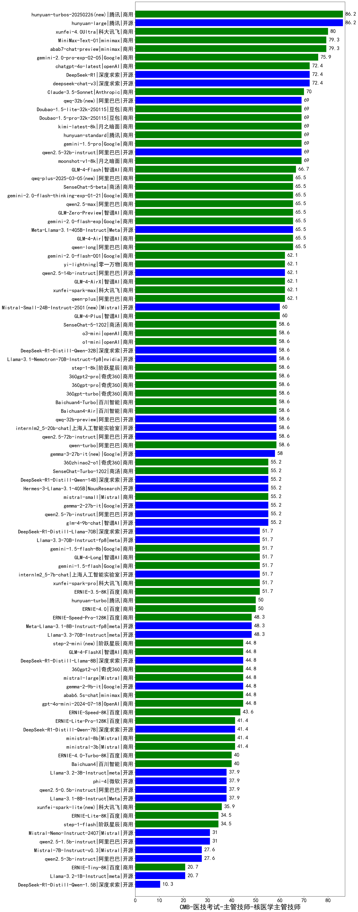

| 类别 | 大模型                         | CMB-医技考试-主管技师-核医学主管技师 | 排名 |
|-----|------------------------------|---------|----|
|开源|hunyuan-large|86.2|1|
|商用|hunyuan-turbos-20250226(new)|86.2|2|
|商用|xunfei-4.0Ultra|80.0|3|
|商用|MiniMax-Text-01|79.3|4|
|商用|abab7-chat-preview|79.3|5|
|商用|gemini-2.0-pro-exp-02-05|75.9|6|
|开源|DeepSeek-R1|72.4|7|
|开源|deepseek-chat-v3|72.4|8|
|商用|chatgpt-4o-latest|72.4|9|
|商用|Claude-3.5-Sonnet|70.0|10|
|商用|Doubao-1.5-pro-32k-250115|69.0|11|
|商用|kimi-latest-8k|69.0|12|
|开源|qwen2.5-32b-instruct|69.0|13|
|商用|gemini-1.5-pro|69.0|14|
|商用|hunyuan-standard|69.0|15|
|商用|Doubao-1.5-lite-32k-250115|69.0|16|
|开源|qwq-32b(new)|69.0|17|
|商用|moonshot-v1-8k|69.0|18|
|商用|GLM-4-Flash|66.7|19|
|商用|qwen-long|65.5|20|
|商用|GLM-4-Air|65.5|21|
|开源|Meta-Llama-3.1-405B-Instruct|65.5|22|
|商用|gemini-2.0-flash-exp|65.5|23|
|商用|gemini-2.0-flash-thinking-exp-01-21|65.5|24|
|商用|GLM-Zero-Preview|65.5|25|
|商用|SenseChat-5-beta|65.5|26|
|商用|qwen2.5-max|65.5|27|
|商用|qwq-plus-2025-03-05(new)|65.5|28|
|开源|qwen2.5-14b-instruct|62.1|29|
|商用|xunfei-spark-max|62.1|30|
|商用|GLM-4-AirX|62.1|31|
|商用|qwen-plus|62.1|32|
|商用|yi-lightning|62.1|33|
|商用|gemini-2.0-flash-001|62.1|34|
|开源|Mistral-Small-24B-Instruct-2501(new)|60.0|35|
|商用|GLM-4-Plus|60.0|36|
|开源|internlm2_5-20b-chat|58.6|37|
|开源|qwq-32b-preview|58.6|38|
|开源|qwen2.5-72b-instruct|58.6|39|
|商用|qwen-turbo|58.6|40|
|商用|Baichuan4-Air|58.6|41|
|商用|360gpt2-pro|58.6|42|
|商用|360gpt-pro|58.6|43|
|开源|Llama-3.1-Nemotron-70B-Instruct-fp8|58.6|44|
|开源|DeepSeek-R1-Distill-Qwen-32B|58.6|45|
|商用|SenseChat-5-1202|58.6|46|
|商用|Baichuan4-Turbo|58.6|47|
|商用|step-1-8k|58.6|48|
|商用|360gpt-turbo|58.6|49|
|商用|o3-mini|58.6|50|
|商用|o1-mini|58.6|51|
|开源|gemma-3-27b-it(new)|58.0|52|
|开源|gemma-2-27b-it|55.2|53|
|开源|DeepSeek-R1-Distill-Qwen-14B|55.2|54|
|商用|SenseChat-Turbo-1202|55.2|55|
|开源|Hermes-3-Llama-3.1-405B|55.2|56|
|商用|mistral-small|55.2|57|
|开源|qwen2.5-7b-instruct|55.2|58|
|商用|360zhinao2-o1|55.2|59|
|开源|glm-4-9b-chat|55.2|60|
|商用|GLM-4-Long|51.7|61|
|商用|xunfei-spark-pro|51.7|62|
|商用|ERNIE-3.5-8K|51.7|63|
|商用|gemini-1.5-flash-8b|51.7|64|
|开源|Llama-3.3-70B-Instruct-fp8|51.7|65|
|开源|DeepSeek-R1-Distill-Llama-70B|51.7|66|
|开源|internlm2_5-7b-chat|51.7|67|
|商用|gemini-1.5-flash|51.7|68|
|商用|hunyuan-turbo|50.0|69|
|商用|ERNIE-4.0|50.0|70|
|商用|ERNIE-Speed-Pro-128K|48.3|71|
|开源|Llama-3.3-70B-Instruct|48.3|72|
|开源|Meta-Llama-3.1-8B-Instruct-fp8|48.3|73|
|商用|GLM-4-FlashX|44.8|74|
|商用|gpt-4o-mini-2024-07-18|44.8|75|
|开源|gemma-2-9b-it|44.8|76|
|商用|abab6.5s-chat|44.8|77|
|商用|mistral-large|44.8|78|
|开源|DeepSeek-R1-Distill-Llama-8B|44.8|79|
|商用|step-2-mini(new)|44.8|80|
|商用|360gpt2-o1|44.8|81|
|商用|ERNIE-Speed-8K|43.6|82|
|商用|ministral-8b|41.4|83|
|商用|ministral-3b|41.4|84|
|开源|DeepSeek-R1-Distill-Qwen-7B|41.4|85|
|商用|ERNIE-Lite-Pro-128K|41.4|86|
|商用|Baichuan4|40.0|87|
|商用|ERNIE-4.0-Turbo-8K|40.0|88|
|开源|Llama-3.1-8B-Instruct|37.9|89|
|开源|qwen2.5-0.5b-instruct|37.9|90|
|开源|phi-4|37.9|91|
|开源|Llama-3.2-3B-Instruct|37.9|92|
|商用|xunfei-spark-lite(new)|35.9|93|
|商用|ERNIE-Lite-8K|34.5|94|
|商用|step-1-flash|34.5|95|
|开源|Mistral-Nemo-Instruct-2407|31.0|96|
|开源|qwen2.5-1.5b-instruct|31.0|97|
|开源|qwen2.5-3b-instruct|27.6|98|
|开源|Mistral-7B-Instruct-v0.3|27.6|99|
|开源|Llama-3.2-1B-Instruct|20.7|100|
|商用|ERNIE-Tiny-8K|20.7|101|
|开源|DeepSeek-R1-Distill-Qwen-1.5B|10.3|102|
|开源|Yi-1.5-34B-Chat|/|103|
|开源|Yi-1.5-9B-Chat|/|104|
|开源|qwen2.5-math-72b-instruct|/|105|

