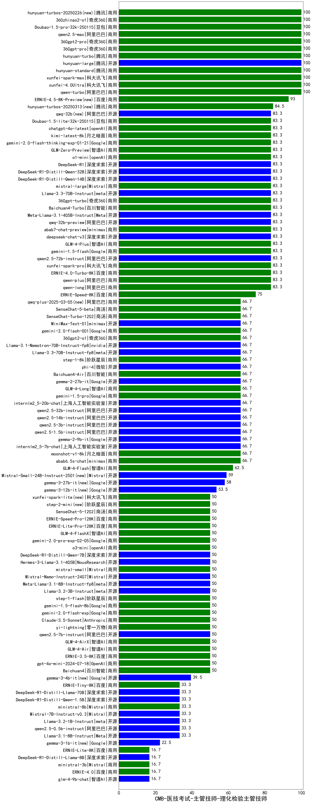

| 类别 | 大模型                         | CMB-医技考试-主管技师-理化检验主管技师 | 排名 |
|-----|------------------------------|---------|----|
|商用|qwen-turbo|100.0|1|
|商用|hunyuan-turbo|100.0|2|
|商用|hunyuan-standard|100.0|3|
|商用|xunfei-4.0Ultra|100.0|4|
|商用|hunyuan-large|100.0|5|
|商用|xunfei-spark-max|100.0|6|
|商用|hunyuan-turbos-20250226(new)|100.0|7|
|商用|360gpt2-pro|100.0|8|
|商用|360gpt-pro|100.0|9|
|商用|360zhinao2-o1|100.0|10|
|商用|qwen2.5-max|100.0|11|
|商用|Doubao-1.5-pro-32k-250115|100.0|12|
|商用|abab7-chat-preview|83.3|13|
|商用|GLM-4-Plus|83.3|14|
|商用|xunfei-spark-pro|83.3|15|
|开源|DeepSeek-R1|83.3|16|
|商用|o1-mini|83.3|17|
|开源|Meta-Llama-3.1-405B-Instruct|83.3|18|
|开源|qwq-32b-preview|83.3|19|
|开源|qwen2.5-72b-instruct|83.3|20|
|开源|deepseek-chat-v3|83.3|21|
|商用|ERNIE-4.0-Turbo-8K|83.3|22|
|开源|qwq-32b(new)|83.3|23|
|商用|chatgpt-4o-latest|83.3|24|
|商用|Doubao-1.5-lite-32k-250115|83.3|25|
|商用|mistral-large|83.3|26|
|商用|Baichuan4-Turbo|83.3|27|
|商用|360gpt-turbo|83.3|28|
|开源|Llama-3.3-70B-Instruct|83.3|29|
|开源|DeepSeek-R1-Distill-Qwen-14B|83.3|30|
|开源|DeepSeek-R1-Distill-Qwen-32B|83.3|31|
|商用|gemini-1.5-flash|83.3|32|
|商用|qwen-plus|83.3|33|
|商用|GLM-Zero-Preview|83.3|34|
|商用|qwen-long|83.3|35|
|商用|gemini-2.0-flash-thinking-exp-01-21|83.3|36|
|商用|kimi-latest-8k|83.3|37|
|商用|ERNIE-Speed-8K|75.0|38|
|开源|qwen2.5-3b-instruct|66.7|39|
|开源|qwen2.5-14b-instruct|66.7|40|
|商用|abab6.5s-chat|66.7|41|
|商用|qwq-plus-2025-03-05(new)|66.7|42|
|商用|SenseChat-Turbo-1202|66.7|43|
|商用|moonshot-v1-8k|66.7|44|
|商用|gemini-1.5-pro|66.7|45|
|开源|internlm2_5-20b-chat|66.7|46|
|开源|qwen2.5-32b-instruct|66.7|47|
|商用|gemini-2.0-flash-001|66.7|48|
|商用|MiniMax-Text-01|66.7|49|
|开源|phi-4|66.7|50|
|商用|step-1-8k|66.7|51|
|商用|Baichuan4-Air|66.7|52|
|开源|gemma-2-27b-it|66.7|53|
|商用|360gpt2-o1|66.7|54|
|开源|Llama-3.1-Nemotron-70B-Instruct-fp8|66.7|55|
|商用|GLM-4-Long|66.7|56|
|开源|qwen2.5-1.5b-instruct|66.7|57|
|开源|internlm2_5-7b-chat|66.7|58|
|开源|gemma-2-9b-it|66.7|59|
|开源|Llama-3.3-70B-Instruct-fp8|66.7|60|
|商用|SenseChat-5-beta|66.7|61|
|商用|GLM-4-Flash|62.5|62|
|开源|Mistral-Small-24B-Instruct-2501(new)|59.0|63|
|开源|gemma-3-27b-it(new)|58.0|64|
|商用|Claude-3.5-Sonnet|50.0|65|
|商用|gpt-4o-mini-2024-07-18|50.0|66|
|商用|yi-lightning|50.0|67|
|商用|GLM-4-Air|50.0|68|
|商用|Baichuan4|50.0|69|
|商用|ERNIE-3.5-8K|50.0|70|
|商用|o3-mini|50.0|71|
|商用|GLM-4-AirX|50.0|72|
|开源|qwen2.5-7b-instruct|50.0|73|
|商用|ERNIE-Lite-Pro-128K|50.0|74|
|商用|GLM-4-FlashX|50.0|75|
|商用|step-2-mini(new)|50.0|76|
|商用|ERNIE-Speed-Pro-128K|50.0|77|
|商用|xunfei-spark-lite(new)|50.0|78|
|商用|SenseChat-5-1202|50.0|79|
|商用|gemini-2.0-pro-exp-02-05|50.0|80|
|开源|DeepSeek-R1-Distill-Qwen-7B|50.0|81|
|开源|Mistral-Nemo-Instruct-2407|50.0|82|
|开源|Meta-Llama-3.1-8B-Instruct-fp8|50.0|83|
|开源|Llama-3.2-3B-Instruct|50.0|84|
|商用|mistral-small|50.0|85|
|商用|step-1-flash|50.0|86|
|商用|gemini-2.0-flash-exp|50.0|87|
|商用|gemini-1.5-flash-8b|50.0|88|
|开源|Hermes-3-Llama-3.1-405B|50.0|89|
|开源|Llama-3.2-1B-Instruct|33.3|90|
|开源|DeepSeek-R1-Distill-Llama-70B|33.3|91|
|商用|ERNIE-Tiny-8K|33.3|92|
|商用|ministral-8b|33.3|93|
|开源|Llama-3.1-8B-Instruct|33.3|94|
|开源|qwen2.5-0.5b-instruct|33.3|95|
|开源|DeepSeek-R1-Distill-Qwen-1.5B|33.3|96|
|开源|Mistral-7B-Instruct-v0.3|33.3|97|
|商用|ministral-3b|16.7|98|
|开源|DeepSeek-R1-Distill-Llama-8B|16.7|99|
|商用|ERNIE-4.0|16.7|100|
|开源|glm-4-9b-chat|16.7|101|
|商用|ERNIE-Lite-8K|16.7|102|
|开源|Yi-1.5-34B-Chat|/|103|
|开源|Yi-1.5-9B-Chat|/|104|
|开源|qwen2.5-math-72b-instruct|/|105|

