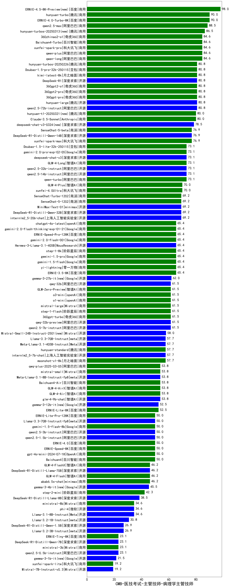

| 类别 | 大模型                         | CMB-医技考试-主管技师-病理学主管技师 | 排名 |
|-----|------------------------------|---------|----|
|商用|ERNIE-4.5-8K-Preview(new)|98.0|1|
|商用|ERNIE-4.0-Turbo-8K|90.0|2|
|商用|hunyuan-turbo|90.0|3|
|商用|qwen2.5-max|88.5|4|
|商用|hunyuan-turbos-20250313(new)|86.5|5|
|商用|qwen-plus|84.6|6|
|商用|360zhinao2-o1|84.6|7|
|商用|xunfei-spark-pro|84.6|8|
|商用|Baichuan4-Turbo|84.6|9|
|商用|qwen-long|84.6|10|
|开源|hunyuan-large|80.8|11|
|开源|qwen2.5-72b-instruct|80.8|12|
|商用|360gpt2-pro|80.8|13|
|商用|360gpt-pro|80.8|14|
|商用|360gpt2-o1|80.8|15|
|开源|DeepSeek-R1|80.8|16|
|商用|Doubao-1.5-pro-32k-250115|80.8|17|
|商用|kimi-latest-8k|80.8|18|
|商用|hunyuan-turbos-20250226|80.8|19|
|商用|hunyuan-t1-20250321(new)|80.0|20|
|商用|Claude-3.5-Sonnet|80.0|21|
|开源|deepseek-chat-v3-0324(new)|78.5|22|
|开源|DeepSeek-R1-Distill-Qwen-14B|76.9|23|
|商用|SenseChat-5-beta|76.9|24|
|商用|xunfei-spark-max|76.9|25|
|商用|GLM-4-Long|73.1|26|
|开源|deepseek-chat-v3|73.1|27|
|开源|qwen2.5-32b-instruct|73.1|28|
|开源|qwen2.5-14b-instruct|73.1|29|
|商用|Doubao-1.5-lite-32k-250115|73.1|30|
|商用|gemini-2.0-pro-exp-02-05|73.1|31|
|商用|qwen-turbo|73.1|32|
|商用|xunfei-4.0Ultra|70.0|33|
|商用|GLM-4-Plus|70.0|34|
|商用|SenseChat-Turbo-1202|69.2|35|
|商用|SenseChat-5-1202|69.2|36|
|开源|MiniMax-Text-01|69.2|37|
|开源|internlm2_5-20b-chat|69.2|38|
|开源|DeepSeek-R1-Distill-Qwen-32B|69.2|39|
|商用|abab7-chat-preview|65.4|40|
|商用|gemini-2.0-flash-thinking-exp-01-21|65.4|41|
|商用|gemini-2.0-flash-001|65.4|42|
|商用|yi-lightning|65.4|43|
|商用|gemini-1.5-pro|65.4|44|
|商用|ERNIE-3.5-8K|65.4|45|
|商用|gemini-1.5-flash|65.4|46|
|开源|Hermes-3-Llama-3.1-405B|65.4|47|
|商用|step-1-8k|65.4|48|
|商用|chatgpt-4o-latest|65.4|49|
|商用|ERNIE-Speed-Pro-128K|65.4|50|
|商用|gemini-2.0-flash-exp|65.4|51|
|开源|gemma-3-27b-it(new)|62.0|52|
|开源|qwq-32b-preview|61.5|53|
|开源|gemma-2-27b-it|61.5|54|
|商用|o1-mini|61.5|55|
|商用|o3-mini|61.5|56|
|商用|360gpt-turbo|61.5|57|
|开源|qwq-32b|61.5|58|
|商用|GLM-Zero-Preview|61.5|59|
|商用|step-1-flash|61.5|60|
|开源|Llama-3.1-Nemotron-70B-Instruct-fp8|61.5|61|
|商用|mistral-large|61.5|62|
|开源|qwen2.5-7b-instruct|61.5|63|
|开源|Mistral-Small-24B-Instruct-2501(new)|58.0|64|
|开源|Meta-Llama-3.1-405B-Instruct|57.7|65|
|商用|hunyuan-standard|57.7|66|
|商用|moonshot-v1-8k|57.7|67|
|开源|internlm2_5-7b-chat|57.7|68|
|开源|Llama-3.3-70B-Instruct|57.7|69|
|商用|qwq-plus-2025-03-05|53.8|70|
|开源|Meta-Llama-3.1-8B-Instruct-fp8|53.8|71|
|商用|mistral-small|53.8|72|
|开源|glm-4-9b-chat|53.8|73|
|商用|Baichuan4-Air|53.8|74|
|商用|GLM-4-Air|53.8|75|
|商用|GLM-4-AirX|53.8|76|
|开源|gemma-3-12b-it(new)|52.5|77|
|商用|ERNIE-Lite-8K|52.5|78|
|商用|ERNIE-Speed-8K|50.0|79|
|商用|gpt-4o-mini-2024-07-18|50.0|80|
|商用|ERNIE-4.0|50.0|81|
|商用|Baichuan4|50.0|82|
|开源|Llama-3.3-70B-Instruct-fp8|50.0|83|
|商用|ERNIE-Lite-Pro-128K|50.0|84|
|开源|qwen2.5-1.5b-instruct|50.0|85|
|开源|qwen2.5-3b-instruct|50.0|86|
|商用|gemini-1.5-flash-8b|50.0|87|
|商用|abab6.5s-chat|46.2|88|
|商用|GLM-4-FlashX|46.2|89|
|商用|GLM-4-Flash|46.2|90|
|开源|gemma-2-9b-it|46.2|91|
|开源|DeepSeek-R1-Distill-Llama-70B|46.2|92|
|开源|gemma-3-4b-it(new)|45.5|93|
|商用|step-2-mini|42.3|94|
|开源|Mistral-Nemo-Instruct-2407|38.5|95|
|开源|DeepSeek-R1-Distill-Llama-8B|38.5|96|
|开源|Llama-3.1-8B-Instruct|34.6|97|
|开源|phi-4|34.6|98|
|商用|ministral-8b|34.6|99|
|开源|Llama-3.2-1B-Instruct|30.8|100|
|开源|Llama-3.2-3B-Instruct|26.9|101|
|开源|DeepSeek-R1-Distill-Qwen-1.5B|26.9|102|
|商用|ERNIE-Tiny-8K|23.1|103|
|开源|qwen2.5-0.5b-instruct|23.1|104|
|商用|ministral-3b|23.1|105|
|开源|DeepSeek-R1-Distill-Qwen-7B|23.1|106|
|开源|gemma-3-1b-it(new)|21.5|107|
|开源|Mistral-7B-Instruct-v0.3|19.2|108|
|商用|xunfei-spark-lite|19.2|109|
|开源|qwen2.5-math-72b-instruct|/|110|

