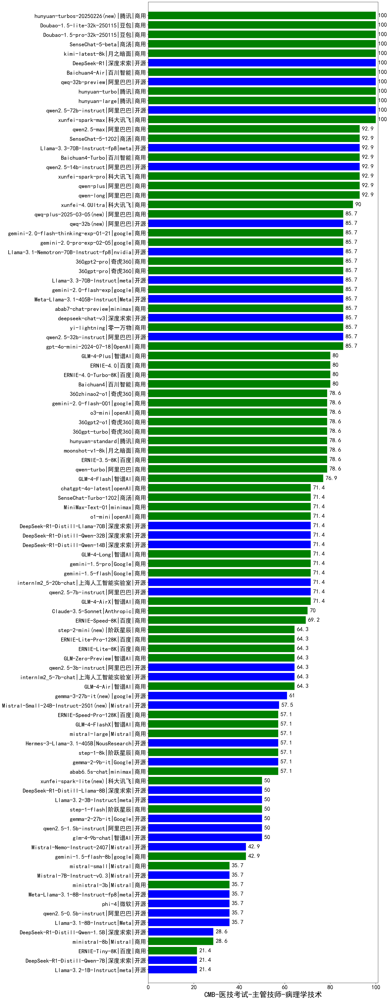

| 类别 | 大模型                         | CMB-医技考试-主管技师-病理学技术 | 排名 |
|-----|------------------------------|---------|----|
|商用|hunyuan-turbo|100.0|1|
|开源|qwq-32b-preview|100.0|2|
|开源|qwen2.5-72b-instruct|100.0|3|
|商用|xunfei-spark-max|100.0|4|
|开源|hunyuan-large|100.0|5|
|商用|SenseChat-5-beta|100.0|6|
|商用|Doubao-1.5-lite-32k-250115|100.0|7|
|商用|Doubao-1.5-pro-32k-250115|100.0|8|
|商用|hunyuan-turbos-20250226(new)|100.0|9|
|商用|kimi-latest-8k|100.0|10|
|开源|DeepSeek-R1|100.0|11|
|商用|Baichuan4-Air|100.0|12|
|商用|ERNIE-4.5-8K-Preview(new)|98.0|13|
|商用|qwen-plus|92.9|14|
|开源|qwen2.5-14b-instruct|92.9|15|
|商用|xunfei-spark-pro|92.9|16|
|商用|Baichuan4-Turbo|92.9|17|
|开源|Llama-3.3-70B-Instruct-fp8|92.9|18|
|商用|qwen2.5-max|92.9|19|
|商用|SenseChat-5-1202|92.9|20|
|商用|qwen-long|92.9|21|
|商用|hunyuan-turbos-20250313(new)|91.0|22|
|商用|xunfei-4.0Ultra|90.0|23|
|商用|abab7-chat-preview|85.7|24|
|商用|yi-lightning|85.7|25|
|开源|deepseek-chat-v3|85.7|26|
|开源|qwq-32b(new)|85.7|27|
|开源|Llama-3.1-Nemotron-70B-Instruct-fp8|85.7|28|
|商用|360gpt2-pro|85.7|29|
|开源|Llama-3.3-70B-Instruct|85.7|30|
|商用|360gpt-pro|85.7|31|
|开源|Meta-Llama-3.1-405B-Instruct|85.7|32|
|商用|gemini-2.0-flash-thinking-exp-01-21|85.7|33|
|商用|gemini-2.0-pro-exp-02-05|85.7|34|
|开源|qwen2.5-32b-instruct|85.7|35|
|商用|gpt-4o-mini-2024-07-18|85.7|36|
|商用|gemini-2.0-flash-exp|85.7|37|
|商用|qwq-plus-2025-03-05(new)|85.7|38|
|商用|GLM-4-Plus|80.0|39|
|商用|Baichuan4|80.0|40|
|商用|ERNIE-4.0-Turbo-8K|80.0|41|
|商用|ERNIE-4.0|80.0|42|
|商用|qwen-turbo|78.6|43|
|商用|moonshot-v1-8k|78.6|44|
|商用|o3-mini|78.6|45|
|商用|360gpt2-o1|78.6|46|
|商用|360gpt-turbo|78.6|47|
|商用|gemini-2.0-flash-001|78.6|48|
|商用|ERNIE-3.5-8K|78.6|49|
|商用|hunyuan-standard|78.6|50|
|商用|360zhinao2-o1|78.6|51|
|商用|GLM-4-Flash|76.9|52|
|商用|SenseChat-Turbo-1202|71.4|53|
|开源|MiniMax-Text-01|71.4|54|
|商用|GLM-4-AirX|71.4|55|
|开源|DeepSeek-R1-Distill-Qwen-14B|71.4|56|
|开源|DeepSeek-R1-Distill-Qwen-32B|71.4|57|
|商用|gemini-1.5-pro|71.4|58|
|开源|qwen2.5-7b-instruct|71.4|59|
|商用|GLM-4-Long|71.4|60|
|开源|internlm2_5-20b-chat|71.4|61|
|商用|gemini-1.5-flash|71.4|62|
|开源|DeepSeek-R1-Distill-Llama-70B|71.4|63|
|商用|chatgpt-4o-latest|71.4|64|
|商用|o1-mini|71.4|65|
|商用|Claude-3.5-Sonnet|70.0|66|
|商用|ERNIE-Speed-8K|69.2|67|
|商用|ERNIE-Lite-8K|64.3|68|
|开源|qwen2.5-3b-instruct|64.3|69|
|开源|internlm2_5-7b-chat|64.3|70|
|商用|GLM-4-Air|64.3|71|
|商用|step-2-mini(new)|64.3|72|
|商用|ERNIE-Lite-Pro-128K|64.3|73|
|商用|GLM-Zero-Preview|64.3|74|
|开源|gemma-3-27b-it(new)|61.0|75|
|开源|gemma-3-12b-it(new)|59.5|76|
|开源|Mistral-Small-24B-Instruct-2501(new)|57.5|77|
|商用|step-1-8k|57.1|78|
|商用|GLM-4-FlashX|57.1|79|
|商用|ERNIE-Speed-Pro-128K|57.1|80|
|开源|Hermes-3-Llama-3.1-405B|57.1|81|
|商用|mistral-large|57.1|82|
|商用|abab6.5s-chat|57.1|83|
|开源|gemma-2-9b-it|57.1|84|
|商用|xunfei-spark-lite(new)|50.0|85|
|商用|step-1-flash|50.0|86|
|开源|DeepSeek-R1-Distill-Llama-8B|50.0|87|
|开源|gemma-2-27b-it|50.0|88|
|开源|qwen2.5-1.5b-instruct|50.0|89|
|开源|glm-4-9b-chat|50.0|90|
|开源|Llama-3.2-3B-Instruct|50.0|91|
|商用|gemini-1.5-flash-8b|42.9|92|
|开源|Mistral-Nemo-Instruct-2407|42.9|93|
|开源|gemma-3-4b-it(new)|40.0|94|
|开源|Llama-3.1-8B-Instruct|35.7|95|
|开源|qwen2.5-0.5b-instruct|35.7|96|
|开源|Mistral-7B-Instruct-v0.3|35.7|97|
|开源|phi-4|35.7|98|
|商用|ministral-3b|35.7|99|
|商用|mistral-small|35.7|100|
|开源|Meta-Llama-3.1-8B-Instruct-fp8|35.7|101|
|开源|gemma-3-1b-it(new)|31.5|102|
|商用|ministral-8b|28.6|103|
|开源|DeepSeek-R1-Distill-Qwen-1.5B|28.6|104|
|开源|DeepSeek-R1-Distill-Qwen-7B|21.4|105|
|开源|Llama-3.2-1B-Instruct|21.4|106|
|商用|ERNIE-Tiny-8K|21.4|107|
|开源|qwen2.5-math-72b-instruct|/|108|

