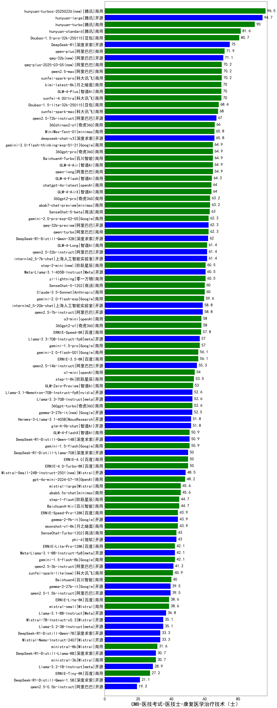

| 类别 | 大模型                         | CMB-医技考试-医技士-康复医学治疗技术（士） | 排名 |
|-----|------------------------------|---------|----|
|商用|hunyuan-turbos-20250226(new)|96.5|1|
|商用|hunyuan-large|94.7|2|
|商用|hunyuan-turbo|90.0|3|
|商用|hunyuan-standard|81.6|4|
|商用|Doubao-1.5-pro-32k-250115|80.7|5|
|开源|DeepSeek-R1|75.0|6|
|商用|qwen-plus|71.9|7|
|开源|qwq-32b(new)|71.1|8|
|商用|qwq-plus-2025-03-05(new)|70.2|9|
|商用|qwen2.5-max|70.2|10|
|商用|xunfei-spark-pro|70.2|11|
|商用|xunfei-4.0Ultra|70.0|12|
|商用|GLM-4-Plus|70.0|13|
|商用|kimi-latest-8k|70.0|14|
|商用|Doubao-1.5-lite-32k-250115|68.4|15|
|商用|xunfei-spark-max|68.0|16|
|开源|qwen2.5-72b-instruct|67.0|17|
|商用|360zhinao2-o1|66.0|18|
|开源|deepseek-chat-v3|65.8|19|
|商用|MiniMax-Text-01|65.8|20|
|商用|GLM-4-Air|64.9|21|
|商用|qwen-long|64.9|22|
|商用|360gpt-pro|64.9|23|
|商用|gemini-2.0-flash-thinking-exp-01-21|64.9|24|
|商用|Baichuan4-Turbo|64.9|25|
|商用|GLM-4-Flash|64.3|26|
|商用|chatgpt-4o-latest|64.0|27|
|商用|GLM-4-AirX|64.0|28|
|商用|abab7-chat-preview|63.2|29|
|商用|360gpt2-pro|63.2|30|
|商用|SenseChat-5-beta|63.0|31|
|开源|qwq-32b-preview|62.3|32|
|商用|gemini-2.0-pro-exp-02-05|62.3|33|
|商用|qwen-turbo|62.3|34|
|开源|DeepSeek-R1-Distill-Qwen-32B|62.0|35|
|开源|qwen2.5-32b-instruct|61.4|36|
|商用|GLM-4-Long|61.4|37|
|开源|internlm2_5-7b-chat|61.4|38|
|商用|yi-lightning|60.5|39|
|开源|Meta-Llama-3.1-405B-Instruct|60.5|40|
|商用|step-2-mini(new)|60.5|41|
|商用|SenseChat-5-1202|60.0|42|
|商用|Claude-3.5-Sonnet|60.0|43|
|商用|gemini-2.0-flash-exp|59.6|44|
|开源|internlm2_5-20b-chat|58.8|45|
|开源|qwen2.5-7b-instruct|58.8|46|
|商用|o3-mini|58.0|47|
|商用|360gpt2-o1|58.0|48|
|商用|ERNIE-Speed-8K|57.8|49|
|开源|Llama-3.3-70B-Instruct-fp8|57.0|50|
|商用|gemini-1.5-pro|57.0|51|
|商用|ERNIE-3.5-8K|56.1|52|
|商用|gemini-2.0-flash-001|56.1|53|
|开源|qwen2.5-14b-instruct|55.3|54|
|商用|o1-mini|54.0|55|
|商用|step-1-8k|53.5|56|
|商用|GLM-Zero-Preview|53.0|57|
|商用|360gpt-turbo|52.6|58|
|开源|Llama-3.1-Nemotron-70B-Instruct-fp8|52.6|59|
|开源|Llama-3.3-70B-Instruct|52.6|60|
|开源|Hermes-3-Llama-3.1-405B|51.8|61|
|开源|glm-4-9b-chat|51.8|62|
|商用|GLM-4-FlashX|50.9|63|
|开源|DeepSeek-R1-Distill-Qwen-14B|50.9|64|
|商用|gemini-1.5-flash|50.9|65|
|商用|ERNIE-4.0-Turbo-8K|50.0|66|
|商用|ERNIE-4.0|50.0|67|
|开源|DeepSeek-R1-Distill-Llama-70B|50.0|68|
|商用|gpt-4o-mini-2024-07-18|48.2|69|
|商用|mistral-large|45.6|70|
|商用|abab6.5s-chat|45.6|71|
|商用|step-1-flash|44.7|72|
|商用|Baichuan4-Air|44.7|73|
|商用|moonshot-v1-8k|43.9|74|
|商用|ERNIE-Speed-Pro-128K|43.9|75|
|开源|gemma-2-9b-it|43.9|76|
|开源|phi-4|43.0|77|
|商用|SenseChat-Turbo-1202|43.0|78|
|开源|Meta-Llama-3.1-8B-Instruct-fp8|42.1|79|
|商用|ERNIE-Lite-Pro-128K|42.1|80|
|商用|gemini-1.5-flash-8b|42.1|81|
|开源|qwen2.5-3b-instruct|41.2|82|
|商用|xunfei-spark-lite(new)|40.9|83|
|商用|Baichuan4|40.0|84|
|开源|qwen2.5-1.5b-instruct|39.5|85|
|开源|gemma-2-27b-it|39.5|86|
|商用|mistral-small|38.6|87|
|商用|ERNIE-Lite-8K|38.6|88|
|开源|Llama-3.1-8B-Instruct|36.8|89|
|开源|Mistral-7B-Instruct-v0.3|35.1|90|
|开源|Llama-3.2-3B-Instruct|35.1|91|
|开源|DeepSeek-R1-Distill-Qwen-7B|33.3|92|
|开源|Mistral-Nemo-Instruct-2407|33.3|93|
|商用|ministral-8b|31.6|94|
|开源|DeepSeek-R1-Distill-Llama-8B|30.7|95|
|商用|ministral-3b|30.7|96|
|开源|Llama-3.2-1B-Instruct|28.9|97|
|商用|ERNIE-Tiny-8K|27.2|98|
|开源|DeepSeek-R1-Distill-Qwen-1.5B|21.1|99|
|开源|qwen2.5-0.5b-instruct|19.3|100|
|开源|Yi-1.5-9B-Chat|/|101|
|开源|Yi-1.5-34B-Chat|/|102|
|开源|qwen2.5-math-72b-instruct|/|103|

