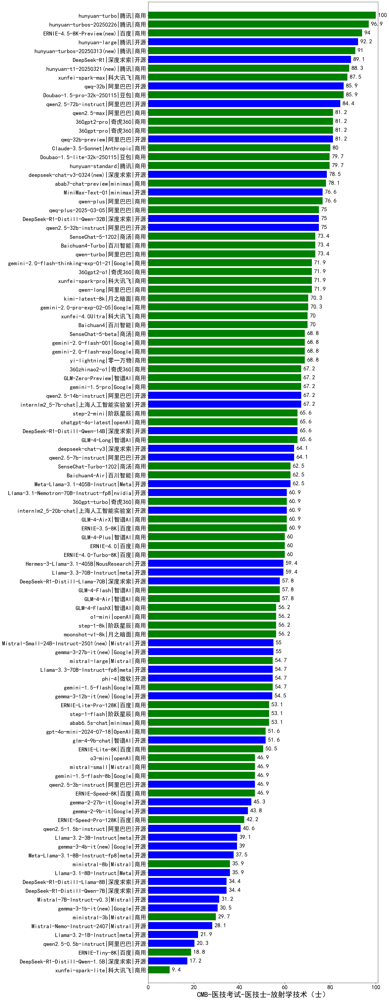

| 类别 | 大模型                         | CMB-医技考试-医技士-放射学技术（士） | 排名 |
|-----|------------------------------|---------|----|
|商用|hunyuan-turbo|100.0|1|
|商用|hunyuan-turbos-20250226(new)|96.9|2|
|商用|ERNIE-4.5-8K-Preview(new)|94.0|3|
|开源|hunyuan-large|92.2|4|
|商用|hunyuan-turbos-20250313(new)|91.0|5|
|开源|DeepSeek-R1|89.1|6|
|商用|xunfei-spark-max|87.5|7|
|商用|Doubao-1.5-pro-32k-250115|85.9|8|
|开源|qwq-32b(new)|85.9|9|
|开源|qwen2.5-72b-instruct|84.4|10|
|开源|qwq-32b-preview|81.2|11|
|商用|360gpt-pro|81.2|12|
|商用|360gpt2-pro|81.2|13|
|商用|qwen2.5-max|81.2|14|
|商用|Claude-3.5-Sonnet|80.0|15|
|商用|hunyuan-standard|79.7|16|
|商用|Doubao-1.5-lite-32k-250115|79.7|17|
|商用|abab7-chat-preview|78.1|18|
|商用|qwen-plus|76.6|19|
|开源|MiniMax-Text-01|76.6|20|
|开源|DeepSeek-R1-Distill-Qwen-32B|75.0|21|
|开源|qwen2.5-32b-instruct|75.0|22|
|商用|qwq-plus-2025-03-05(new)|75.0|23|
|商用|Baichuan4-Turbo|73.4|24|
|商用|qwen-turbo|73.4|25|
|商用|SenseChat-5-1202|73.4|26|
|商用|xunfei-spark-pro|71.9|27|
|商用|gemini-2.0-flash-thinking-exp-01-21|71.9|28|
|商用|360gpt2-o1|71.9|29|
|商用|qwen-long|71.9|30|
|商用|kimi-latest-8k|70.3|31|
|商用|gemini-2.0-pro-exp-02-05|70.3|32|
|商用|xunfei-4.0Ultra|70.0|33|
|商用|Baichuan4|70.0|34|
|商用|gemini-2.0-flash-001|68.8|35|
|商用|yi-lightning|68.8|36|
|商用|SenseChat-5-beta|68.8|37|
|商用|gemini-2.0-flash-exp|68.8|38|
|商用|360zhinao2-o1|67.2|39|
|商用|GLM-Zero-Preview|67.2|40|
|开源|internlm2_5-7b-chat|67.2|41|
|开源|qwen2.5-14b-instruct|67.2|42|
|商用|gemini-1.5-pro|67.2|43|
|商用|GLM-4-Flash|67.1|44|
|商用|step-2-mini(new)|65.6|45|
|商用|chatgpt-4o-latest|65.6|46|
|开源|DeepSeek-R1-Distill-Qwen-14B|65.6|47|
|商用|GLM-4-Long|65.6|48|
|开源|qwen2.5-7b-instruct|64.1|49|
|开源|deepseek-chat-v3|64.1|50|
|开源|Meta-Llama-3.1-405B-Instruct|62.5|51|
|商用|Baichuan4-Air|62.5|52|
|商用|SenseChat-Turbo-1202|62.5|53|
|商用|ERNIE-3.5-8K|60.9|54|
|开源|internlm2_5-20b-chat|60.9|55|
|商用|GLM-4-AirX|60.9|56|
|开源|Llama-3.1-Nemotron-70B-Instruct-fp8|60.9|57|
|商用|360gpt-turbo|60.9|58|
|商用|ERNIE-4.0|60.0|59|
|商用|ERNIE-4.0-Turbo-8K|60.0|60|
|商用|GLM-4-Plus|60.0|61|
|开源|Hermes-3-Llama-3.1-405B|59.4|62|
|开源|Llama-3.3-70B-Instruct|59.4|63|
|商用|ERNIE-Speed-8K|58.5|64|
|商用|GLM-4-Air|57.8|65|
|开源|DeepSeek-R1-Distill-Llama-70B|57.8|66|
|商用|step-1-8k|56.2|67|
|商用|o1-mini|56.2|68|
|商用|GLM-4-FlashX|56.2|69|
|商用|moonshot-v1-8k|56.2|70|
|开源|gemma-3-27b-it(new)|55.0|71|
|开源|Mistral-Small-24B-Instruct-2501(new)|55.0|72|
|开源|phi-4|54.7|73|
|开源|Llama-3.3-70B-Instruct-fp8|54.7|74|
|商用|gemini-1.5-flash|54.7|75|
|商用|mistral-large|54.7|76|
|开源|gemma-3-12b-it(new)|54.5|77|
|商用|abab6.5s-chat|53.1|78|
|商用|step-1-flash|53.1|79|
|商用|ERNIE-Lite-Pro-128K|53.1|80|
|商用|gpt-4o-mini-2024-07-18|51.6|81|
|开源|glm-4-9b-chat|51.6|82|
|开源|qwen2.5-3b-instruct|46.9|83|
|商用|o3-mini|46.9|84|
|商用|mistral-small|46.9|85|
|商用|gemini-1.5-flash-8b|46.9|86|
|开源|gemma-2-27b-it|45.3|87|
|开源|gemma-2-9b-it|43.8|88|
|商用|ERNIE-Speed-Pro-128K|42.2|89|
|开源|qwen2.5-1.5b-instruct|40.6|90|
|开源|Llama-3.2-3B-Instruct|39.1|91|
|开源|gemma-3-4b-it(new)|39.0|92|
|开源|Meta-Llama-3.1-8B-Instruct-fp8|37.5|93|
|商用|ERNIE-Lite-8K|35.9|94|
|开源|Llama-3.1-8B-Instruct|35.9|95|
|商用|ministral-8b|35.9|96|
|开源|DeepSeek-R1-Distill-Qwen-7B|34.4|97|
|开源|DeepSeek-R1-Distill-Llama-8B|34.4|98|
|开源|Mistral-7B-Instruct-v0.3|31.2|99|
|开源|gemma-3-1b-it(new)|30.5|100|
|商用|ministral-3b|29.7|101|
|商用|xunfei-spark-lite(new)|29.3|102|
|开源|Mistral-Nemo-Instruct-2407|28.1|103|
|开源|Llama-3.2-1B-Instruct|21.9|104|
|开源|qwen2.5-0.5b-instruct|20.3|105|
|商用|ERNIE-Tiny-8K|18.8|106|
|开源|DeepSeek-R1-Distill-Qwen-1.5B|17.2|107|
|开源|qwen2.5-math-72b-instruct|/|108|

