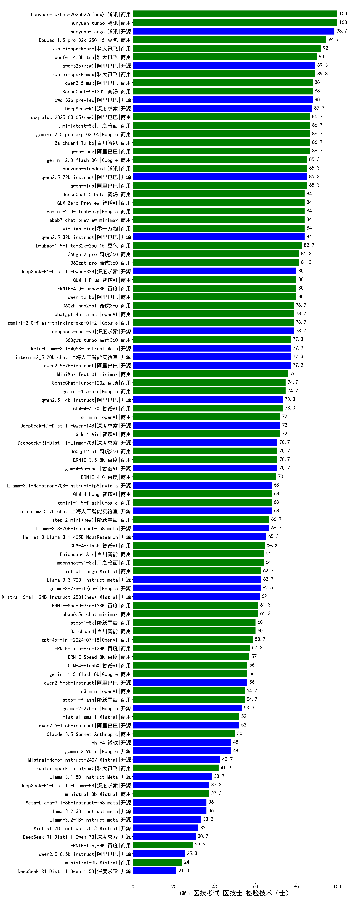

| 类别 | 大模型                         | CMB-医技考试-医技士-检验技术（士） | 排名 |
|-----|------------------------------|---------|----|
|商用|hunyuan-turbo|100.0|1|
|商用|hunyuan-turbos-20250226(new)|100.0|2|
|商用|hunyuan-large|98.7|3|
|商用|Doubao-1.5-pro-32k-250115|94.7|4|
|商用|xunfei-spark-pro|92.0|5|
|商用|xunfei-4.0Ultra|90.0|6|
|商用|xunfei-spark-max|89.3|7|
|开源|qwq-32b(new)|89.3|8|
|商用|qwen2.5-max|88.0|9|
|商用|SenseChat-5-1202|88.0|10|
|开源|qwq-32b-preview|88.0|11|
|开源|DeepSeek-R1|87.7|12|
|商用|Baichuan4-Turbo|86.7|13|
|商用|qwq-plus-2025-03-05(new)|86.7|14|
|商用|gemini-2.0-pro-exp-02-05|86.7|15|
|商用|qwen-long|86.7|16|
|商用|kimi-latest-8k|86.7|17|
|商用|gemini-2.0-flash-001|85.3|18|
|商用|hunyuan-standard|85.3|19|
|开源|qwen2.5-72b-instruct|85.3|20|
|商用|qwen-plus|85.3|21|
|开源|qwen2.5-32b-instruct|84.0|22|
|商用|abab7-chat-preview|84.0|23|
|商用|SenseChat-5-beta|84.0|24|
|商用|gemini-2.0-flash-exp|84.0|25|
|商用|yi-lightning|84.0|26|
|商用|GLM-Zero-Preview|84.0|27|
|商用|Doubao-1.5-lite-32k-250115|82.7|28|
|商用|360gpt2-pro|81.3|29|
|商用|360gpt-pro|81.3|30|
|商用|GLM-4-Plus|80.0|31|
|商用|qwen-turbo|80.0|32|
|商用|ERNIE-4.0-Turbo-8K|80.0|33|
|开源|DeepSeek-R1-Distill-Qwen-32B|80.0|34|
|商用|360zhinao2-o1|78.7|35|
|商用|gemini-2.0-flash-thinking-exp-01-21|78.7|36|
|商用|chatgpt-4o-latest|78.7|37|
|开源|deepseek-chat-v3|78.7|38|
|开源|qwen2.5-7b-instruct|77.3|39|
|开源|Meta-Llama-3.1-405B-Instruct|77.3|40|
|商用|360gpt-turbo|77.3|41|
|开源|internlm2_5-20b-chat|77.3|42|
|商用|MiniMax-Text-01|76.0|43|
|商用|gemini-1.5-pro|74.7|44|
|商用|SenseChat-Turbo-1202|74.7|45|
|商用|GLM-4-AirX|73.3|46|
|开源|qwen2.5-14b-instruct|73.3|47|
|商用|o1-mini|72.0|48|
|开源|DeepSeek-R1-Distill-Qwen-14B|72.0|49|
|商用|GLM-4-Air|72.0|50|
|开源|glm-4-9b-chat|70.7|51|
|开源|DeepSeek-R1-Distill-Llama-70B|70.7|52|
|商用|ERNIE-3.5-8K|70.7|53|
|商用|360gpt2-o1|70.7|54|
|商用|ERNIE-4.0|70.0|55|
|开源|Llama-3.1-Nemotron-70B-Instruct-fp8|68.0|56|
|商用|GLM-4-Long|68.0|57|
|开源|internlm2_5-7b-chat|68.0|58|
|商用|gemini-1.5-flash|68.0|59|
|商用|step-2-mini(new)|66.7|60|
|开源|Llama-3.3-70B-Instruct-fp8|66.7|61|
|开源|Hermes-3-Llama-3.1-405B|65.3|62|
|商用|GLM-4-Flash|64.5|63|
|商用|Baichuan4-Air|64.0|64|
|商用|moonshot-v1-8k|64.0|65|
|开源|Llama-3.3-70B-Instruct|62.7|66|
|商用|mistral-large|62.7|67|
|商用|abab6.5s-chat|61.3|68|
|商用|ERNIE-Speed-Pro-128K|61.3|69|
|商用|step-1-8k|60.0|70|
|商用|Baichuan4|60.0|71|
|商用|gpt-4o-mini-2024-07-18|58.7|72|
|商用|ERNIE-Lite-Pro-128K|57.3|73|
|商用|ERNIE-Speed-8K|57.0|74|
|商用|gemini-1.5-flash-8b|56.0|75|
|开源|qwen2.5-3b-instruct|56.0|76|
|商用|GLM-4-FlashX|56.0|77|
|商用|o3-mini|54.7|78|
|商用|step-1-flash|54.7|79|
|开源|gemma-2-27b-it|53.3|80|
|开源|qwen2.5-1.5b-instruct|52.0|81|
|商用|mistral-small|52.0|82|
|商用|Claude-3.5-Sonnet|50.0|83|
|开源|gemma-2-9b-it|48.0|84|
|开源|phi-4|48.0|85|
|开源|Mistral-Nemo-Instruct-2407|42.7|86|
|商用|xunfei-spark-lite(new)|41.9|87|
|开源|Llama-3.1-8B-Instruct|38.7|88|
|开源|DeepSeek-R1-Distill-Llama-8B|37.3|89|
|商用|ministral-8b|37.3|90|
|开源|Llama-3.2-3B-Instruct|36.0|91|
|开源|Meta-Llama-3.1-8B-Instruct-fp8|36.0|92|
|开源|Llama-3.2-1B-Instruct|33.3|93|
|开源|Mistral-7B-Instruct-v0.3|32.0|94|
|开源|DeepSeek-R1-Distill-Qwen-7B|30.7|95|
|商用|ERNIE-Tiny-8K|29.3|96|
|开源|qwen2.5-0.5b-instruct|25.3|97|
|商用|ministral-3b|24.0|98|
|开源|DeepSeek-R1-Distill-Qwen-1.5B|21.3|99|
|开源|Yi-1.5-34B-Chat|/|100|
|开源|Yi-1.5-9B-Chat|/|101|
|开源|qwen2.5-math-72b-instruct|/|102|
|商用|ERNIE-Lite-8K|/|103|

