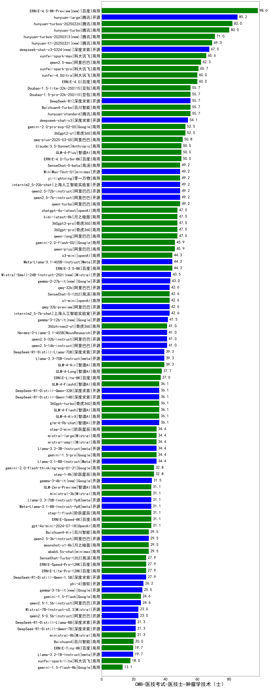

| 类别 | 大模型                         | CMB-医技考试-医技士-肿瘤学技术（士） | 排名 |
|-----|------------------------------|---------|----|
|商用|ERNIE-4.5-8K-Preview|98.0|1|
|开源|hunyuan-large|85.2|2|
|商用|hunyuan-turbos-20250226|82.0|3|
|商用|hunyuan-turbo|80.0|4|
|商用|hunyuan-turbos-20250313|71.0|5|
|商用|gemini-2.5-pro-preview-03-25(new)|70.0|6|
|商用|hunyuan-t1-20250321(new)|69.3|7|
|开源|deepseek-chat-v3-0324(new)|67.5|8|
|开源|Llama-4-Maverick-17B-128E-Instruct-FP8(new)|66.0|9|
|商用|xunfei-spark-max|65.6|10|
|开源|Llama-4-Scout-17B-16E-Instruct(new)|65.0|11|
|商用|qwen2.5-max|62.3|12|
|商用|xunfei-spark-pro|60.7|13|
|商用|ERNIE-4.0|60.0|14|
|商用|xunfei-4.0Ultra|60.0|15|
|商用|Doubao-1.5-pro-32k-250115|55.7|16|
|开源|DeepSeek-R1|55.7|17|
|商用|Doubao-1.5-lite-32k-250115|55.7|18|
|商用|Baichuan4-Turbo|55.7|19|
|商用|hunyuan-standard|55.7|20|
|开源|deepseek-chat-v3|54.1|21|
|商用|360gpt2-o1|52.5|22|
|商用|qwq-plus-2025-03-05|50.8|23|
|商用|GLM-4-Plus|50.0|24|
|商用|Claude-3.5-Sonnet|50.0|25|
|商用|ERNIE-4.0-Turbo-8K|50.0|26|
|商用|SenseChat-5-beta|49.2|27|
|开源|MiniMax-Text-01|49.2|28|
|商用|qwen-turbo|49.2|29|
|开源|qwen2.5-72b-instruct|49.2|30|
|开源|qwen2.5-7b-instruct|49.2|31|
|开源|internlm2_5-20b-chat|49.2|32|
|商用|yi-lightning|49.2|33|
|商用|qwen-long|47.5|34|
|商用|360gpt2-pro|47.5|35|
|商用|kimi-latest-8k|47.5|36|
|商用|chatgpt-4o-latest|47.5|37|
|商用|360gpt-pro|47.5|38|
|商用|ERNIE-X1-32K-Preview(new)|46.7|39|
|商用|qwen-plus|45.9|40|
|商用|gemini-2.0-flash-001|45.9|41|
|商用|ERNIE-3.5-8K|44.3|42|
|商用|o3-mini|44.3|43|
|开源|Meta-Llama-3.1-405B-Instruct|44.3|44|
|开源|Mistral-Small-24B-Instruct-2501|43.5|45|
|开源|gemma-3-27b-it|43.0|46|
|开源|Mistral-Small-3.1-24B-Instruct-2503(new)|43.0|47|
|开源|internlm2_5-7b-chat|42.6|48|
|商用|SenseChat-5-1202|42.6|49|
|开源|qwq-32b-preview|42.6|50|
|开源|qwq-32b|42.6|51|
|开源|gemma-3-12b-it|41.5|52|
|开源|qwen2.5-14b-instruct|41.0|53|
|开源|qwen2.5-32b-instruct|41.0|54|
|开源|Hermes-3-Llama-3.1-405B|41.0|55|
|商用|360zhinao2-o1|41.0|56|
|开源|DeepSeek-R1-Distill-Llama-70B|39.3|57|
|开源|Llama-3.3-70B-Instruct|39.3|58|
|商用|GLM-4-Air|39.3|59|
|商用|GLM-4-Long|37.7|60|
|商用|ERNIE-Lite-8K|37.0|61|
|商用|360gpt-turbo|36.1|62|
|商用|GLM-4-FlashX|36.1|63|
|开源|DeepSeek-R1-Distill-Qwen-32B|36.1|64|
|开源|glm-4-9b-chat|36.1|65|
|开源|DeepSeek-R1-Distill-Qwen-14B|36.1|66|
|商用|GLM-4-Flash|36.1|67|
|商用|GLM-4-AirX|36.1|68|
|商用|gemini-1.5-pro|34.4|69|
|开源|Llama-3.1-8B-Instruct|34.4|70|
|商用|mistral-large|34.4|71|
|开源|Llama-3.2-3B-Instruct|34.4|72|
|商用|mistral-small|34.4|73|
|商用|step-2-mini|34.4|74|
|商用|gemini-2.0-flash-thinking-exp-01-21|32.8|75|
|商用|step-1-8k|32.8|76|
|开源|gemma-3-4b-it|31.5|77|
|开源|Meta-Llama-3.1-8B-Instruct-fp8|31.1|78|
|商用|ministral-3b|31.1|79|
|商用|step-1-flash|31.1|80|
|开源|Llama-3.3-70B-Instruct-fp8|31.1|81|
|商用|GLM-Zero-Preview|31.1|82|
|商用|ERNIE-Speed-8K|31.1|83|
|商用|gpt-4o-mini-2024-07-18|31.1|84|
|商用|abab6.5s-chat|29.5|85|
|商用|Baichuan4-Air|29.5|86|
|商用|moonshot-v1-8k|29.5|87|
|开源|qwen2.5-3b-instruct|29.5|88|
|商用|SenseChat-Turbo-1202|27.9|89|
|商用|ERNIE-Speed-Pro-128K|27.9|90|
|商用|ERNIE-Lite-Pro-128K|27.9|91|
|开源|DeepSeek-R1-Distill-Qwen-1.5B|27.9|92|
|开源|phi-4|26.2|93|
|开源|gemma-3-1b-it|25.5|94|
|开源|qwen2.5-1.5b-instruct|24.6|95|
|商用|gemini-1.5-flash|24.6|96|
|开源|Mistral-7B-Instruct-v0.3|23.0|97|
|开源|qwen2.5-0.5b-instruct|23.0|98|
|开源|DeepSeek-R1-Distill-Llama-8B|21.3|99|
|商用|ministral-8b|21.3|100|
|开源|DeepSeek-R1-Distill-Qwen-7B|21.3|101|
|商用|Baichuan4|20.0|102|
|商用|ERNIE-Tiny-8K|19.7|103|
|开源|Llama-3.2-1B-Instruct|19.7|104|
|商用|xunfei-spark-lite|18.0|105|
|商用|gemini-1.5-flash-8b|13.1|106|

