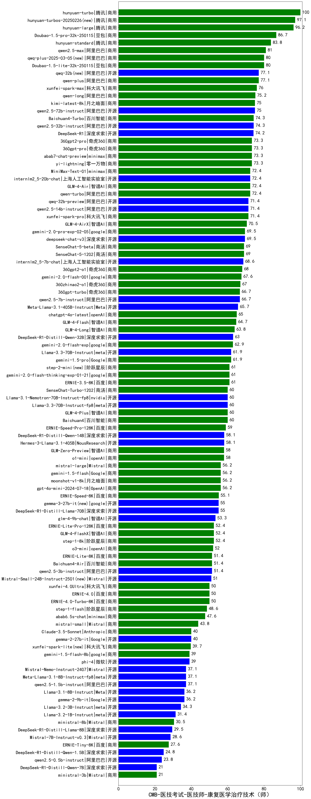

| 类别 | 大模型                         | CMB-医技考试-医技师-康复医学治疗技术（师） | 排名 |
|-----|------------------------------|---------|----|
|商用|hunyuan-turbo|100.0|1|
|商用|ERNIE-4.5-8K-Preview|98.0|2|
|商用|hunyuan-turbos-20250226|97.1|3|
|开源|hunyuan-large|96.2|4|
|商用|hunyuan-turbos-20250313|94.0|5|
|商用|Doubao-1.5-pro-32k-250115|86.7|6|
|商用|hunyuan-standard|83.8|7|
|开源|deepseek-chat-v3-0324(new)|81.5|8|
|商用|qwen2.5-max|81.0|9|
|商用|hunyuan-t1-20250321(new)|81.0|10|
|商用|Doubao-1.5-lite-32k-250115|80.0|11|
|商用|qwq-plus-2025-03-05|80.0|12|
|商用|qwen-plus|77.1|13|
|开源|qwq-32b|77.1|14|
|开源|DeepSeek-R1|77.0|15|
|商用|xunfei-spark-max|76.0|16|
|商用|qwen-long|75.2|17|
|商用|kimi-latest-8k|75.0|18|
|开源|qwen2.5-72b-instruct|75.0|19|
|开源|qwen2.5-32b-instruct|74.3|20|
|商用|Baichuan4-Turbo|74.3|21|
|商用|360gpt2-pro|73.3|22|
|商用|yi-lightning|73.3|23|
|开源|Llama-4-Scout-17B-16E-Instruct(new)|72.5|24|
|开源|MiniMax-Text-01|72.4|25|
|商用|GLM-4-Air|72.4|26|
|开源|internlm2_5-20b-chat|72.4|27|
|商用|qwen-turbo|72.4|28|
|开源|qwen2.5-14b-instruct|71.4|29|
|商用|xunfei-spark-pro|71.4|30|
|商用|GLM-4-AirX|70.5|31|
|商用|ERNIE-X1-32K-Preview(new)|70.0|32|
|商用|SenseChat-5-1202|69.0|33|
|商用|SenseChat-5-beta|69.0|34|
|开源|internlm2_5-7b-chat|68.6|35|
|商用|360gpt2-o1|68.0|36|
|商用|gemini-2.0-flash-001|67.6|37|
|商用|360zhinao2-o1|67.0|38|
|开源|qwen2.5-7b-instruct|66.7|39|
|商用|360gpt-turbo|66.7|40|
|开源|Llama-4-Maverick-17B-128E-Instruct-FP8(new)|66.0|41|
|开源|Meta-Llama-3.1-405B-Instruct|65.7|42|
|商用|chatgpt-4o-latest|65.0|43|
|商用|GLM-4-Long|63.8|44|
|开源|DeepSeek-R1-Distill-Qwen-32B|63.0|45|
|商用|gemini-1.5-pro|61.9|46|
|开源|Llama-3.3-70B-Instruct|61.9|47|
|商用|gemini-2.0-flash-thinking-exp-01-21|61.0|48|
|商用|step-2-mini|61.0|49|
|商用|ERNIE-3.5-8K|61.0|50|
|商用|GLM-4-Plus|60.0|51|
|商用|SenseChat-Turbo-1202|60.0|52|
|商用|gemini-2.5-pro-preview-03-25(new)|60.0|53|
|开源|Llama-3.3-70B-Instruct-fp8|60.0|54|
|开源|Mistral-Small-3.1-24B-Instruct-2503(new)|59.5|55|
|商用|ERNIE-Speed-Pro-128K|59.0|56|
|开源|DeepSeek-R1-Distill-Qwen-14B|58.1|57|
|开源|Hermes-3-Llama-3.1-405B|58.1|58|
|商用|GLM-Zero-Preview|58.0|59|
|商用|gemini-1.5-flash|56.2|60|
|商用|gpt-4o-mini-2024-07-18|56.2|61|
|商用|mistral-large|56.2|62|
|商用|moonshot-v1-8k|56.2|63|
|开源|gemma-3-27b-it|55.0|64|
|开源|DeepSeek-R1-Distill-Llama-70B|55.0|65|
|商用|ERNIE-Lite-8K|55.0|66|
|商用|GLM-4-Flash|54.3|67|
|开源|glm-4-9b-chat|53.3|68|
|商用|GLM-4-FlashX|52.4|69|
|商用|step-1-8k|52.4|70|
|商用|ERNIE-Lite-Pro-128K|52.4|71|
|商用|o3-mini|52.0|72|
|商用|Baichuan4-Air|51.4|73|
|开源|qwen2.5-3b-instruct|51.4|74|
|开源|Mistral-Small-24B-Instruct-2501|51.0|75|
|商用|ERNIE-4.0-Turbo-8K|50.0|76|
|商用|xunfei-4.0Ultra|50.0|77|
|商用|abab6.5s-chat|47.6|78|
|开源|gemma-3-12b-it|45.0|79|
|商用|mistral-small|43.8|80|
|商用|ERNIE-Speed-8K|41.9|81|
|商用|Claude-3.5-Sonnet|40.0|82|
|开源|phi-4|39.0|83|
|商用|gemini-1.5-flash-8b|39.0|84|
|开源|qwen2.5-1.5b-instruct|37.1|85|
|开源|Meta-Llama-3.1-8B-Instruct-fp8|37.1|86|
|开源|Llama-3.1-8B-Instruct|36.2|87|
|开源|Llama-3.2-3B-Instruct|34.3|88|
|开源|gemma-3-4b-it|33.5|89|
|开源|Llama-3.2-1B-Instruct|31.4|90|
|商用|ministral-8b|30.5|91|
|开源|DeepSeek-R1-Distill-Llama-8B|29.5|92|
|开源|gemma-3-1b-it|29.0|93|
|商用|ERNIE-Tiny-8K|27.6|94|
|开源|DeepSeek-R1-Distill-Qwen-1.5B|24.8|95|
|开源|qwen2.5-0.5b-instruct|23.8|96|
|商用|xunfei-spark-lite|21.9|97|
|开源|DeepSeek-R1-Distill-Qwen-7B|21.0|98|
|商用|ministral-3b|21.0|99|

