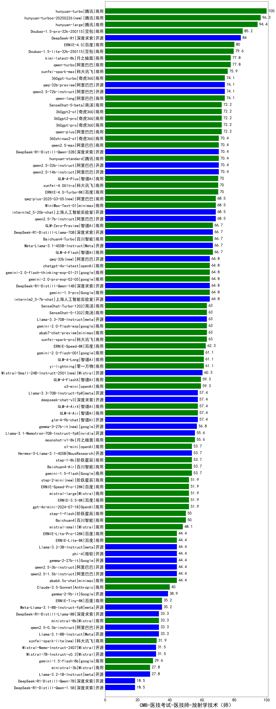

| 类别 | 大模型                         | CMB-医技考试-医技师-放射学技术（师） | 排名 |
|-----|------------------------------|---------|----|
|商用|hunyuan-turbo|100.0|1|
|商用|hunyuan-turbos-20250226|96.3|2|
|商用|ERNIE-4.5-8K-Preview(new)|96.0|3|
|开源|hunyuan-large|94.4|4|
|商用|hunyuan-turbos-20250313(new)|88.9|5|
|商用|Doubao-1.5-pro-32k-250115|85.2|6|
|商用|hunyuan-t1-20250321(new)|84.9|7|
|开源|DeepSeek-R1|81.5|8|
|商用|ERNIE-4.0|80.0|9|
|开源|deepseek-chat-v3-0324(new)|79.9|10|
|商用|Doubao-1.5-lite-32k-250115|79.6|11|
|商用|qwen-turbo|77.8|12|
|商用|kimi-latest-8k|77.8|13|
|商用|xunfei-spark-max|75.9|14|
|商用|360gpt-turbo|74.1|15|
|开源|qwen2.5-72b-instruct|74.1|16|
|开源|qwq-32b-preview|74.1|17|
|商用|qwen-long|74.1|18|
|商用|qwen-plus|72.2|19|
|商用|360gpt-pro|72.2|20|
|商用|360gpt2-pro|72.2|21|
|商用|SenseChat-5-beta|72.2|22|
|商用|360gpt2-o1|72.2|23|
|开源|DeepSeek-R1-Distill-Qwen-32B|70.4|24|
|商用|360zhinao2-o1|70.4|25|
|开源|qwen2.5-14b-instruct|70.4|26|
|商用|hunyuan-standard|70.4|27|
|开源|qwen2.5-32b-instruct|70.4|28|
|商用|qwen2.5-max|70.4|29|
|商用|xunfei-4.0Ultra|70.0|30|
|商用|GLM-4-Plus|70.0|31|
|商用|ERNIE-4.0-Turbo-8K|70.0|32|
|开源|internlm2_5-20b-chat|68.5|33|
|商用|qwq-plus-2025-03-05|68.5|34|
|开源|qwen2.5-7b-instruct|68.5|35|
|开源|MiniMax-Text-01|68.5|36|
|商用|GLM-Zero-Preview|66.7|37|
|开源|Meta-Llama-3.1-405B-Instruct|66.7|38|
|开源|DeepSeek-R1-Distill-Llama-70B|66.7|39|
|商用|Baichuan4-Turbo|66.7|40|
|商用|gemini-2.0-pro-exp-02-05|64.8|41|
|开源|qwq-32b|64.8|42|
|商用|gemini-1.5-pro|64.8|43|
|开源|internlm2_5-7b-chat|64.8|44|
|开源|DeepSeek-R1-Distill-Qwen-14B|64.8|45|
|商用|gemini-2.0-flash-thinking-exp-01-21|64.8|46|
|商用|chatgpt-4o-latest|64.8|47|
|商用|SenseChat-5-1202|63.0|48|
|商用|SenseChat-Turbo-1202|63.0|49|
|商用|xunfei-spark-pro|63.0|50|
|开源|Llama-3.3-70B-Instruct|63.0|51|
|商用|yi-lightning|61.1|52|
|商用|GLM-4-Long|61.1|53|
|商用|gemini-2.0-flash-001|61.1|54|
|开源|Mistral-Small-24B-Instruct-2501(new)|60.3|55|
|商用|o3-mini|59.3|56|
|商用|GLM-4-FlashX|59.3|57|
|商用|ERNIE-Lite-8K|57.8|58|
|开源|Llama-3.3-70B-Instruct-fp8|57.4|59|
|开源|glm-4-9b-chat|57.4|60|
|开源|deepseek-chat-v3|57.4|61|
|商用|GLM-4-Air|57.4|62|
|商用|GLM-4-AirX|57.4|63|
|商用|GLM-4-Flash|57.4|64|
|开源|gemma-3-27b-it(new)|56.8|65|
|商用|moonshot-v1-8k|55.6|66|
|商用|gemini-1.5-flash|53.7|67|
|商用|o1-mini|53.7|68|
|商用|Baichuan4-Air|53.7|69|
|开源|Hermes-3-Llama-3.1-405B|53.7|70|
|商用|step-1-8k|53.7|71|
|商用|gpt-4o-mini-2024-07-18|51.9|72|
|商用|ERNIE-Speed-Pro-128K|51.9|73|
|商用|mistral-large|51.9|74|
|商用|step-2-mini|51.9|75|
|商用|ERNIE-3.5-8K|51.9|76|
|商用|ERNIE-Speed-8K|51.9|77|
|商用|step-1-flash|50.0|78|
|商用|Baichuan4|50.0|79|
|开源|gemma-3-12b-it(new)|48.2|80|
|商用|mistral-small|48.1|81|
|开源|phi-4|44.4|82|
|开源|qwen2.5-1.5b-instruct|44.4|83|
|商用|abab6.5s-chat|44.4|84|
|商用|ERNIE-Lite-Pro-128K|44.4|85|
|开源|qwen2.5-3b-instruct|44.4|86|
|开源|Llama-3.2-3B-Instruct|44.4|87|
|开源|gemma-3-4b-it(new)|40.7|88|
|商用|Claude-3.5-Sonnet|40.0|89|
|开源|Meta-Llama-3.1-8B-Instruct-fp8|35.2|90|
|商用|ERNIE-Tiny-8K|35.2|91|
|开源|qwen2.5-0.5b-instruct|33.3|92|
|开源|Llama-3.1-8B-Instruct|33.3|93|
|商用|ministral-8b|33.3|94|
|开源|DeepSeek-R1-Distill-Llama-8B|33.3|95|
|开源|Mistral-7B-Instruct-v0.3|31.5|96|
|商用|gemini-1.5-flash-8b|29.6|97|
|开源|gemma-3-1b-it(new)|28.1|98|
|商用|ministral-3b|27.8|99|
|开源|Llama-3.2-1B-Instruct|27.8|100|
|开源|DeepSeek-R1-Distill-Qwen-7B|18.5|101|
|开源|DeepSeek-R1-Distill-Qwen-1.5B|18.5|102|
|商用|xunfei-spark-lite|13.0|103|

