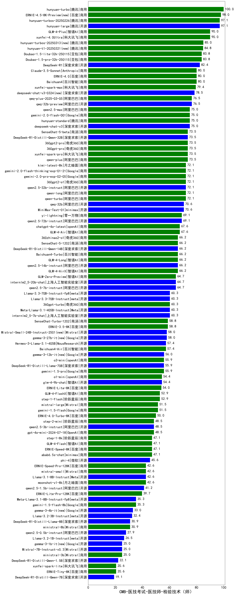

| 类别 | 大模型                         | CMB-医技考试-医技师-检验技术（师） | 排名 |
|-----|------------------------------|---------|----|
|商用|hunyuan-turbo|100.0|1|
|开源|hunyuan-large|97.1|2|
|商用|hunyuan-turbos-20250226(new)|97.1|3|
|商用|GLM-4-Plus|90.0|4|
|商用|xunfei-4.0Ultra|90.0|5|
|商用|Doubao-1.5-pro-32k-250115|83.8|6|
|商用|Doubao-1.5-lite-32k-250115|83.8|7|
|开源|DeepSeek-R1|82.4|8|
|商用|ERNIE-4.0|80.0|9|
|商用|Baichuan4|80.0|10|
|商用|Claude-3.5-Sonnet|80.0|11|
|商用|xunfei-spark-max|79.4|12|
|开源|qwq-32b-preview|76.5|13|
|商用|qwq-plus-2025-03-05(new)|76.5|14|
|商用|hunyuan-standard|75.0|15|
|商用|abab7-chat-preview|75.0|16|
|商用|qwen2.5-max|75.0|17|
|商用|gemini-2.0-flash-001|75.0|18|
|开源|deepseek-chat-v3|75.0|19|
|商用|qwen-plus|73.5|20|
|商用|xunfei-spark-pro|73.5|21|
|商用|360gpt2-pro|73.5|22|
|商用|360gpt-pro|73.5|23|
|开源|DeepSeek-R1-Distill-Qwen-32B|73.5|24|
|商用|SenseChat-5-beta|73.5|25|
|商用|kimi-latest-8k|72.1|26|
|商用|gemini-2.0-flash-thinking-exp-01-21|72.1|27|
|商用|360gpt2-o1|72.1|28|
|开源|qwen2.5-32b-instruct|72.1|29|
|商用|qwen-turbo|72.1|30|
|商用|qwen-long|72.1|31|
|商用|gemini-2.0-pro-exp-02-05|72.1|32|
|商用|MiniMax-Text-01|70.6|33|
|开源|qwq-32b(new)|70.6|34|
|商用|gemini-2.0-flash-exp|69.1|35|
|商用|yi-lightning|69.1|36|
|开源|qwen2.5-72b-instruct|69.1|37|
|商用|GLM-4-Air|67.6|38|
|开源|Llama-3.1-Nemotron-70B-Instruct-fp8|67.6|39|
|商用|chatgpt-4o-latest|67.6|40|
|商用|GLM-4-Long|66.2|41|
|商用|SenseChat-5-1202|66.2|42|
|商用|360zhinao2-o1|66.2|43|
|开源|DeepSeek-R1-Distill-Qwen-14B|66.2|44|
|商用|Baichuan4-Turbo|66.2|45|
|商用|GLM-4-AirX|66.2|46|
|开源|qwen2.5-14b-instruct|66.2|47|
|开源|internlm2_5-20b-chat|64.7|48|
|开源|qwen2.5-7b-instruct|64.7|49|
|商用|GLM-Zero-Preview|64.7|50|
|商用|GLM-4-Flash|62.9|51|
|商用|ERNIE-Speed-8K|62.9|52|
|开源|Llama-3.3-70B-Instruct|60.3|53|
|开源|Meta-Llama-3.1-405B-Instruct|60.3|54|
|开源|Llama-3.3-70B-Instruct-fp8|60.3|55|
|商用|360gpt-turbo|60.3|56|
|开源|internlm2_5-7b-chat|60.3|57|
|商用|ERNIE-3.5-8K|58.8|58|
|商用|SenseChat-Turbo-1202|58.8|59|
|开源|Mistral-Small-24B-Instruct-2501(new)|58.0|60|
|开源|gemma-3-27b-it(new)|58.0|61|
|商用|Baichuan4-Air|57.4|62|
|开源|Hermes-3-Llama-3.1-405B|57.4|63|
|商用|o3-mini|55.9|64|
|开源|DeepSeek-R1-Distill-Llama-70B|55.9|65|
|商用|gemini-1.5-pro|55.9|66|
|开源|glm-4-9b-chat|54.4|67|
|商用|o1-mini|54.4|68|
|商用|step-1-flash|52.9|69|
|商用|GLM-4-FlashX|52.9|70|
|商用|mistral-large|51.5|71|
|商用|gemini-1.5-flash|51.5|72|
|商用|ERNIE-4.0-Turbo-8K|50.0|73|
|商用|gpt-4o-mini-2024-07-18|48.5|74|
|开源|qwen2.5-3b-instruct|48.5|75|
|商用|step-2-mini(new)|48.5|76|
|商用|ERNIE-Lite-8K|47.1|77|
|商用|step-1-8k|47.1|78|
|商用|abab6.5s-chat|47.1|79|
|开源|phi-4|45.6|80|
|商用|xunfei-spark-lite(new)|44.3|81|
|商用|ERNIE-Speed-Pro-128K|42.6|82|
|开源|Llama-3.1-8B-Instruct|42.6|83|
|商用|moonshot-v1-8k|42.6|84|
|商用|mistral-small|42.6|85|
|开源|qwen2.5-1.5b-instruct|41.2|86|
|开源|gemma-2-27b-it|41.2|87|
|商用|ERNIE-Lite-Pro-128K|39.7|88|
|开源|gemma-2-9b-it|39.7|89|
|开源|Mistral-Nemo-Instruct-2407|39.7|90|
|商用|gemini-1.5-flash-8b|35.3|91|
|开源|Meta-Llama-3.1-8B-Instruct-fp8|35.3|92|
|开源|Llama-3.2-3B-Instruct|32.4|93|
|开源|DeepSeek-R1-Distill-Llama-8B|30.9|94|
|商用|ministral-8b|30.9|95|
|开源|qwen2.5-0.5b-instruct|27.9|96|
|开源|Llama-3.2-1B-Instruct|26.5|97|
|商用|ministral-3b|25.0|98|
|开源|Mistral-7B-Instruct-v0.3|25.0|99|
|开源|DeepSeek-R1-Distill-Qwen-1.5B|22.1|100|
|商用|ERNIE-Tiny-8K|20.6|101|
|开源|DeepSeek-R1-Distill-Qwen-7B|19.1|102|
|开源|Yi-1.5-34B-Chat|/|103|
|开源|Yi-1.5-9B-Chat|/|104|
|开源|qwen2.5-math-72b-instruct|/|105|

