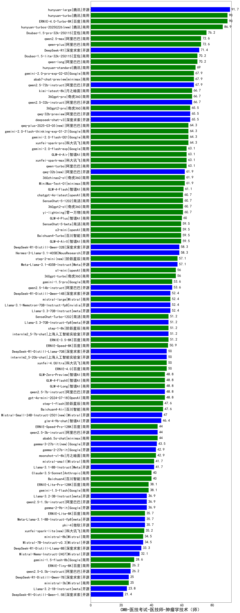

| 类别 | 大模型                         | CMB-医技考试-医技师-肿瘤学技术（师） | 排名 |
|-----|------------------------------|---------|----|
|商用|ERNIE-4.5-8K-Preview|99.0|1|
|开源|hunyuan-large|91.7|2|
|商用|ERNIE-4.0-Turbo-8K|90.0|3|
|商用|hunyuan-turbo|90.0|4|
|商用|hunyuan-turbos-20250226|86.9|5|
|商用|hunyuan-turbos-20250313|81.0|6|
|商用|hunyuan-t1-20250321(new)|77.0|7|
|商用|Doubao-1.5-pro-32k-250115|76.2|8|
|开源|deepseek-chat-v3-0324(new)|76.0|9|
|商用|qwen-plus|72.6|10|
|商用|qwen2.5-max|72.6|11|
|开源|DeepSeek-R1|71.4|12|
|开源|Llama-4-Maverick-17B-128E-Instruct-FP8(new)|71.0|13|
|商用|Doubao-1.5-lite-32k-250115|70.2|14|
|商用|qwen-long|70.2|15|
|商用|hunyuan-standard|69.0|16|
|开源|qwen2.5-72b-instruct|67.9|17|
|开源|qwen2.5-32b-instruct|66.7|18|
|商用|kimi-latest-8k|66.7|19|
|商用|360gpt2-pro|65.5|20|
|开源|Llama-4-Scout-17B-16E-Instruct(new)|65.5|21|
|商用|gemini-2.0-flash-thinking-exp-01-21|64.3|22|
|商用|gemini-2.0-flash-001|64.3|23|
|商用|qwq-plus-2025-03-05|64.3|24|
|商用|xunfei-spark-pro|64.3|25|
|商用|GLM-4-Air|63.1|26|
|商用|qwen-turbo|63.1|27|
|商用|xunfei-spark-max|63.1|28|
|开源|MiniMax-Text-01|61.9|29|
|开源|qwq-32b|61.9|30|
|商用|360zhinao2-o1|61.9|31|
|商用|SenseChat-5-1202|60.7|32|
|商用|yi-lightning|60.7|33|
|商用|chatgpt-4o-latest|60.7|34|
|商用|360gpt2-o1|60.7|35|
|商用|ERNIE-X1-32K-Preview(new)|60.0|36|
|商用|GLM-4-Plus|60.0|37|
|商用|gemini-2.5-pro-preview-03-25(new)|60.0|38|
|商用|SenseChat-5-beta|59.5|39|
|商用|GLM-4-AirX|59.5|40|
|商用|Baichuan4-Turbo|59.5|41|
|商用|o3-mini|59.5|42|
|开源|Hermes-3-Llama-3.1-405B|58.3|43|
|开源|DeepSeek-R1-Distill-Qwen-32B|58.3|44|
|开源|Meta-Llama-3.1-405B-Instruct|57.1|45|
|商用|step-2-mini|57.1|46|
|商用|360gpt-turbo|56.0|47|
|开源|qwen2.5-14b-instruct|53.6|48|
|商用|gemini-1.5-pro|53.6|49|
|开源|DeepSeek-R1-Distill-Qwen-14B|52.4|50|
|商用|mistral-large|52.4|51|
|开源|Llama-3.3-70B-Instruct|52.4|52|
|开源|internlm2_5-7b-chat|51.2|53|
|商用|ERNIE-3.5-8K|51.2|54|
|开源|Llama-3.3-70B-Instruct-fp8|51.2|55|
|商用|step-1-8k|51.2|56|
|商用|SenseChat-Turbo-1202|51.2|57|
|开源|Mistral-Small-3.1-24B-Instruct-2503(new)|50.5|58|
|开源|DeepSeek-R1-Distill-Llama-70B|50.0|59|
|商用|GLM-4-Flash|50.0|60|
|开源|internlm2_5-20b-chat|50.0|61|
|商用|xunfei-4.0Ultra|50.0|62|
|商用|GLM-4-FlashX|48.8|63|
|商用|gpt-4o-mini-2024-07-18|48.8|64|
|商用|GLM-Zero-Preview|48.8|65|
|商用|GLM-4-Long|48.8|66|
|开源|qwen2.5-7b-instruct|48.8|67|
|商用|Baichuan4-Air|47.6|68|
|开源|Mistral-Small-24B-Instruct-2501|47.0|69|
|开源|glm-4-9b-chat|46.4|70|
|商用|ERNIE-Speed-Pro-128K|44.0|71|
|开源|qwen2.5-3b-instruct|44.0|72|
|商用|abab6.5s-chat|44.0|73|
|开源|gemma-3-12b-it|43.5|74|
|开源|gemma-3-27b-it|43.5|75|
|商用|moonshot-v1-8k|42.9|76|
|商用|ERNIE-Lite-8K|42.5|77|
|开源|Llama-3.1-8B-Instruct|41.7|78|
|商用|mistral-small|41.7|79|
|商用|Claude-3.5-Sonnet|40.0|80|
|商用|ERNIE-Lite-Pro-128K|38.1|81|
|商用|gemini-1.5-flash|38.1|82|
|开源|gemma-3-4b-it|37.0|83|
|商用|ERNIE-Speed-8K|36.9|84|
|开源|qwen2.5-1.5b-instruct|36.9|85|
|开源|Llama-3.2-3B-Instruct|36.9|86|
|开源|phi-4|35.7|87|
|开源|Meta-Llama-3.1-8B-Instruct-fp8|35.7|88|
|商用|ministral-8b|34.5|89|
|开源|DeepSeek-R1-Distill-Llama-8B|33.3|90|
|商用|gemini-1.5-flash-8b|28.6|91|
|开源|qwen2.5-0.5b-instruct|26.2|92|
|商用|ERNIE-Tiny-8K|26.2|93|
|商用|ministral-3b|25.0|94|
|开源|DeepSeek-R1-Distill-Qwen-7B|25.0|95|
|开源|gemma-3-1b-it|25.0|96|
|开源|Llama-3.2-1B-Instruct|23.8|97|
|开源|DeepSeek-R1-Distill-Qwen-1.5B|21.4|98|
|商用|xunfei-spark-lite|16.7|99|

