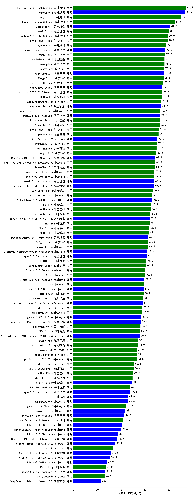

| 类别 | 大模型                         | CMB-医技考试 | 排名 |
|-----|------------------------------|---------|----|
|商用|hunyuan-turbos-20250226(new)|94.3|1|
|开源|hunyuan-large|93.7|2|
|商用|hunyuan-turbo|90.0|3|
|商用|Doubao-1.5-pro-32k-250115|84.8|4|
|开源|DeepSeek-R1|81.0|5|
|商用|qwen2.5-max|80.2|6|
|商用|Doubao-1.5-lite-32k-250115|79.0|7|
|商用|xunfei-spark-max|78.9|8|
|商用|hunyuan-standard|77.8|9|
|开源|qwen2.5-72b-instruct|77.0|10|
|商用|qwen-long|76.7|11|
|商用|kimi-latest-8k|76.3|12|
|商用|qwen-plus|76.3|13|
|商用|360gpt-pro|75.9|14|
|开源|qwq-32b(new)|75.8|15|
|商用|360gpt2-pro|75.6|16|
|商用|xunfei-4.0Ultra|75.3|17|
|开源|qwq-32b-preview|74.5|18|
|商用|qwq-plus-2025-03-05(new)|74.5|19|
|商用|GLM-4-Plus|74.3|20|
|商用|abab7-chat-preview|73.4|21|
|开源|deepseek-chat-v3|73.2|22|
|商用|gemini-2.0-pro-exp-02-05|72.7|23|
|开源|qwen2.5-32b-instruct|72.5|24|
|商用|Baichuan4-Turbo|72.5|25|
|商用|SenseChat-5-beta|72.2|26|
|商用|xunfei-spark-pro|71.6|27|
|商用|qwen-turbo|71.3|28|
|商用|MiniMax-Text-01|70.3|29|
|商用|360zhinao2-o1|70.0|30|
|商用|yi-lightning|69.6|31|
|商用|360gpt2-o1|69.5|32|
|开源|DeepSeek-R1-Distill-Qwen-32B|68.4|33|
|商用|gemini-2.0-flash-thinking-exp-01-21|68.3|34|
|商用|SenseChat-5-1202|68.2|35|
|商用|gemini-2.0-flash-exp|67.8|36|
|商用|gemini-2.0-flash-001|67.7|37|
|开源|qwen2.5-14b-instruct|67.5|38|
|开源|internlm2_5-20b-chat|67.5|39|
|商用|GLM-Zero-Preview|66.4|40|
|开源|Meta-Llama-3.1-405B-Instruct|66.0|41|
|商用|chatgpt-4o-latest|66.0|42|
|商用|GLM-4-Air|65.2|43|
|商用|GLM-4-AirX|64.6|44|
|商用|ERNIE-4.0-Turbo-8K|64.3|45|
|开源|internlm2_5-7b-chat|63.8|46|
|商用|ERNIE-4.0|63.8|47|
|商用|GLM-4-Flash|63.4|48|
|商用|GLM-4-Long|63.2|49|
|开源|DeepSeek-R1-Distill-Qwen-14B|62.6|50|
|商用|360gpt-turbo|62.5|51|
|商用|gemini-1.5-pro|62.4|52|
|开源|Llama-3.1-Nemotron-70B-Instruct-fp8|61.9|53|
|开源|qwen2.5-7b-instruct|61.4|54|
|商用|ERNIE-3.5-8K|61.0|55|
|商用|SenseChat-Turbo-1202|60.9|56|
|商用|Claude-3.5-Sonnet|60.3|57|
|商用|o3-mini|60.1|58|
|开源|Llama-3.3-70B-Instruct-fp8|59.5|59|
|商用|o1-mini|59.5|60|
|开源|Llama-3.3-70B-Instruct|59.1|61|
|商用|ERNIE-Speed-8K|58.8|62|
|商用|step-2-mini(new)|58.1|63|
|开源|Hermes-3-Llama-3.1-405B|57.9|64|
|商用|mistral-large|57.8|65|
|商用|gemini-1.5-flash|57.2|66|
|开源|gemma-3-27b-it(new)|57.0|67|
|开源|DeepSeek-R1-Distill-Llama-70B|56.4|68|
|商用|Baichuan4-Air|56.2|69|
|商用|ERNIE-Lite-8K|55.7|70|
|开源|Mistral-Small-24B-Instruct-2501(new)|55.5|71|
|商用|step-1-8k|54.1|72|
|商用|moonshot-v1-8k|53.9|73|
|商用|Baichuan4|53.0|74|
|商用|abab6.5s-chat|53.0|75|
|商用|gpt-4o-mini-2024-07-18|53.0|76|
|商用|mistral-small|50.8|77|
|商用|ERNIE-Speed-Pro-128K|50.4|78|
|商用|GLM-4-FlashX|49.7|79|
|商用|step-1-flash|49.5|80|
|开源|glm-4-9b-chat|49.4|81|
|商用|ERNIE-Lite-Pro-128K|47.5|82|
|开源|qwen2.5-3b-instruct|47.4|83|
|开源|phi-4|45.6|84|
|开源|gemma-2-27b-it|45.6|85|
|商用|gemini-1.5-flash-8b|44.4|86|
|开源|gemma-2-9b-it|43.4|87|
|开源|qwen2.5-1.5b-instruct|42.6|88|
|商用|xunfei-spark-lite(new)|41.5|89|
|开源|Llama-3.1-8B-Instruct|41.1|90|
|开源|Meta-Llama-3.1-8B-Instruct-fp8|39.6|91|
|开源|Llama-3.2-3B-Instruct|37.5|92|
|开源|DeepSeek-R1-Distill-Llama-8B|36.5|93|
|开源|Mistral-Nemo-Instruct-2407|35.1|94|
|商用|ministral-8b|33.5|95|
|开源|DeepSeek-R1-Distill-Qwen-7B|31.5|96|
|开源|Mistral-7B-Instruct-v0.3|30.5|97|
|开源|Llama-3.2-1B-Instruct|27.9|98|
|商用|ERNIE-Tiny-8K|27.0|99|
|开源|qwen2.5-0.5b-instruct|26.7|100|
|商用|ministral-3b|26.1|101|
|开源|DeepSeek-R1-Distill-Qwen-1.5B|23.1|102|
|开源|Yi-1.5-34B-Chat|/|103|
|开源|Yi-1.5-9B-Chat|/|104|
|开源|qwen2.5-math-72b-instruct|/|105|

