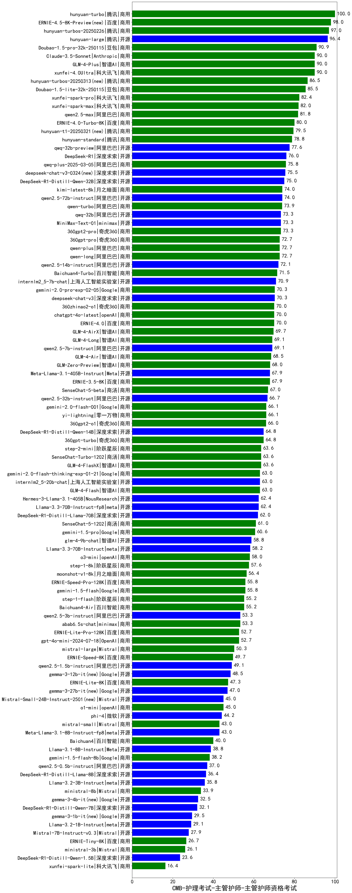

| 类别 | 大模型                         | CMB-护理考试-主管护师-主管护师资格考试 | 排名 |
|-----|------------------------------|---------|----|
|商用|hunyuan-turbo|100.0|1|
|商用|ERNIE-4.5-8K-Preview(new)|98.0|2|
|商用|hunyuan-turbos-20250226|97.0|3|
|开源|hunyuan-large|96.4|4|
|商用|Doubao-1.5-pro-32k-250115|90.9|5|
|商用|Claude-3.5-Sonnet|90.0|6|
|商用|xunfei-4.0Ultra|90.0|7|
|商用|GLM-4-Plus|90.0|8|
|商用|hunyuan-turbos-20250313(new)|86.5|9|
|商用|Doubao-1.5-lite-32k-250115|85.5|10|
|商用|xunfei-spark-pro|82.4|11|
|商用|xunfei-spark-max|82.0|12|
|商用|qwen2.5-max|81.8|13|
|商用|ERNIE-4.0-Turbo-8K|80.0|14|
|商用|hunyuan-t1-20250321(new)|79.5|15|
|商用|hunyuan-standard|78.8|16|
|开源|qwq-32b-preview|77.6|17|
|开源|DeepSeek-R1|76.0|18|
|商用|qwq-plus-2025-03-05|75.8|19|
|开源|deepseek-chat-v3-0324(new)|75.5|20|
|开源|DeepSeek-R1-Distill-Qwen-32B|75.0|21|
|商用|kimi-latest-8k|74.0|22|
|开源|qwen2.5-72b-instruct|74.0|23|
|商用|qwen-turbo|73.9|24|
|开源|qwq-32b|73.3|25|
|开源|MiniMax-Text-01|73.3|26|
|商用|360gpt2-pro|73.3|27|
|商用|360gpt-pro|72.7|28|
|商用|qwen-plus|72.7|29|
|商用|qwen-long|72.7|30|
|开源|qwen2.5-14b-instruct|72.1|31|
|商用|Baichuan4-Turbo|71.5|32|
|开源|internlm2_5-7b-chat|70.9|33|
|商用|abab7-chat-preview|70.3|34|
|开源|deepseek-chat-v3|70.3|35|
|商用|gemini-2.0-pro-exp-02-05|70.3|36|
|商用|chatgpt-4o-latest|70.0|37|
|商用|ERNIE-4.0|70.0|38|
|商用|360zhinao2-o1|70.0|39|
|商用|GLM-4-AirX|69.7|40|
|商用|GLM-4-Long|69.1|41|
|开源|qwen2.5-7b-instruct|69.1|42|
|商用|GLM-4-Air|68.5|43|
|商用|GLM-Zero-Preview|68.0|44|
|开源|Meta-Llama-3.1-405B-Instruct|67.9|45|
|商用|ERNIE-3.5-8K|67.9|46|
|开源|Llama-3.1-Nemotron-70B-Instruct-fp8|67.3|47|
|商用|SenseChat-5-beta|67.0|48|
|开源|qwen2.5-32b-instruct|66.7|49|
|商用|yi-lightning|66.1|50|
|商用|gemini-2.0-flash-001|66.1|51|
|商用|360gpt2-o1|66.0|52|
|商用|gemini-2.0-flash-exp|65.5|53|
|开源|DeepSeek-R1-Distill-Qwen-14B|64.8|54|
|商用|360gpt-turbo|64.8|55|
|商用|SenseChat-Turbo-1202|63.6|56|
|商用|GLM-4-FlashX|63.6|57|
|商用|step-2-mini|63.6|58|
|商用|GLM-4-Flash|63.0|59|
|开源|internlm2_5-20b-chat|63.0|60|
|商用|gemini-2.0-flash-thinking-exp-01-21|63.0|61|
|开源|Llama-3.3-70B-Instruct-fp8|62.4|62|
|开源|Hermes-3-Llama-3.1-405B|62.4|63|
|开源|DeepSeek-R1-Distill-Llama-70B|62.0|64|
|商用|SenseChat-5-1202|61.0|65|
|商用|gemini-1.5-pro|60.6|66|
|开源|glm-4-9b-chat|58.8|67|
|开源|Llama-3.3-70B-Instruct|58.2|68|
|商用|o3-mini|58.0|69|
|商用|step-1-8k|57.6|70|
|商用|moonshot-v1-8k|56.4|71|
|商用|gemini-1.5-flash|55.8|72|
|商用|ERNIE-Speed-Pro-128K|55.8|73|
|商用|Baichuan4-Air|55.2|74|
|商用|step-1-flash|55.2|75|
|开源|qwen2.5-3b-instruct|53.3|76|
|商用|abab6.5s-chat|53.3|77|
|商用|gpt-4o-mini-2024-07-18|52.7|78|
|商用|ERNIE-Lite-Pro-128K|52.7|79|
|商用|mistral-large|50.3|80|
|商用|ERNIE-Speed-8K|49.7|81|
|开源|qwen2.5-1.5b-instruct|49.1|82|
|开源|gemma-3-12b-it(new)|48.5|83|
|商用|ERNIE-Lite-8K|47.3|84|
|开源|gemma-3-27b-it(new)|47.0|85|
|商用|o1-mini|45.0|86|
|开源|Mistral-Small-24B-Instruct-2501(new)|45.0|87|
|开源|gemma-2-27b-it|44.2|88|
|开源|phi-4|44.2|89|
|商用|mistral-small|43.0|90|
|开源|Meta-Llama-3.1-8B-Instruct-fp8|43.0|91|
|开源|gemma-2-9b-it|41.8|92|
|商用|Baichuan4|40.0|93|
|开源|Llama-3.1-8B-Instruct|38.8|94|
|商用|gemini-1.5-flash-8b|38.2|95|
|开源|qwen2.5-0.5b-instruct|37.0|96|
|开源|DeepSeek-R1-Distill-Llama-8B|36.4|97|
|开源|Mistral-Nemo-Instruct-2407|35.8|98|
|开源|Llama-3.2-3B-Instruct|35.8|99|
|商用|ministral-8b|33.9|100|
|开源|gemma-3-4b-it(new)|32.5|101|
|开源|DeepSeek-R1-Distill-Qwen-7B|32.1|102|
|开源|gemma-3-1b-it(new)|29.5|103|
|开源|Llama-3.2-1B-Instruct|29.1|104|
|开源|Mistral-7B-Instruct-v0.3|27.9|105|
|商用|ERNIE-Tiny-8K|26.7|106|
|商用|ministral-3b|26.1|107|
|开源|DeepSeek-R1-Distill-Qwen-1.5B|23.6|108|
|商用|xunfei-spark-lite|16.4|109|
|开源|qwen2.5-math-72b-instruct|/|110|

