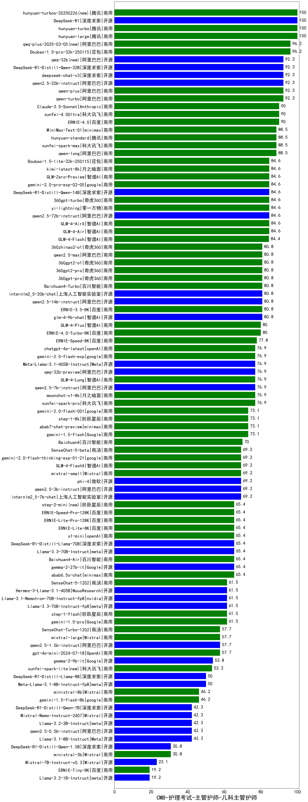

| 类别 | 大模型                         | CMB-护理考试-主管护师-儿科主管护师 | 排名 |
|-----|------------------------------|---------|----|
|开源|hunyuan-large|100.0|1|
|商用|hunyuan-turbo|100.0|2|
|商用|hunyuan-turbos-20250226(new)|100.0|3|
|开源|DeepSeek-R1|100.0|4|
|商用|qwq-plus-2025-03-05(new)|96.2|5|
|商用|Doubao-1.5-pro-32k-250115|96.2|6|
|开源|deepseek-chat-v3|92.3|7|
|商用|qwen-plus|92.3|8|
|商用|qwen-turbo|92.3|9|
|开源|qwen2.5-32b-instruct|92.3|10|
|开源|DeepSeek-R1-Distill-Qwen-32B|92.3|11|
|开源|qwq-32b(new)|92.3|12|
|商用|Claude-3.5-Sonnet|90.0|13|
|商用|xunfei-4.0Ultra|90.0|14|
|商用|ERNIE-4.0|90.0|15|
|商用|xunfei-spark-max|88.5|16|
|商用|qwen-long|88.5|17|
|开源|MiniMax-Text-01|88.5|18|
|商用|hunyuan-standard|88.5|19|
|商用|GLM-4-AirX|84.6|20|
|商用|yi-lightning|84.6|21|
|开源|qwen2.5-72b-instruct|84.6|22|
|商用|GLM-4-Air|84.6|23|
|商用|360gpt-turbo|84.6|24|
|开源|DeepSeek-R1-Distill-Qwen-14B|84.6|25|
|商用|GLM-Zero-Preview|84.6|26|
|商用|gemini-2.0-pro-exp-02-05|84.6|27|
|商用|kimi-latest-8k|84.6|28|
|商用|Doubao-1.5-lite-32k-250115|84.6|29|
|商用|GLM-4-Flash|84.4|30|
|商用|360gpt-pro|80.8|31|
|商用|Baichuan4-Turbo|80.8|32|
|开源|glm-4-9b-chat|80.8|33|
|商用|ERNIE-3.5-8K|80.8|34|
|开源|qwen2.5-14b-instruct|80.8|35|
|开源|internlm2_5-20b-chat|80.8|36|
|商用|360gpt2-pro|80.8|37|
|商用|qwen2.5-max|80.8|38|
|商用|360zhinao2-o1|80.8|39|
|商用|360gpt2-o1|80.8|40|
|商用|ERNIE-4.0-Turbo-8K|80.0|41|
|商用|GLM-4-Plus|80.0|42|
|商用|ERNIE-Speed-8K|77.8|43|
|开源|qwen2.5-7b-instruct|76.9|44|
|商用|xunfei-spark-pro|76.9|45|
|开源|Meta-Llama-3.1-405B-Instruct|76.9|46|
|商用|chatgpt-4o-latest|76.9|47|
|开源|qwq-32b-preview|76.9|48|
|商用|gemini-2.0-flash-exp|76.9|49|
|商用|moonshot-v1-8k|76.9|50|
|商用|GLM-4-Long|76.9|51|
|商用|gemini-2.0-flash-001|73.1|52|
|商用|step-1-8k|73.1|53|
|商用|abab7-chat-preview|73.1|54|
|商用|gemini-1.5-flash|73.1|55|
|商用|Baichuan4|70.0|56|
|开源|internlm2_5-7b-chat|69.2|57|
|商用|gemini-2.0-flash-thinking-exp-01-21|69.2|58|
|开源|qwen2.5-3b-instruct|69.2|59|
|商用|mistral-small|69.2|60|
|开源|phi-4|69.2|61|
|商用|GLM-4-FlashX|69.2|62|
|商用|SenseChat-5-beta|69.2|63|
|商用|step-2-mini(new)|65.4|64|
|商用|ERNIE-Lite-Pro-128K|65.4|65|
|商用|abab6.5s-chat|65.4|66|
|开源|gemma-2-27b-it|65.4|67|
|商用|Baichuan4-Air|65.4|68|
|商用|ERNIE-Speed-Pro-128K|65.4|69|
|商用|ERNIE-Lite-8K|65.4|70|
|开源|DeepSeek-R1-Distill-Llama-70B|65.4|71|
|商用|o1-mini|65.4|72|
|开源|Llama-3.3-70B-Instruct|65.4|73|
|商用|step-1-flash|61.5|74|
|商用|SenseChat-5-1202|61.5|75|
|开源|Hermes-3-Llama-3.1-405B|61.5|76|
|开源|Llama-3.1-Nemotron-70B-Instruct-fp8|61.5|77|
|开源|Llama-3.3-70B-Instruct-fp8|61.5|78|
|商用|gemini-1.5-pro|61.5|79|
|开源|qwen2.5-1.5b-instruct|57.7|80|
|商用|gpt-4o-mini-2024-07-18|57.7|81|
|商用|SenseChat-Turbo-1202|57.7|82|
|商用|mistral-large|57.7|83|
|开源|gemma-3-27b-it(new)|54.5|84|
|开源|gemma-2-9b-it|53.8|85|
|商用|xunfei-spark-lite(new)|53.3|86|
|开源|Mistral-Small-24B-Instruct-2501(new)|51.5|87|
|开源|Meta-Llama-3.1-8B-Instruct-fp8|50.0|88|
|开源|DeepSeek-R1-Distill-Llama-8B|50.0|89|
|商用|gemini-1.5-flash-8b|46.2|90|
|商用|ministral-8b|46.2|91|
|开源|Llama-3.1-8B-Instruct|42.3|92|
|开源|qwen2.5-0.5b-instruct|42.3|93|
|开源|Mistral-Nemo-Instruct-2407|42.3|94|
|开源|DeepSeek-R1-Distill-Qwen-7B|42.3|95|
|开源|Llama-3.2-3B-Instruct|42.3|96|
|商用|ministral-3b|30.8|97|
|开源|DeepSeek-R1-Distill-Qwen-1.5B|30.8|98|
|开源|Mistral-7B-Instruct-v0.3|23.1|99|
|商用|ERNIE-Tiny-8K|19.2|100|
|开源|Llama-3.2-1B-Instruct|19.2|101|
|开源|Yi-1.5-9B-Chat|/|102|
|开源|Yi-1.5-34B-Chat|/|103|
|开源|qwen2.5-math-72b-instruct|/|104|
|商用|o3-mini|/|105|

