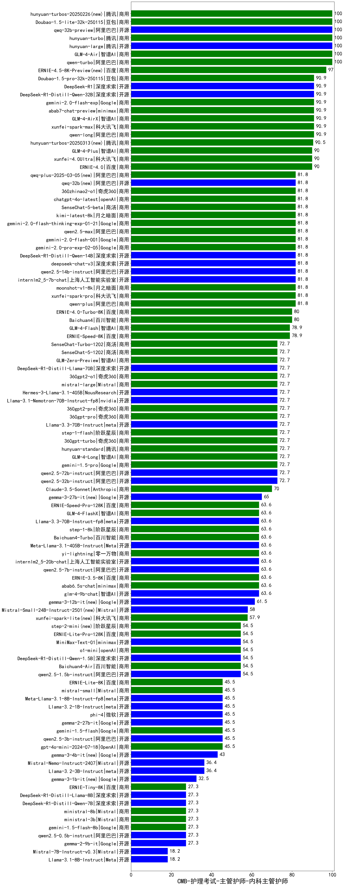

| 类别 | 大模型                         | CMB-护理考试-主管护师-内科主管护师 | 排名 |
|-----|------------------------------|---------|----|
|商用|qwen-turbo|100.0|1|
|商用|hunyuan-turbo|100.0|2|
|开源|hunyuan-large|100.0|3|
|商用|GLM-4-Air|100.0|4|
|开源|qwq-32b-preview|100.0|5|
|商用|hunyuan-turbos-20250226(new)|100.0|6|
|商用|Doubao-1.5-lite-32k-250115|100.0|7|
|商用|xunfei-spark-max|90.9|8|
|商用|qwen-long|90.9|9|
|商用|gemini-2.0-flash-exp|90.9|10|
|商用|Doubao-1.5-pro-32k-250115|90.9|11|
|开源|DeepSeek-R1-Distill-Qwen-32B|90.9|12|
|开源|DeepSeek-R1|90.9|13|
|商用|abab7-chat-preview|90.9|14|
|商用|GLM-4-AirX|90.9|15|
|商用|GLM-4-Plus|90.0|16|
|商用|xunfei-4.0Ultra|90.0|17|
|商用|ERNIE-4.0|90.0|18|
|开源|qwq-32b(new)|81.8|19|
|开源|deepseek-chat-v3|81.8|20|
|开源|internlm2_5-7b-chat|81.8|21|
|商用|moonshot-v1-8k|81.8|22|
|商用|xunfei-spark-pro|81.8|23|
|商用|qwen-plus|81.8|24|
|开源|qwen2.5-14b-instruct|81.8|25|
|商用|gemini-2.0-flash-thinking-exp-01-21|81.8|26|
|商用|SenseChat-5-beta|81.8|27|
|商用|kimi-latest-8k|81.8|28|
|商用|chatgpt-4o-latest|81.8|29|
|商用|qwen2.5-max|81.8|30|
|商用|gemini-2.0-pro-exp-02-05|81.8|31|
|开源|DeepSeek-R1-Distill-Qwen-14B|81.8|32|
|商用|gemini-2.0-flash-001|81.8|33|
|商用|360zhinao2-o1|81.8|34|
|商用|qwq-plus-2025-03-05(new)|81.8|35|
|商用|ERNIE-4.0-Turbo-8K|80.0|36|
|商用|Baichuan4|80.0|37|
|商用|GLM-4-Flash|78.9|38|
|商用|ERNIE-Speed-8K|78.9|39|
|开源|qwen2.5-72b-instruct|72.7|40|
|商用|gemini-1.5-pro|72.7|41|
|开源|qwen2.5-32b-instruct|72.7|42|
|商用|hunyuan-standard|72.7|43|
|商用|360gpt-turbo|72.7|44|
|商用|360gpt2-pro|72.7|45|
|开源|Llama-3.3-70B-Instruct|72.7|46|
|商用|360gpt-pro|72.7|47|
|商用|step-1-flash|72.7|48|
|商用|360gpt2-o1|72.7|49|
|开源|Llama-3.1-Nemotron-70B-Instruct-fp8|72.7|50|
|开源|Hermes-3-Llama-3.1-405B|72.7|51|
|商用|mistral-large|72.7|52|
|商用|GLM-Zero-Preview|72.7|53|
|商用|SenseChat-Turbo-1202|72.7|54|
|开源|DeepSeek-R1-Distill-Llama-70B|72.7|55|
|商用|SenseChat-5-1202|72.7|56|
|商用|GLM-4-Long|72.7|57|
|商用|Claude-3.5-Sonnet|70.0|58|
|开源|gemma-3-27b-it(new)|65.0|59|
|商用|step-1-8k|63.6|60|
|商用|Baichuan4-Turbo|63.6|61|
|开源|Llama-3.3-70B-Instruct-fp8|63.6|62|
|商用|ERNIE-Speed-Pro-128K|63.6|63|
|商用|GLM-4-FlashX|63.6|64|
|开源|Meta-Llama-3.1-405B-Instruct|63.6|65|
|商用|abab6.5s-chat|63.6|66|
|开源|qwen2.5-7b-instruct|63.6|67|
|商用|yi-lightning|63.6|68|
|开源|glm-4-9b-chat|63.6|69|
|开源|internlm2_5-20b-chat|63.6|70|
|商用|ERNIE-3.5-8K|63.6|71|
|开源|Mistral-Small-24B-Instruct-2501(new)|58.0|72|
|商用|xunfei-spark-lite(new)|57.9|73|
|开源|qwen2.5-1.5b-instruct|54.5|74|
|商用|ERNIE-Lite-Pro-128K|54.5|75|
|商用|o1-mini|54.5|76|
|商用|MiniMax-Text-01|54.5|77|
|商用|step-2-mini(new)|54.5|78|
|商用|Baichuan4-Air|54.5|79|
|开源|DeepSeek-R1-Distill-Qwen-1.5B|54.5|80|
|开源|qwen2.5-3b-instruct|45.5|81|
|开源|phi-4|45.5|82|
|开源|Meta-Llama-3.1-8B-Instruct-fp8|45.5|83|
|开源|Llama-3.2-1B-Instruct|45.5|84|
|商用|mistral-small|45.5|85|
|商用|ERNIE-Lite-8K|45.5|86|
|商用|gpt-4o-mini-2024-07-18|45.5|87|
|商用|gemini-1.5-flash|45.5|88|
|开源|gemma-2-27b-it|45.5|89|
|开源|Mistral-Nemo-Instruct-2407|36.4|90|
|开源|Llama-3.2-3B-Instruct|36.4|91|
|商用|ministral-3b|27.3|92|
|开源|qwen2.5-0.5b-instruct|27.3|93|
|开源|gemma-2-9b-it|27.3|94|
|开源|DeepSeek-R1-Distill-Qwen-7B|27.3|95|
|商用|ministral-8b|27.3|96|
|商用|gemini-1.5-flash-8b|27.3|97|
|商用|ERNIE-Tiny-8K|27.3|98|
|开源|DeepSeek-R1-Distill-Llama-8B|27.3|99|
|开源|Llama-3.1-8B-Instruct|18.2|100|
|开源|Mistral-7B-Instruct-v0.3|18.2|101|
|开源|Yi-1.5-9B-Chat|/|102|
|开源|Yi-1.5-34B-Chat|/|103|
|开源|qwen2.5-math-72b-instruct|/|104|
|商用|o3-mini|/|105|

