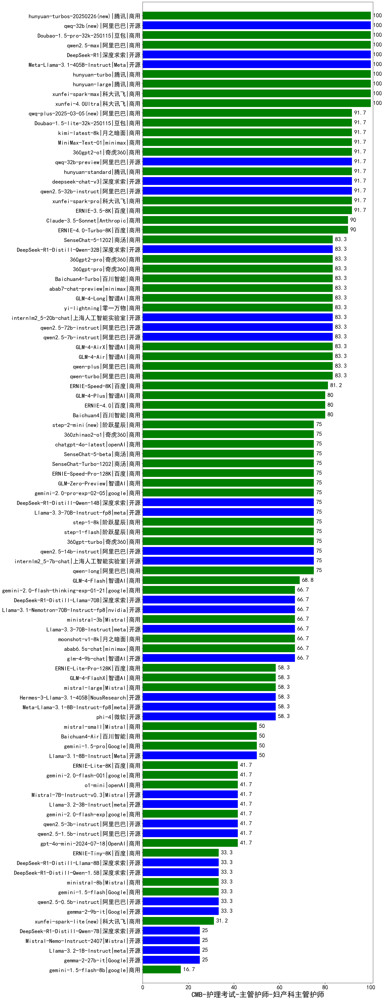

| 类别 | 大模型                         | CMB-护理考试-主管护师-妇产科主管护师 | 排名 |
|-----|------------------------------|---------|----|
|商用|xunfei-spark-max|100.0|1|
|商用|hunyuan-turbo|100.0|2|
|开源|hunyuan-large|100.0|3|
|商用|xunfei-4.0Ultra|100.0|4|
|商用|qwen2.5-max|100.0|5|
|开源|qwq-32b(new)|100.0|6|
|商用|hunyuan-turbos-20250226(new)|100.0|7|
|商用|Doubao-1.5-pro-32k-250115|100.0|8|
|开源|Meta-Llama-3.1-405B-Instruct|100.0|9|
|开源|DeepSeek-R1|100.0|10|
|商用|360gpt2-o1|91.7|11|
|开源|qwq-32b-preview|91.7|12|
|开源|deepseek-chat-v3|91.7|13|
|商用|kimi-latest-8k|91.7|14|
|开源|MiniMax-Text-01|91.7|15|
|商用|qwq-plus-2025-03-05(new)|91.7|16|
|商用|Doubao-1.5-lite-32k-250115|91.7|17|
|商用|xunfei-spark-pro|91.7|18|
|商用|ERNIE-3.5-8K|91.7|19|
|开源|qwen2.5-32b-instruct|91.7|20|
|商用|hunyuan-standard|91.7|21|
|商用|ERNIE-4.0-Turbo-8K|90.0|22|
|商用|Claude-3.5-Sonnet|90.0|23|
|开源|qwen2.5-7b-instruct|83.3|24|
|商用|yi-lightning|83.3|25|
|商用|360gpt2-pro|83.3|26|
|商用|Baichuan4-Turbo|83.3|27|
|商用|360gpt-pro|83.3|28|
|开源|internlm2_5-20b-chat|83.3|29|
|开源|qwen2.5-72b-instruct|83.3|30|
|商用|GLM-4-Air|83.3|31|
|商用|GLM-4-AirX|83.3|32|
|商用|qwen-plus|83.3|33|
|商用|qwen-turbo|83.3|34|
|商用|abab7-chat-preview|83.3|35|
|商用|GLM-4-Long|83.3|36|
|商用|SenseChat-5-1202|83.3|37|
|开源|DeepSeek-R1-Distill-Qwen-32B|83.3|38|
|商用|ERNIE-Speed-8K|81.2|39|
|商用|ERNIE-4.0|80.0|40|
|商用|GLM-4-Plus|80.0|41|
|商用|Baichuan4|80.0|42|
|商用|qwen-long|75.0|43|
|商用|gemini-2.0-pro-exp-02-05|75.0|44|
|商用|GLM-Zero-Preview|75.0|45|
|商用|chatgpt-4o-latest|75.0|46|
|开源|DeepSeek-R1-Distill-Qwen-14B|75.0|47|
|商用|ERNIE-Speed-Pro-128K|75.0|48|
|商用|360gpt-turbo|75.0|49|
|商用|step-1-8k|75.0|50|
|商用|step-1-flash|75.0|51|
|开源|Llama-3.3-70B-Instruct-fp8|75.0|52|
|商用|step-2-mini(new)|75.0|53|
|商用|360zhinao2-o1|75.0|54|
|商用|SenseChat-Turbo-1202|75.0|55|
|开源|qwen2.5-14b-instruct|75.0|56|
|开源|internlm2_5-7b-chat|75.0|57|
|商用|SenseChat-5-beta|75.0|58|
|商用|GLM-4-Flash|68.8|59|
|商用|gemini-2.0-flash-thinking-exp-01-21|66.7|60|
|商用|ministral-3b|66.7|61|
|商用|moonshot-v1-8k|66.7|62|
|开源|DeepSeek-R1-Distill-Llama-70B|66.7|63|
|开源|Llama-3.1-Nemotron-70B-Instruct-fp8|66.7|64|
|开源|Llama-3.3-70B-Instruct|66.7|65|
|商用|abab6.5s-chat|66.7|66|
|开源|glm-4-9b-chat|66.7|67|
|商用|mistral-large|58.3|68|
|开源|Meta-Llama-3.1-8B-Instruct-fp8|58.3|69|
|开源|Hermes-3-Llama-3.1-405B|58.3|70|
|开源|phi-4|58.3|71|
|商用|ERNIE-Lite-Pro-128K|58.3|72|
|商用|GLM-4-FlashX|58.3|73|
|开源|gemma-3-27b-it(new)|57.0|74|
|开源|Mistral-Small-24B-Instruct-2501(new)|51.0|75|
|商用|gemini-1.5-pro|50.0|76|
|开源|Llama-3.1-8B-Instruct|50.0|77|
|商用|mistral-small|50.0|78|
|商用|Baichuan4-Air|50.0|79|
|开源|qwen2.5-1.5b-instruct|41.7|80|
|开源|qwen2.5-3b-instruct|41.7|81|
|商用|gemini-2.0-flash-001|41.7|82|
|商用|gemini-2.0-flash-exp|41.7|83|
|商用|o1-mini|41.7|84|
|商用|ERNIE-Lite-8K|41.7|85|
|开源|Mistral-7B-Instruct-v0.3|41.7|86|
|商用|gpt-4o-mini-2024-07-18|41.7|87|
|开源|Llama-3.2-3B-Instruct|41.7|88|
|开源|gemma-2-9b-it|33.3|89|
|商用|ministral-8b|33.3|90|
|商用|ERNIE-Tiny-8K|33.3|91|
|商用|gemini-1.5-flash|33.3|92|
|开源|qwen2.5-0.5b-instruct|33.3|93|
|开源|DeepSeek-R1-Distill-Qwen-1.5B|33.3|94|
|开源|DeepSeek-R1-Distill-Llama-8B|33.3|95|
|商用|xunfei-spark-lite(new)|31.2|96|
|开源|gemma-2-27b-it|25.0|97|
|开源|DeepSeek-R1-Distill-Qwen-7B|25.0|98|
|开源|Mistral-Nemo-Instruct-2407|25.0|99|
|开源|Llama-3.2-1B-Instruct|25.0|100|
|商用|gemini-1.5-flash-8b|16.7|101|
|开源|Yi-1.5-9B-Chat|/|102|
|开源|Yi-1.5-34B-Chat|/|103|
|开源|qwen2.5-math-72b-instruct|/|104|
|商用|o3-mini|/|105|

