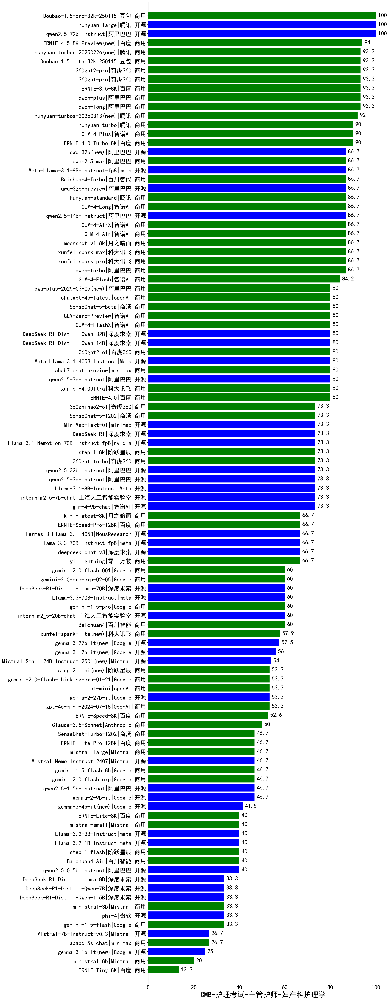

| 类别 | 大模型                         | CMB-护理考试-主管护师-妇产科护理学 | 排名 |
|-----|------------------------------|---------|----|
|开源|hunyuan-large|100.0|1|
|开源|qwen2.5-72b-instruct|100.0|2|
|商用|Doubao-1.5-pro-32k-250115|100.0|3|
|商用|qwen-plus|93.3|4|
|商用|ERNIE-3.5-8K|93.3|5|
|商用|360gpt2-pro|93.3|6|
|商用|Doubao-1.5-lite-32k-250115|93.3|7|
|商用|360gpt-pro|93.3|8|
|商用|qwen-long|93.3|9|
|商用|hunyuan-turbos-20250226(new)|93.3|10|
|商用|ERNIE-4.0-Turbo-8K|90.0|11|
|商用|GLM-4-Plus|90.0|12|
|商用|hunyuan-turbo|90.0|13|
|商用|moonshot-v1-8k|86.7|14|
|商用|hunyuan-standard|86.7|15|
|开源|qwen2.5-14b-instruct|86.7|16|
|商用|xunfei-spark-pro|86.7|17|
|商用|Baichuan4-Turbo|86.7|18|
|开源|qwq-32b-preview|86.7|19|
|开源|Meta-Llama-3.1-8B-Instruct-fp8|86.7|20|
|商用|GLM-4-Long|86.7|21|
|商用|GLM-4-AirX|86.7|22|
|商用|GLM-4-Air|86.7|23|
|商用|xunfei-spark-max|86.7|24|
|商用|qwen-turbo|86.7|25|
|开源|qwq-32b(new)|86.7|26|
|商用|qwen2.5-max|86.7|27|
|商用|GLM-4-Flash|84.2|28|
|商用|360gpt2-o1|80.0|29|
|商用|GLM-Zero-Preview|80.0|30|
|开源|DeepSeek-R1-Distill-Qwen-14B|80.0|31|
|开源|Meta-Llama-3.1-405B-Instruct|80.0|32|
|开源|DeepSeek-R1-Distill-Qwen-32B|80.0|33|
|商用|chatgpt-4o-latest|80.0|34|
|开源|qwen2.5-7b-instruct|80.0|35|
|商用|abab7-chat-preview|80.0|36|
|商用|ERNIE-4.0|80.0|37|
|商用|xunfei-4.0Ultra|80.0|38|
|商用|SenseChat-5-beta|80.0|39|
|商用|qwq-plus-2025-03-05(new)|80.0|40|
|商用|GLM-4-FlashX|80.0|41|
|开源|qwen2.5-3b-instruct|73.3|42|
|开源|internlm2_5-7b-chat|73.3|43|
|开源|glm-4-9b-chat|73.3|44|
|商用|SenseChat-5-1202|73.3|45|
|商用|360zhinao2-o1|73.3|46|
|开源|DeepSeek-R1|73.3|47|
|商用|MiniMax-Text-01|73.3|48|
|商用|360gpt-turbo|73.3|49|
|商用|step-1-8k|73.3|50|
|开源|Llama-3.1-Nemotron-70B-Instruct-fp8|73.3|51|
|开源|Llama-3.1-8B-Instruct|73.3|52|
|开源|qwen2.5-32b-instruct|73.3|53|
|商用|yi-lightning|66.7|54|
|开源|deepseek-chat-v3|66.7|55|
|开源|Llama-3.3-70B-Instruct-fp8|66.7|56|
|开源|Hermes-3-Llama-3.1-405B|66.7|57|
|商用|kimi-latest-8k|66.7|58|
|商用|ERNIE-Speed-Pro-128K|66.7|59|
|开源|internlm2_5-20b-chat|60.0|60|
|商用|Baichuan4|60.0|61|
|商用|gemini-2.0-pro-exp-02-05|60.0|62|
|开源|DeepSeek-R1-Distill-Llama-70B|60.0|63|
|开源|Llama-3.3-70B-Instruct|60.0|64|
|商用|gemini-2.0-flash-001|60.0|65|
|商用|gemini-1.5-pro|60.0|66|
|商用|xunfei-spark-lite(new)|57.9|67|
|开源|gemma-3-27b-it(new)|57.5|68|
|开源|Mistral-Small-24B-Instruct-2501(new)|54.0|69|
|商用|gpt-4o-mini-2024-07-18|53.3|70|
|商用|o1-mini|53.3|71|
|开源|gemma-2-27b-it|53.3|72|
|商用|gemini-2.0-flash-thinking-exp-01-21|53.3|73|
|商用|step-2-mini(new)|53.3|74|
|商用|ERNIE-Speed-8K|52.6|75|
|商用|Claude-3.5-Sonnet|50.0|76|
|商用|gemini-2.0-flash-exp|46.7|77|
|商用|SenseChat-Turbo-1202|46.7|78|
|开源|qwen2.5-1.5b-instruct|46.7|79|
|开源|gemma-2-9b-it|46.7|80|
|商用|ERNIE-Lite-Pro-128K|46.7|81|
|商用|mistral-large|46.7|82|
|开源|Mistral-Nemo-Instruct-2407|46.7|83|
|商用|gemini-1.5-flash-8b|46.7|84|
|开源|Llama-3.2-3B-Instruct|40.0|85|
|开源|qwen2.5-0.5b-instruct|40.0|86|
|商用|Baichuan4-Air|40.0|87|
|开源|Llama-3.2-1B-Instruct|40.0|88|
|商用|mistral-small|40.0|89|
|商用|step-1-flash|40.0|90|
|商用|ERNIE-Lite-8K|40.0|91|
|开源|DeepSeek-R1-Distill-Llama-8B|33.3|92|
|商用|gemini-1.5-flash|33.3|93|
|开源|DeepSeek-R1-Distill-Qwen-1.5B|33.3|94|
|商用|ministral-3b|33.3|95|
|开源|phi-4|33.3|96|
|开源|DeepSeek-R1-Distill-Qwen-7B|33.3|97|
|商用|abab6.5s-chat|26.7|98|
|开源|Mistral-7B-Instruct-v0.3|26.7|99|
|商用|ministral-8b|20.0|100|
|商用|ERNIE-Tiny-8K|13.3|101|
|开源|Yi-1.5-9B-Chat|/|102|
|开源|Yi-1.5-34B-Chat|/|103|
|开源|qwen2.5-math-72b-instruct|/|104|
|商用|o3-mini|/|105|

