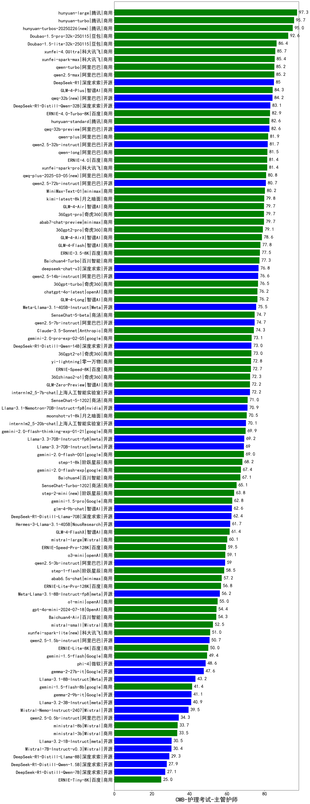

| 类别 | 大模型                         | CMB-护理考试-主管护师 | 排名 |
|-----|------------------------------|---------|----|
|商用|hunyuan-large|97.3|1|
|商用|hunyuan-turbo|95.7|2|
|商用|hunyuan-turbos-20250226(new)|95.0|3|
|商用|Doubao-1.5-pro-32k-250115|92.6|4|
|商用|Doubao-1.5-lite-32k-250115|86.4|5|
|商用|xunfei-4.0Ultra|85.7|6|
|商用|xunfei-spark-max|85.4|7|
|商用|qwen-turbo|85.2|8|
|商用|qwen2.5-max|85.2|9|
|开源|DeepSeek-R1|85.0|10|
|商用|GLM-4-Plus|84.3|11|
|开源|qwq-32b(new)|84.2|12|
|开源|DeepSeek-R1-Distill-Qwen-32B|83.1|13|
|商用|ERNIE-4.0-Turbo-8K|82.9|14|
|商用|hunyuan-standard|82.6|15|
|开源|qwq-32b-preview|82.6|16|
|商用|qwen-plus|81.9|17|
|开源|qwen2.5-32b-instruct|81.7|18|
|商用|qwen-long|81.5|19|
|商用|ERNIE-4.0|81.4|20|
|商用|xunfei-spark-pro|81.4|21|
|商用|qwq-plus-2025-03-05(new)|80.8|22|
|开源|qwen2.5-72b-instruct|80.7|23|
|商用|MiniMax-Text-01|80.2|24|
|商用|kimi-latest-8k|79.8|25|
|商用|GLM-4-Air|79.7|26|
|商用|360gpt-pro|79.7|27|
|商用|abab7-chat-preview|79.7|28|
|商用|360gpt2-pro|79.1|29|
|商用|GLM-4-AirX|78.6|30|
|商用|GLM-4-Flash|77.8|31|
|商用|ERNIE-3.5-8K|77.5|32|
|商用|Baichuan4-Turbo|77.3|33|
|开源|deepseek-chat-v3|76.8|34|
|开源|qwen2.5-14b-instruct|76.6|35|
|商用|360gpt-turbo|76.5|36|
|商用|GLM-4-Long|76.2|37|
|商用|chatgpt-4o-latest|76.2|38|
|开源|Meta-Llama-3.1-405B-Instruct|75.5|39|
|商用|SenseChat-5-beta|74.7|40|
|开源|qwen2.5-7b-instruct|74.7|41|
|商用|Claude-3.5-Sonnet|74.3|42|
|商用|gemini-2.0-pro-exp-02-05|73.1|43|
|开源|DeepSeek-R1-Distill-Qwen-14B|73.0|44|
|商用|360gpt2-o1|73.0|45|
|商用|yi-lightning|72.8|46|
|商用|ERNIE-Speed-8K|72.7|47|
|商用|360zhinao2-o1|72.3|48|
|商用|GLM-Zero-Preview|72.2|49|
|开源|internlm2_5-7b-chat|72.2|50|
|商用|SenseChat-5-1202|71.0|51|
|开源|Llama-3.1-Nemotron-70B-Instruct-fp8|70.9|52|
|商用|moonshot-v1-8k|70.5|53|
|开源|internlm2_5-20b-chat|70.1|54|
|商用|gemini-2.0-flash-thinking-exp-01-21|69.9|55|
|开源|Llama-3.3-70B-Instruct-fp8|69.2|56|
|开源|Llama-3.3-70B-Instruct|69.0|57|
|商用|gemini-2.0-flash-001|69.0|58|
|商用|step-1-8k|68.2|59|
|商用|gemini-2.0-flash-exp|67.4|60|
|商用|Baichuan4|67.1|61|
|商用|SenseChat-Turbo-1202|65.1|62|
|商用|step-2-mini(new)|63.8|63|
|商用|gemini-1.5-pro|62.8|64|
|开源|glm-4-9b-chat|62.6|65|
|开源|DeepSeek-R1-Distill-Llama-70B|62.4|66|
|开源|Hermes-3-Llama-3.1-405B|61.7|67|
|商用|GLM-4-FlashX|61.4|68|
|商用|mistral-large|60.1|69|
|商用|ERNIE-Speed-Pro-128K|59.5|70|
|商用|o3-mini|59.1|71|
|开源|qwen2.5-3b-instruct|59.0|72|
|商用|step-1-flash|58.5|73|
|商用|abab6.5s-chat|57.2|74|
|商用|ERNIE-Lite-Pro-128K|56.8|75|
|开源|Meta-Llama-3.1-8B-Instruct-fp8|56.2|76|
|商用|o1-mini|55.0|77|
|商用|gpt-4o-mini-2024-07-18|54.4|78|
|商用|Baichuan4-Air|54.3|79|
|商用|mistral-small|52.5|80|
|商用|xunfei-spark-lite(new)|51.0|81|
|开源|qwen2.5-1.5b-instruct|50.7|82|
|商用|ERNIE-Lite-8K|50.0|83|
|商用|gemini-1.5-flash|49.4|84|
|开源|phi-4|48.6|85|
|开源|gemma-2-27b-it|47.6|86|
|开源|Llama-3.1-8B-Instruct|43.2|87|
|商用|gemini-1.5-flash-8b|41.4|88|
|开源|gemma-2-9b-it|41.1|89|
|开源|Llama-3.2-3B-Instruct|40.9|90|
|开源|Mistral-Nemo-Instruct-2407|39.5|91|
|开源|qwen2.5-0.5b-instruct|34.3|92|
|商用|ministral-8b|33.7|93|
|商用|ministral-3b|33.5|94|
|开源|Llama-3.2-1B-Instruct|30.5|95|
|开源|Mistral-7B-Instruct-v0.3|30.4|96|
|开源|DeepSeek-R1-Distill-Llama-8B|29.3|97|
|开源|DeepSeek-R1-Distill-Qwen-1.5B|27.9|98|
|开源|DeepSeek-R1-Distill-Qwen-7B|27.1|99|
|商用|ERNIE-Tiny-8K|25.0|100|
|开源|Yi-1.5-9B-Chat|/|101|
|开源|Yi-1.5-34B-Chat|/|102|
|开源|qwen2.5-math-72b-instruct|/|103|

