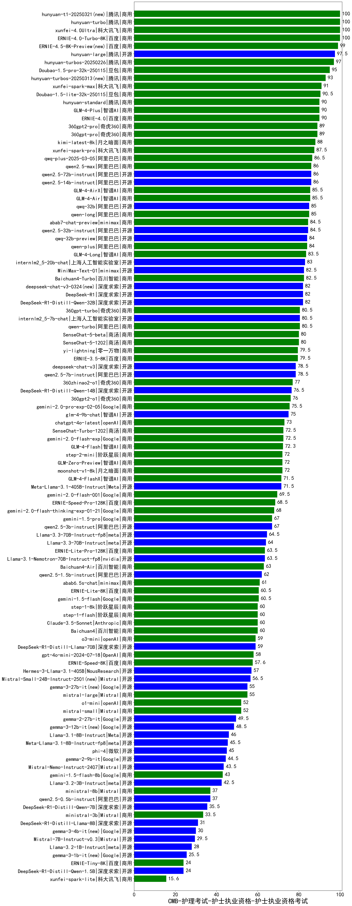

| 类别 | 大模型                         | CMB-护理考试-护士执业资格-护士执业资格考试 | 排名 |
|-----|------------------------------|---------|----|
|商用|ERNIE-4.0-Turbo-8K|100.0|1|
|商用|xunfei-4.0Ultra|100.0|2|
|商用|hunyuan-turbo|100.0|3|
|开源|DeepSeek-R1|100.0|4|
|开源|hunyuan-large|97.5|5|
|商用|hunyuan-turbos-20250226(new)|97.0|6|
|商用|Doubao-1.5-pro-32k-250115|95.0|7|
|商用|xunfei-spark-max|91.0|8|
|商用|Doubao-1.5-lite-32k-250115|90.5|9|
|商用|ERNIE-4.0|90.0|10|
|商用|GLM-4-Plus|90.0|11|
|商用|hunyuan-standard|90.0|12|
|商用|360gpt-pro|89.0|13|
|商用|360gpt2-pro|89.0|14|
|商用|kimi-latest-8k|88.0|15|
|商用|qwq-plus-2025-03-05(new)|87.6|16|
|商用|xunfei-spark-pro|87.5|17|
|开源|qwen2.5-72b-instruct|86.0|18|
|开源|qwen2.5-14b-instruct|86.0|19|
|商用|qwen2.5-max|86.0|20|
|商用|GLM-4-AirX|85.5|21|
|商用|GLM-4-Air|85.5|22|
|商用|qwen-long|85.0|23|
|开源|qwq-32b(new)|85.0|24|
|商用|GLM-4-Flash|84.9|25|
|商用|abab7-chat-preview|84.5|26|
|开源|qwen2.5-32b-instruct|84.5|27|
|商用|qwen-plus|84.0|28|
|开源|qwq-32b-preview|84.0|29|
|商用|GLM-4-Long|83.5|30|
|开源|internlm2_5-20b-chat|83.0|31|
|商用|Baichuan4-Turbo|82.5|32|
|商用|MiniMax-Text-01|82.5|33|
|开源|DeepSeek-R1-Distill-Qwen-32B|82.0|34|
|商用|360gpt-turbo|80.5|35|
|商用|qwen-turbo|80.5|36|
|开源|internlm2_5-7b-chat|80.5|37|
|商用|SenseChat-5-beta|80.0|38|
|商用|SenseChat-5-1202|80.0|39|
|商用|ERNIE-3.5-8K|79.5|40|
|商用|yi-lightning|79.5|41|
|开源|qwen2.5-7b-instruct|78.5|42|
|开源|deepseek-chat-v3|78.5|43|
|商用|360zhinao2-o1|77.0|44|
|商用|ERNIE-Speed-8K|76.8|45|
|开源|DeepSeek-R1-Distill-Qwen-14B|76.5|46|
|商用|360gpt2-o1|76.0|47|
|商用|gemini-2.0-pro-exp-02-05|75.5|48|
|开源|glm-4-9b-chat|75.0|49|
|商用|chatgpt-4o-latest|73.0|50|
|商用|gemini-2.0-flash-exp|72.5|51|
|商用|SenseChat-Turbo-1202|72.5|52|
|商用|GLM-Zero-Preview|72.0|53|
|商用|moonshot-v1-8k|72.0|54|
|商用|step-2-mini(new)|72.0|55|
|商用|GLM-4-FlashX|71.5|56|
|开源|Meta-Llama-3.1-405B-Instruct|71.5|57|
|商用|gemini-2.0-flash-001|69.5|58|
|商用|ERNIE-Speed-Pro-128K|68.5|59|
|商用|gemini-2.0-flash-thinking-exp-01-21|68.0|60|
|商用|gemini-1.5-pro|67.0|61|
|开源|qwen2.5-3b-instruct|67.0|62|
|开源|Llama-3.3-70B-Instruct-fp8|64.5|63|
|开源|Llama-3.3-70B-Instruct|64.0|64|
|开源|Llama-3.1-Nemotron-70B-Instruct-fp8|63.5|65|
|商用|ERNIE-Lite-Pro-128K|63.5|66|
|商用|Baichuan4-Air|63.0|67|
|开源|qwen2.5-1.5b-instruct|62.0|68|
|商用|abab6.5s-chat|61.0|69|
|商用|ERNIE-Lite-8K|60.5|70|
|商用|gemini-1.5-flash|60.5|71|
|商用|Baichuan4|60.0|72|
|商用|step-1-8k|60.0|73|
|商用|step-1-flash|60.0|74|
|商用|Claude-3.5-Sonnet|60.0|75|
|开源|DeepSeek-R1-Distill-Llama-70B|59.0|76|
|商用|gpt-4o-mini-2024-07-18|58.0|77|
|开源|Hermes-3-Llama-3.1-405B|57.0|78|
|开源|Mistral-Small-24B-Instruct-2501(new)|56.5|79|
|商用|mistral-large|55.0|80|
|开源|gemma-3-27b-it(new)|55.0|81|
|商用|xunfei-spark-lite(new)|53.9|82|
|商用|mistral-small|52.0|83|
|商用|o1-mini|52.0|84|
|开源|gemma-2-27b-it|49.5|85|
|开源|Llama-3.1-8B-Instruct|46.0|86|
|开源|Meta-Llama-3.1-8B-Instruct-fp8|45.5|87|
|开源|phi-4|45.0|88|
|开源|gemma-2-9b-it|44.5|89|
|开源|Mistral-Nemo-Instruct-2407|43.5|90|
|商用|gemini-1.5-flash-8b|43.0|91|
|开源|Llama-3.2-3B-Instruct|42.5|92|
|开源|qwen2.5-0.5b-instruct|37.0|93|
|商用|ministral-8b|37.0|94|
|开源|DeepSeek-R1-Distill-Qwen-7B|35.5|95|
|商用|ministral-3b|33.5|96|
|开源|DeepSeek-R1-Distill-Llama-8B|31.0|97|
|开源|Mistral-7B-Instruct-v0.3|29.5|98|
|开源|Llama-3.2-1B-Instruct|28.0|99|
|商用|ERNIE-Tiny-8K|24.0|100|
|开源|DeepSeek-R1-Distill-Qwen-1.5B|24.0|101|
|开源|Yi-1.5-9B-Chat|/|102|
|开源|Yi-1.5-34B-Chat|/|103|
|开源|qwen2.5-math-72b-instruct|/|104|
|商用|o3-mini|/|105|

