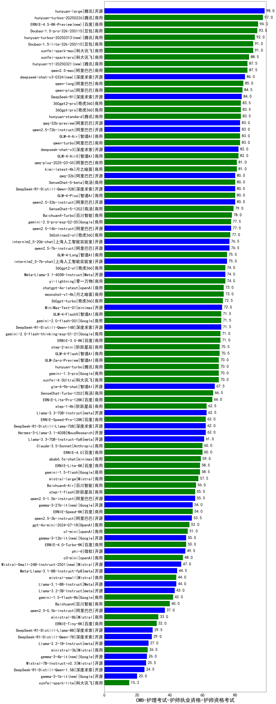

| 类别 | 大模型                         | CMB-护理考试-护师执业资格-护师资格考试 | 排名 |
|-----|------------------------------|---------|----|
|开源|DeepSeek-R1|100.0|1|
|商用|hunyuan-large|98.0|2|
|商用|hunyuan-turbos-20250226(new)|97.0|3|
|商用|Doubao-1.5-pro-32k-250115|93.5|4|
|商用|xunfei-spark-max|91.0|5|
|商用|Doubao-1.5-lite-32k-250115|91.0|6|
|商用|xunfei-spark-pro|88.5|7|
|商用|qwen2.5-max|87.5|8|
|商用|qwen-long|85.0|9|
|商用|qwen-plus|84.5|10|
|商用|360gpt2-pro|83.5|11|
|商用|360gpt-pro|83.5|12|
|商用|hunyuan-standard|83.5|13|
|商用|GLM-4-Air|83.0|14|
|开源|qwq-32b-preview|83.0|15|
|开源|qwen2.5-72b-instruct|83.0|16|
|商用|qwen-turbo|83.0|17|
|商用|GLM-4-Flash|82.9|18|
|商用|GLM-4-AirX|82.0|19|
|开源|deepseek-chat-v3|82.0|20|
|商用|qwq-plus-2025-03-05(new)|81.0|21|
|商用|kimi-latest-8k|81.0|22|
|开源|qwen2.5-32b-instruct|80.0|23|
|开源|DeepSeek-R1-Distill-Qwen-32B|80.0|24|
|商用|GLM-4-Plus|80.0|25|
|开源|qwq-32b(new)|80.0|26|
|商用|SenseChat-5-beta|80.0|27|
|商用|SenseChat-5-1202|79.0|28|
|商用|abab7-chat-preview|78.5|29|
|商用|Baichuan4-Turbo|78.0|30|
|开源|qwen2.5-14b-instruct|77.5|31|
|商用|gemini-2.0-pro-exp-02-05|77.5|32|
|商用|360zhinao2-o1|77.0|33|
|开源|qwen2.5-7b-instruct|76.5|34|
|开源|internlm2_5-20b-chat|76.5|35|
|开源|internlm2_5-7b-chat|75.0|36|
|商用|GLM-4-Long|75.0|37|
|商用|yi-lightning|74.0|38|
|商用|360gpt2-o1|74.0|39|
|开源|Meta-Llama-3.1-405B-Instruct|74.0|40|
|商用|ERNIE-Speed-8K|73.4|41|
|商用|chatgpt-4o-latest|73.0|42|
|商用|moonshot-v1-8k|73.0|43|
|商用|360gpt-turbo|72.5|44|
|商用|MiniMax-Text-01|72.0|45|
|开源|DeepSeek-R1-Distill-Qwen-14B|71.5|46|
|商用|gemini-2.0-flash-001|71.5|47|
|商用|GLM-4-FlashX|71.5|48|
|商用|ERNIE-3.5-8K|71.0|49|
|商用|gemini-2.0-flash-thinking-exp-01-21|71.0|50|
|商用|gemini-2.0-flash-exp|70.5|51|
|商用|step-2-mini(new)|70.5|52|
|商用|hunyuan-turbo|70.0|53|
|商用|gemini-1.5-pro|70.0|54|
|商用|xunfei-4.0Ultra|70.0|55|
|商用|GLM-Zero-Preview|70.0|56|
|开源|glm-4-9b-chat|67.5|57|
|商用|SenseChat-Turbo-1202|66.5|58|
|商用|ERNIE-Lite-Pro-128K|66.0|59|
|开源|Llama-3.1-Nemotron-70B-Instruct-fp8|63.0|60|
|开源|Llama-3.3-70B-Instruct|62.5|61|
|商用|step-1-8k|62.5|62|
|商用|ERNIE-Speed-Pro-128K|62.0|63|
|开源|Hermes-3-Llama-3.1-405B|62.0|64|
|开源|DeepSeek-R1-Distill-Llama-70B|62.0|65|
|开源|Llama-3.3-70B-Instruct-fp8|61.0|66|
|商用|Claude-3.5-Sonnet|60.0|67|
|商用|ERNIE-4.0|60.0|68|
|商用|abab6.5s-chat|59.0|69|
|商用|gemini-1.5-flash|58.5|70|
|商用|ERNIE-Lite-8K|58.5|71|
|商用|mistral-large|57.5|72|
|商用|Baichuan4-Air|56.0|73|
|商用|step-1-flash|55.5|74|
|开源|qwen2.5-1.5b-instruct|55.5|75|
|开源|qwen2.5-3b-instruct|53.5|76|
|商用|gpt-4o-mini-2024-07-18|52.0|77|
|商用|xunfei-spark-lite(new)|51.0|78|
|商用|o1-mini|51.0|79|
|商用|ERNIE-4.0-Turbo-8K|50.0|80|
|开源|phi-4|49.5|81|
|开源|gemma-2-27b-it|49.0|82|
|开源|Meta-Llama-3.1-8B-Instruct-fp8|44.5|83|
|商用|mistral-small|44.0|84|
|开源|Llama-3.1-8B-Instruct|44.0|85|
|开源|Llama-3.2-3B-Instruct|43.0|86|
|商用|gemini-1.5-flash-8b|42.0|87|
|开源|gemma-2-9b-it|41.5|88|
|商用|Baichuan4|40.0|89|
|开源|qwen2.5-0.5b-instruct|37.0|90|
|开源|Mistral-Nemo-Instruct-2407|37.0|91|
|商用|ministral-8b|33.0|92|
|商用|ERNIE-Tiny-8K|32.0|93|
|开源|DeepSeek-R1-Distill-Llama-8B|29.5|94|
|开源|DeepSeek-R1-Distill-Qwen-7B|29.0|95|
|开源|Llama-3.2-1B-Instruct|27.0|96|
|商用|ministral-3b|26.5|97|
|开源|Mistral-7B-Instruct-v0.3|25.5|98|
|开源|DeepSeek-R1-Distill-Qwen-1.5B|24.5|99|
|开源|Yi-1.5-34B-Chat|/|100|
|开源|Yi-1.5-9B-Chat|/|101|
|开源|qwen2.5-math-72b-instruct|/|102|
|商用|o3-mini|/|103|

