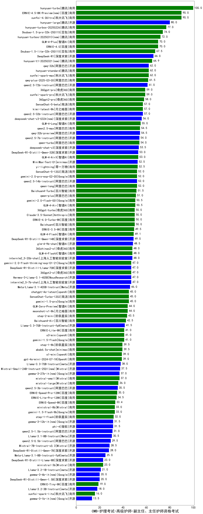

| 类别 | 大模型                         | CMB-护理考试-高级护师-副主任、主任护师资格考试 | 排名 |
|-----|------------------------------|---------|----|
|商用|hunyuan-turbo|100.0|1|
|商用|xunfei-4.0Ultra|90.0|2|
|商用|ERNIE-4.5-8K-Preview(new)|90.0|3|
|开源|hunyuan-large|80.0|4|
|商用|hunyuan-turbos-20250226|77.0|5|
|商用|Doubao-1.5-pro-32k-250115|74.0|6|
|商用|hunyuan-turbos-20250313(new)|72.0|7|
|商用|ERNIE-4.0|70.0|8|
|商用|GLM-4-Plus|70.0|9|
|商用|Doubao-1.5-lite-32k-250115|67.5|10|
|开源|DeepSeek-R1|66.0|11|
|商用|hunyuan-t1-20250321(new)|64.9|12|
|开源|qwq-32b|62.0|13|
|商用|hunyuan-standard|62.0|14|
|商用|xunfei-spark-max|62.0|15|
|商用|qwq-plus-2025-03-05|61.5|16|
|开源|qwen2.5-72b-instruct|61.0|17|
|商用|360gpt-pro|59.0|18|
|商用|xunfei-spark-pro|59.0|19|
|商用|360gpt2-pro|58.0|20|
|商用|SenseChat-5-beta|57.0|21|
|开源|qwen2.5-32b-instruct|57.0|22|
|商用|kimi-latest-8k|57.0|23|
|开源|deepseek-chat-v3-0324(new)|56.0|24|
|商用|GLM-4-Long|55.0|25|
|开源|qwq-32b-preview|54.5|26|
|商用|qwen2.5-max|54.5|27|
|商用|qwen-turbo|54.0|28|
|开源|qwen2.5-7b-instruct|54.0|29|
|开源|deepseek-chat-v3|53.5|30|
|开源|DeepSeek-R1-Distill-Qwen-32B|53.0|31|
|商用|GLM-4-AirX|53.0|32|
|商用|yi-lightning|52.5|33|
|开源|MiniMax-Text-01|52.5|34|
|开源|qwen2.5-14b-instruct|52.0|35|
|商用|gemini-2.0-pro-exp-02-05|52.0|36|
|商用|SenseChat-5-1202|52.0|37|
|商用|qwen-long|52.0|38|
|商用|Baichuan4-Turbo|51.5|39|
|商用|qwen-plus|51.0|40|
|商用|gemini-2.0-flash-001|50.5|41|
|商用|GLM-4-Air|50.5|42|
|商用|ERNIE-4.0-Turbo-8K|50.0|43|
|商用|Baichuan4|50.0|44|
|商用|360gpt-turbo|50.0|45|
|商用|Claude-3.5-Sonnet|50.0|46|
|商用|ERNIE-3.5-8K|49.5|47|
|商用|GLM-4-Flash|49.1|48|
|开源|DeepSeek-R1-Distill-Qwen-14B|49.0|49|
|开源|glm-4-9b-chat|48.5|50|
|商用|GLM-4-FlashX|48.0|51|
|开源|internlm2_5-20b-chat|48.0|52|
|商用|360zhinao2-o1|48.0|53|
|商用|360gpt2-o1|47.0|54|
|开源|internlm2_5-7b-chat|47.0|55|
|商用|gemini-2.0-flash-thinking-exp-01-21|47.0|56|
|开源|Hermes-3-Llama-3.1-405B|47.0|57|
|开源|DeepSeek-R1-Distill-Llama-70B|47.0|58|
|开源|Meta-Llama-3.1-405B-Instruct|46.0|59|
|商用|chatgpt-4o-latest|45.0|60|
|商用|gemini-1.5-pro|45.0|61|
|商用|SenseChat-Turbo-1202|45.0|62|
|商用|GLM-Zero-Preview|44.0|63|
|商用|moonshot-v1-8k|44.0|64|
|商用|step-2-mini|43.5|65|
|商用|Baichuan4-Air|42.5|66|
|开源|Llama-3.3-70B-Instruct-fp8|41.5|67|
|商用|ERNIE-Lite-8K|41.0|68|
|商用|o3-mini|41.0|69|
|商用|gemini-1.5-flash|41.0|70|
|商用|abab6.5s-chat|39.5|71|
|商用|step-1-8k|39.5|72|
|商用|gpt-4o-mini-2024-07-18|39.0|73|
|商用|o1-mini|39.0|74|
|开源|Llama-3.3-70B-Instruct|38.0|75|
|开源|Mistral-Small-24B-Instruct-2501(new)|37.5|76|
|开源|gemma-3-27b-it(new)|37.0|77|
|商用|mistral-small|37.0|78|
|商用|mistral-large|36.0|79|
|开源|qwen2.5-3b-instruct|35.5|80|
|商用|ERNIE-Speed-Pro-128K|35.0|81|
|商用|ERNIE-Lite-Pro-128K|34.5|82|
|商用|ERNIE-Speed-8K|33.4|83|
|商用|ministral-8b|33.0|84|
|商用|gemini-1.5-flash-8b|33.0|85|
|商用|step-1-flash|32.0|86|
|开源|phi-4|31.5|87|
|开源|gemma-3-12b-it(new)|31.5|88|
|开源|qwen2.5-1.5b-instruct|31.0|89|
|开源|Llama-3.1-8B-Instruct|30.5|90|
|开源|qwen2.5-0.5b-instruct|29.5|91|
|开源|Mistral-7B-Instruct-v0.3|28.5|92|
|开源|DeepSeek-R1-Distill-Qwen-7B|28.0|93|
|开源|Meta-Llama-3.1-8B-Instruct-fp8|25.0|94|
|商用|ministral-3b|23.0|95|
|开源|DeepSeek-R1-Distill-Llama-8B|23.0|96|
|开源|Llama-3.2-1B-Instruct|21.0|97|
|开源|gemma-3-4b-it(new)|20.0|98|
|开源|DeepSeek-R1-Distill-Qwen-1.5B|20.0|99|
|商用|ERNIE-Tiny-8K|19.0|100|
|开源|Llama-3.2-3B-Instruct|18.0|101|
|商用|xunfei-spark-lite|16.0|102|
|开源|gemma-3-1b-it(new)|13.5|103|

