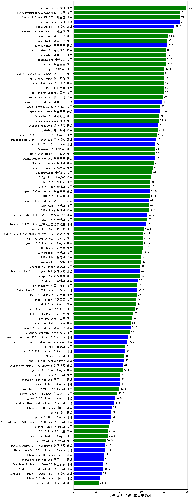

| 类别 | 大模型                         | CMB-药师考试-主管中药师 | 排名 |
|-----|------------------------------|---------|----|
|商用|hunyuan-turbo|100.0|1|
|商用|ERNIE-4.5-8K-Preview(new)|99.0|2|
|商用|Doubao-1.5-pro-32k-250115|94.5|3|
|商用|hunyuan-turbos-20250226|94.5|4|
|开源|hunyuan-large|94.0|5|
|商用|hunyuan-turbos-20250313(new)|93.5|6|
|商用|hunyuan-t1-20250321(new)|90.3|7|
|开源|DeepSeek-R1|90.0|8|
|商用|Doubao-1.5-lite-32k-250115|88.5|9|
|商用|qwen2.5-max|83.5|10|
|商用|qwen-turbo|83.0|11|
|开源|qwq-32b|82.5|12|
|商用|kimi-latest-8k|82.0|13|
|商用|qwen-plus|82.0|14|
|商用|360gpt2-pro|81.5|15|
|开源|deepseek-chat-v3-0324(new)|81.5|16|
|商用|qwen-long|81.5|17|
|商用|360gpt-pro|80.5|18|
|商用|xunfei-spark-max|80.0|19|
|商用|xunfei-4.0Ultra|80.0|20|
|商用|qwq-plus-2025-03-05|80.0|21|
|商用|ERNIE-4.0|80.0|22|
|商用|ERNIE-4.0-Turbo-8K|80.0|23|
|商用|xunfei-spark-pro|79.0|24|
|开源|qwen2.5-72b-instruct|78.0|25|
|商用|abab7-chat-preview|77.0|26|
|开源|qwq-32b-preview|76.5|27|
|商用|SenseChat-5-beta|76.0|28|
|商用|hunyuan-standard|75.5|29|
|开源|deepseek-chat-v3|75.0|30|
|商用|yi-lightning|74.5|31|
|商用|gemini-2.0-pro-exp-02-05|73.5|32|
|开源|DeepSeek-R1-Distill-Qwen-32B|73.0|33|
|开源|MiniMax-Text-01|72.5|34|
|开源|qwen2.5-32b-instruct|72.0|35|
|商用|360zhinao2-o1|72.0|36|
|商用|Baichuan4-Turbo|72.0|37|
|商用|GLM-Zero-Preview|71.0|38|
|商用|step-2-mini|70.0|39|
|商用|360gpt-turbo|69.5|40|
|商用|360gpt2-o1|69.0|41|
|商用|SenseChat-5-1202|68.0|42|
|开源|qwen2.5-7b-instruct|67.5|43|
|商用|ERNIE-3.5-8K|67.5|44|
|开源|qwen2.5-14b-instruct|67.0|45|
|商用|GLM-4-AirX|67.0|46|
|商用|GLM-4-Long|66.5|47|
|开源|internlm2_5-20b-chat|65.5|48|
|商用|GLM-4-Air|65.5|49|
|开源|internlm2_5-7b-chat|64.5|50|
|商用|moonshot-v1-8k|62.5|51|
|商用|gemini-2.0-flash-001|61.5|52|
|商用|gemini-2.0-flash-exp|61.5|53|
|商用|gemini-2.0-flash-thinking-exp-01-21|61.5|54|
|商用|GLM-4-FlashX|60.5|55|
|商用|Baichuan4|60.0|56|
|商用|GLM-4-Plus|60.0|57|
|商用|step-1-8k|59.0|58|
|商用|chatgpt-4o-latest|59.0|59|
|开源|DeepSeek-R1-Distill-Qwen-14B|59.0|60|
|开源|glm-4-9b-chat|57.0|61|
|商用|GLM-4-Flash|56.8|62|
|商用|Baichuan4-Air|56.5|63|
|开源|Meta-Llama-3.1-405B-Instruct|56.5|64|
|商用|ERNIE-Speed-Pro-128K|56.0|65|
|商用|step-1-flash|55.0|66|
|商用|gemini-1.5-pro|55.0|67|
|商用|SenseChat-Turbo-1202|54.0|68|
|商用|ERNIE-Lite-Pro-128K|53.0|69|
|商用|ERNIE-Lite-8K|52.0|70|
|商用|abab6.5s-chat|51.0|71|
|开源|qwen2.5-3b-instruct|50.5|72|
|商用|Claude-3.5-Sonnet|50.0|73|
|开源|Llama-3.1-Nemotron-70B-Instruct-fp8|48.5|74|
|商用|ERNIE-Speed-8K|47.5|75|
|开源|Hermes-3-Llama-3.1-405B|47.5|76|
|商用|o1-mini|46.0|77|
|开源|Llama-3.3-70B-Instruct-fp8|46.0|78|
|开源|Llama-3.3-70B-Instruct|45.0|79|
|商用|o3-mini|45.0|80|
|开源|DeepSeek-R1-Distill-Llama-70B|44.0|81|
|商用|gemini-1.5-flash|43.5|82|
|开源|qwen2.5-1.5b-instruct|41.5|83|
|开源|gemma-2-9b-it|41.5|84|
|商用|mistral-large|41.5|85|
|商用|gpt-4o-mini-2024-07-18|40.5|86|
|开源|gemma-3-27b-it(new)|36.5|87|
|开源|Mistral-Nemo-Instruct-2407|35.5|88|
|开源|Llama-3.1-8B-Instruct|34.0|89|
|开源|gemma-2-27b-it|33.0|90|
|开源|gemma-3-12b-it(new)|33.0|91|
|开源|phi-4|33.0|92|
|开源|Mistral-Small-24B-Instruct-2501(new)|32.5|93|
|商用|mistral-small|31.0|94|
|商用|ERNIE-Tiny-8K|30.5|95|
|商用|gemini-1.5-flash-8b|30.5|96|
|商用|ministral-3b|28.5|97|
|开源|DeepSeek-R1-Distill-Llama-8B|27.5|98|
|开源|Meta-Llama-3.1-8B-Instruct-fp8|27.5|99|
|开源|qwen2.5-0.5b-instruct|27.0|100|
|开源|Llama-3.2-3B-Instruct|27.0|101|
|开源|Mistral-7B-Instruct-v0.3|26.5|102|
|开源|DeepSeek-R1-Distill-Qwen-7B|26.5|103|
|开源|gemma-3-4b-it(new)|25.5|104|
|开源|DeepSeek-R1-Distill-Qwen-1.5B|25.0|105|
|开源|gemma-3-1b-it(new)|24.0|106|
|开源|Llama-3.2-1B-Instruct|23.0|107|
|商用|ministral-8b|22.5|108|
|商用|xunfei-spark-lite|17.2|109|
|开源|qwen2.5-math-72b-instruct|/|110|

