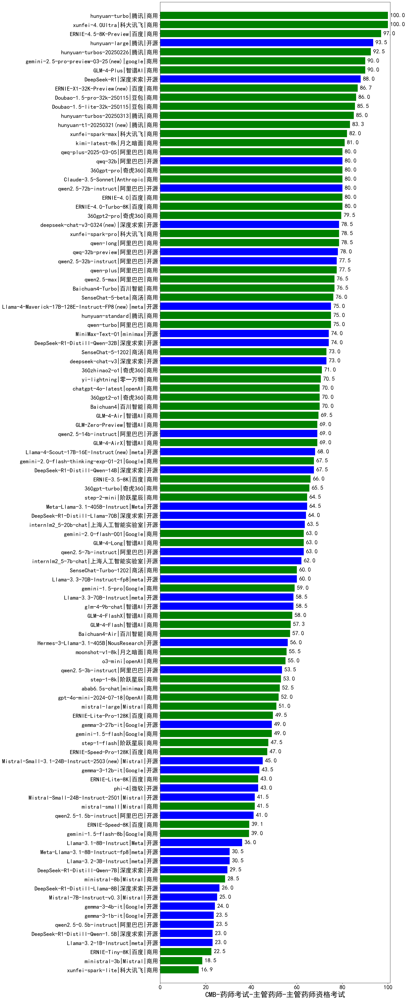

| 类别 | 大模型                         | CMB-药师考试-主管药师-主管药师资格考试 | 排名 |
|-----|------------------------------|---------|----|
|商用|xunfei-4.0Ultra|100.0|1|
|商用|hunyuan-turbo|100.0|2|
|商用|ERNIE-4.5-8K-Preview(new)|97.0|3|
|开源|hunyuan-large|93.5|4|
|商用|hunyuan-turbos-20250226(new)|92.5|5|
|商用|GLM-4-Plus|90.0|6|
|开源|DeepSeek-R1|89.2|7|
|商用|Doubao-1.5-pro-32k-250115|86.0|8|
|商用|Doubao-1.5-lite-32k-250115|85.5|9|
|商用|hunyuan-turbos-20250313(new)|85.0|10|
|商用|xunfei-spark-max|82.0|11|
|商用|kimi-latest-8k|81.0|12|
|商用|360gpt-pro|80.0|13|
|商用|ERNIE-4.0-Turbo-8K|80.0|14|
|开源|qwen2.5-72b-instruct|80.0|15|
|商用|Claude-3.5-Sonnet|80.0|16|
|商用|ERNIE-4.0|80.0|17|
|商用|qwq-plus-2025-03-05(new)|80.0|18|
|开源|qwq-32b(new)|80.0|19|
|商用|360gpt2-pro|79.5|20|
|商用|qwen-long|78.5|21|
|商用|xunfei-spark-pro|78.5|22|
|开源|qwq-32b-preview|78.0|23|
|开源|qwen2.5-32b-instruct|77.5|24|
|商用|qwen-plus|77.5|25|
|商用|Baichuan4-Turbo|76.5|26|
|商用|qwen2.5-max|76.5|27|
|商用|SenseChat-5-beta|76.0|28|
|商用|qwen-turbo|75.0|29|
|商用|hunyuan-standard|75.0|30|
|商用|gemini-2.0-pro-exp-02-05|74.5|31|
|开源|DeepSeek-R1-Distill-Qwen-32B|74.0|32|
|开源|MiniMax-Text-01|74.0|33|
|开源|deepseek-chat-v3|73.0|34|
|商用|SenseChat-5-1202|73.0|35|
|商用|abab7-chat-preview|71.5|36|
|商用|360zhinao2-o1|71.0|37|
|商用|yi-lightning|70.5|38|
|商用|chatgpt-4o-latest|70.0|39|
|商用|360gpt2-o1|70.0|40|
|商用|Baichuan4|70.0|41|
|商用|GLM-4-Air|69.5|42|
|开源|qwen2.5-14b-instruct|69.0|43|
|商用|GLM-4-AirX|69.0|44|
|商用|GLM-Zero-Preview|69.0|45|
|商用|GLM-4-Flash|68.0|46|
|开源|DeepSeek-R1-Distill-Qwen-14B|67.5|47|
|商用|gemini-2.0-flash-thinking-exp-01-21|67.5|48|
|商用|gemini-2.0-flash-exp|66.5|49|
|商用|ERNIE-3.5-8K|66.0|50|
|商用|360gpt-turbo|65.5|51|
|开源|Meta-Llama-3.1-405B-Instruct|64.5|52|
|商用|step-2-mini(new)|64.5|53|
|开源|DeepSeek-R1-Distill-Llama-70B|64.0|54|
|开源|internlm2_5-20b-chat|63.5|55|
|商用|GLM-4-Long|63.0|56|
|商用|gemini-2.0-flash-001|63.0|57|
|开源|qwen2.5-7b-instruct|63.0|58|
|开源|internlm2_5-7b-chat|62.0|59|
|商用|SenseChat-Turbo-1202|60.0|60|
|开源|Llama-3.3-70B-Instruct-fp8|60.0|61|
|商用|gemini-1.5-pro|59.0|62|
|开源|glm-4-9b-chat|58.5|63|
|开源|Llama-3.3-70B-Instruct|58.5|64|
|商用|GLM-4-FlashX|58.0|65|
|商用|o1-mini|57.0|66|
|商用|Baichuan4-Air|57.0|67|
|开源|Hermes-3-Llama-3.1-405B|56.0|68|
|商用|moonshot-v1-8k|55.5|69|
|开源|Llama-3.1-Nemotron-70B-Instruct-fp8|55.0|70|
|商用|o3-mini|55.0|71|
|商用|ERNIE-Speed-8K|54.4|72|
|开源|qwen2.5-3b-instruct|53.5|73|
|商用|step-1-8k|53.0|74|
|商用|abab6.5s-chat|52.5|75|
|商用|gpt-4o-mini-2024-07-18|52.0|76|
|商用|mistral-large|51.0|77|
|商用|ERNIE-Lite-Pro-128K|49.5|78|
|商用|gemini-1.5-flash|49.0|79|
|开源|gemma-3-27b-it(new)|49.0|80|
|商用|step-1-flash|47.5|81|
|商用|ERNIE-Speed-Pro-128K|47.0|82|
|开源|gemma-3-12b-it(new)|43.5|83|
|开源|phi-4|43.0|84|
|商用|ERNIE-Lite-8K|43.0|85|
|商用|mistral-small|41.5|86|
|开源|Mistral-Small-24B-Instruct-2501(new)|41.5|87|
|开源|qwen2.5-1.5b-instruct|41.0|88|
|开源|gemma-2-9b-it|40.0|89|
|开源|gemma-2-27b-it|40.0|90|
|商用|gemini-1.5-flash-8b|39.0|91|
|商用|xunfei-spark-lite(new)|37.8|92|
|开源|Llama-3.1-8B-Instruct|36.0|93|
|开源|Mistral-Nemo-Instruct-2407|34.5|94|
|开源|Meta-Llama-3.1-8B-Instruct-fp8|30.5|95|
|开源|Llama-3.2-3B-Instruct|30.5|96|
|开源|DeepSeek-R1-Distill-Qwen-7B|29.5|97|
|商用|ministral-8b|28.5|98|
|开源|DeepSeek-R1-Distill-Llama-8B|26.0|99|
|开源|Mistral-7B-Instruct-v0.3|25.0|100|
|开源|gemma-3-4b-it(new)|24.0|101|
|开源|qwen2.5-0.5b-instruct|23.5|102|
|开源|gemma-3-1b-it(new)|23.5|103|
|开源|Llama-3.2-1B-Instruct|23.0|104|
|开源|DeepSeek-R1-Distill-Qwen-1.5B|23.0|105|
|商用|ERNIE-Tiny-8K|22.5|106|
|商用|ministral-3b|18.5|107|
|开源|qwen2.5-math-72b-instruct|/|108|

