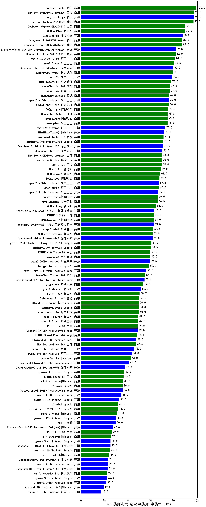

| 类别 | 大模型                         | CMB-药师考试-初级中药师-中药学（师） | 排名 |
|-----|------------------------------|---------|----|
|商用|hunyuan-turbo|100.0|1|
|开源|hunyuan-large|98.0|2|
|商用|ERNIE-4.5-8K-Preview|98.0|3|
|商用|hunyuan-turbos-20250226|97.5|4|
|商用|Doubao-1.5-pro-32k-250115|90.5|5|
|商用|GLM-4-Plus|90.0|6|
|开源|DeepSeek-R1|88.0|7|
|商用|hunyuan-t1-20250321(new)|87.7|8|
|商用|hunyuan-turbos-20250313|87.5|9|
|开源|Llama-4-Maverick-17B-128E-Instruct-FP8(new)|82.0|10|
|商用|Doubao-1.5-lite-32k-250115|82.0|11|
|商用|qwq-plus-2025-03-05|81.5|12|
|商用|qwen2.5-max|80.5|13|
|商用|xunfei-spark-max|80.0|14|
|开源|deepseek-chat-v3-0324(new)|80.0|15|
|商用|gemini-2.5-pro-preview-03-25(new)|80.0|16|
|开源|qwq-32b|79.0|17|
|商用|kimi-latest-8k|78.0|18|
|商用|qwen-long|77.0|19|
|商用|SenseChat-5-1202|77.0|20|
|商用|hunyuan-standard|76.0|21|
|商用|xunfei-spark-pro|76.0|22|
|开源|qwen2.5-72b-instruct|76.0|23|
|商用|360gpt2-pro|75.0|24|
|商用|qwen-plus|75.0|25|
|商用|SenseChat-5-beta|75.0|26|
|开源|MiniMax-Text-01|72.0|27|
|商用|Baichuan4-Turbo|71.5|28|
|开源|DeepSeek-R1-Distill-Qwen-32B|71.0|29|
|商用|xunfei-4.0Ultra|70.0|30|
|商用|ERNIE-X1-32K-Preview(new)|70.0|31|
|商用|GLM-4-Air|69.0|32|
|商用|GLM-4-AirX|68.5|33|
|商用|360gpt2-o1|68.0|34|
|开源|qwen2.5-32b-instruct|67.5|35|
|商用|qwen-turbo|67.5|36|
|开源|qwen2.5-14b-instruct|67.0|37|
|商用|360gpt-turbo|66.5|38|
|商用|yi-lightning|66.5|39|
|商用|GLM-4-Long|65.0|40|
|商用|ERNIE-3.5-8K|63.5|41|
|开源|internlm2_5-20b-chat|63.5|42|
|商用|360zhinao2-o1|63.0|43|
|开源|internlm2_5-7b-chat|63.0|44|
|商用|step-2-mini|62.5|45|
|商用|GLM-Zero-Preview|62.0|46|
|开源|DeepSeek-R1-Distill-Qwen-14B|62.0|47|
|商用|gemini-2.0-flash-thinking-exp-01-21|61.0|48|
|商用|gemini-2.0-flash-001|60.5|49|
|商用|ERNIE-4.0-Turbo-8K|60.0|50|
|开源|qwen2.5-7b-instruct|59.5|51|
|商用|chatgpt-4o-latest|59.0|52|
|开源|Meta-Llama-3.1-405B-Instruct|56.5|53|
|商用|SenseChat-Turbo-1202|55.5|54|
|开源|Llama-4-Scout-17B-16E-Instruct(new)|55.0|55|
|商用|step-1-8k|54.0|56|
|开源|glm-4-9b-chat|52.0|57|
|商用|GLM-4-Flash|50.7|58|
|商用|Baichuan4-Air|50.5|59|
|商用|Claude-3.5-Sonnet|50.0|60|
|商用|gemini-1.5-pro|50.0|61|
|商用|moonshot-v1-8k|50.0|62|
|商用|GLM-4-FlashX|49.5|63|
|商用|ERNIE-Lite-8K|49.0|64|
|开源|Llama-3.3-70B-Instruct-fp8|49.0|65|
|商用|ERNIE-Speed-Pro-128K|48.5|66|
|开源|Llama-3.3-70B-Instruct|48.0|67|
|商用|ERNIE-Lite-Pro-128K|47.5|68|
|开源|qwen2.5-3b-instruct|46.0|69|
|开源|qwen2.5-1.5b-instruct|44.0|70|
|商用|abab6.5s-chat|43.0|71|
|开源|Hermes-3-Llama-3.1-405B|41.5|72|
|开源|Mistral-Small-3.1-24B-Instruct-2503(new)|39.0|73|
|开源|DeepSeek-R1-Distill-Llama-70B|38.0|74|
|商用|gemini-1.5-flash|37.5|75|
|商用|ERNIE-Speed-8K|36.8|76|
|商用|mistral-large|36.5|77|
|开源|Meta-Llama-3.1-8B-Instruct-fp8|36.0|78|
|开源|Llama-3.1-8B-Instruct|35.0|79|
|开源|gemma-3-27b-it|33.0|80|
|商用|gpt-4o-mini-2024-07-18|32.0|81|
|商用|o3-mini|32.0|82|
|商用|mistral-small|31.0|83|
|开源|gemma-3-12b-it|30.5|84|
|开源|phi-4|30.0|85|
|开源|Mistral-Small-24B-Instruct-2501|27.5|86|
|商用|ERNIE-Tiny-8K|26.5|87|
|商用|ministral-8b|26.0|88|
|开源|DeepSeek-R1-Distill-Llama-8B|25.5|89|
|开源|gemma-3-4b-it|25.5|90|
|商用|gemini-1.5-flash-8b|25.0|91|
|商用|ministral-3b|24.5|92|
|开源|Llama-3.2-3B-Instruct|23.5|93|
|开源|DeepSeek-R1-Distill-Qwen-7B|23.5|94|
|开源|DeepSeek-R1-Distill-Qwen-1.5B|23.0|95|
|商用|xunfei-spark-lite|22.6|96|
|开源|gemma-3-1b-it|22.5|97|
|开源|Llama-3.2-1B-Instruct|22.0|98|
|开源|qwen2.5-0.5b-instruct|17.5|99|

