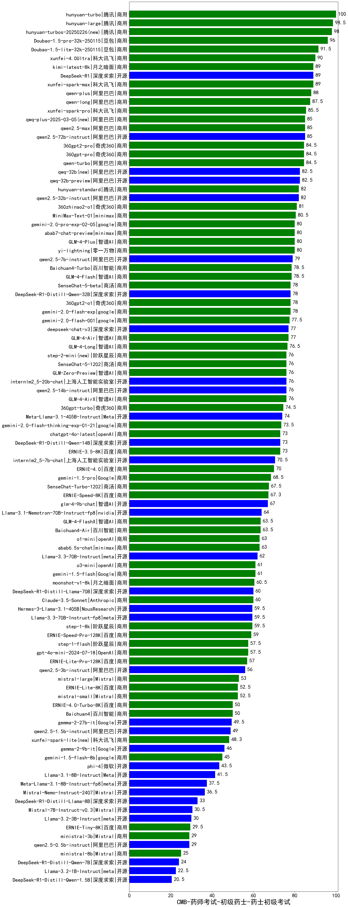

| 类别 | 大模型                         | CMB-药师考试-初级药士-药士初级考试 | 排名 |
|-----|------------------------------|---------|----|
|商用|hunyuan-turbo|100.0|1|
|开源|hunyuan-large|98.5|2|
|商用|ERNIE-4.5-8K-Preview|98.0|3|
|商用|hunyuan-turbos-20250226|98.0|4|
|商用|Doubao-1.5-pro-32k-250115|96.0|5|
|商用|hunyuan-turbos-20250313|95.0|6|
|商用|Doubao-1.5-lite-32k-250115|91.5|7|
|商用|hunyuan-t1-20250321(new)|90.6|8|
|商用|xunfei-4.0Ultra|90.0|9|
|商用|ERNIE-X1-32K-Preview(new)|90.0|10|
|开源|DeepSeek-R1|89.0|11|
|商用|xunfei-spark-max|89.0|12|
|开源|Llama-4-Maverick-17B-128E-Instruct-FP8(new)|89.0|13|
|商用|kimi-latest-8k|89.0|14|
|商用|qwen-plus|88.0|15|
|商用|qwen-long|87.5|16|
|商用|xunfei-spark-pro|85.5|17|
|商用|qwen2.5-max|85.0|18|
|商用|qwq-plus-2025-03-05|85.0|19|
|开源|qwen2.5-72b-instruct|85.0|20|
|商用|360gpt2-pro|84.5|21|
|商用|360gpt-pro|84.5|22|
|商用|qwen-turbo|84.5|23|
|开源|qwq-32b|82.5|24|
|开源|qwq-32b-preview|82.5|25|
|商用|hunyuan-standard|82.0|26|
|开源|deepseek-chat-v3-0324(new)|82.0|27|
|开源|qwen2.5-32b-instruct|82.0|28|
|商用|360zhinao2-o1|81.0|29|
|开源|MiniMax-Text-01|80.5|30|
|商用|GLM-4-Plus|80.0|31|
|商用|gemini-2.5-pro-preview-03-25(new)|80.0|32|
|商用|yi-lightning|80.0|33|
|开源|qwen2.5-7b-instruct|79.0|34|
|商用|Baichuan4-Turbo|78.5|35|
|商用|SenseChat-5-beta|78.0|36|
|商用|360gpt2-o1|78.0|37|
|开源|DeepSeek-R1-Distill-Qwen-32B|78.0|38|
|商用|gemini-2.0-flash-001|77.5|39|
|开源|deepseek-chat-v3|77.0|40|
|商用|GLM-4-Air|77.0|41|
|商用|GLM-4-Long|76.5|42|
|商用|step-2-mini|76.0|43|
|商用|SenseChat-5-1202|76.0|44|
|开源|qwen2.5-14b-instruct|76.0|45|
|商用|GLM-Zero-Preview|76.0|46|
|商用|GLM-4-AirX|76.0|47|
|开源|internlm2_5-20b-chat|76.0|48|
|商用|360gpt-turbo|74.5|49|
|开源|Meta-Llama-3.1-405B-Instruct|74.0|50|
|商用|gemini-2.0-flash-thinking-exp-01-21|73.5|51|
|开源|Llama-4-Scout-17B-16E-Instruct(new)|73.5|52|
|商用|ERNIE-3.5-8K|73.0|53|
|开源|DeepSeek-R1-Distill-Qwen-14B|73.0|54|
|商用|chatgpt-4o-latest|73.0|55|
|开源|internlm2_5-7b-chat|70.5|56|
|商用|ERNIE-4.0|70.0|57|
|商用|gemini-1.5-pro|68.5|58|
|商用|SenseChat-Turbo-1202|67.5|59|
|开源|glm-4-9b-chat|67.0|60|
|商用|GLM-4-Flash|65.8|61|
|商用|GLM-4-FlashX|63.5|62|
|商用|Baichuan4-Air|63.5|63|
|商用|abab6.5s-chat|63.0|64|
|开源|Llama-3.3-70B-Instruct|62.0|65|
|商用|o3-mini|61.0|66|
|商用|gemini-1.5-flash|61.0|67|
|商用|moonshot-v1-8k|60.5|68|
|商用|Claude-3.5-Sonnet|60.0|69|
|开源|DeepSeek-R1-Distill-Llama-70B|60.0|70|
|开源|Llama-3.3-70B-Instruct-fp8|59.5|71|
|商用|step-1-8k|59.5|72|
|开源|Hermes-3-Llama-3.1-405B|59.5|73|
|商用|ERNIE-Speed-Pro-128K|59.0|74|
|开源|Mistral-Small-3.1-24B-Instruct-2503(new)|58.0|75|
|商用|step-1-flash|57.5|76|
|商用|gpt-4o-mini-2024-07-18|57.5|77|
|商用|ERNIE-Lite-Pro-128K|57.0|78|
|开源|qwen2.5-3b-instruct|56.0|79|
|商用|mistral-large|53.0|80|
|商用|mistral-small|52.5|81|
|商用|ERNIE-Lite-8K|52.5|82|
|开源|Mistral-Small-24B-Instruct-2501|51.5|83|
|开源|gemma-3-27b-it|51.0|84|
|商用|ERNIE-4.0-Turbo-8K|50.0|85|
|商用|Baichuan4|50.0|86|
|开源|gemma-3-12b-it|49.5|87|
|开源|qwen2.5-1.5b-instruct|49.0|88|
|商用|ERNIE-Speed-8K|47.9|89|
|商用|gemini-1.5-flash-8b|45.0|90|
|开源|phi-4|43.5|91|
|开源|Llama-3.1-8B-Instruct|41.5|92|
|开源|Meta-Llama-3.1-8B-Instruct-fp8|37.5|93|
|开源|DeepSeek-R1-Distill-Llama-8B|33.0|94|
|开源|gemma-3-4b-it|31.5|95|
|开源|Mistral-7B-Instruct-v0.3|30.5|96|
|开源|Llama-3.2-3B-Instruct|30.0|97|
|商用|ERNIE-Tiny-8K|29.5|98|
|开源|qwen2.5-0.5b-instruct|29.0|99|
|商用|ministral-3b|29.0|100|
|商用|ministral-8b|25.0|101|
|开源|DeepSeek-R1-Distill-Qwen-7B|24.0|102|
|开源|Llama-3.2-1B-Instruct|22.5|103|
|开源|DeepSeek-R1-Distill-Qwen-1.5B|20.5|104|
|开源|gemma-3-1b-it|18.0|105|
|商用|xunfei-spark-lite|17.5|106|

