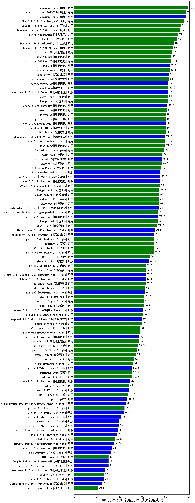

| 类别 | 大模型                         | CMB-药师考试-初级药师-药师初级考试 | 排名 |
|-----|------------------------------|---------|----|
|商用|hunyuan-turbo|100.0|1|
|商用|hunyuan-large|98.0|2|
|商用|hunyuan-turbos-20250226(new)|98.0|3|
|商用|Doubao-1.5-pro-32k-250115|93.5|4|
|商用|xunfei-spark-max|91.0|5|
|商用|GLM-4-Plus|90.0|6|
|商用|Doubao-1.5-lite-32k-250115|87.5|7|
|商用|kimi-latest-8k|86.0|8|
|商用|qwen2.5-max|85.0|9|
|商用|qwq-plus-2025-03-05(new)|84.5|10|
|商用|hunyuan-standard|83.5|11|
|开源|qwq-32b(new)|83.5|12|
|商用|Baichuan4-Turbo|83.0|13|
|商用|xunfei-spark-pro|82.5|14|
|开源|qwq-32b-preview|82.5|15|
|开源|DeepSeek-R1-Distill-Qwen-32B|82.0|16|
|商用|360gpt-pro|82.0|17|
|商用|360gpt2-pro|82.0|18|
|开源|qwen2.5-32b-instruct|81.5|19|
|商用|qwen-turbo|81.0|20|
|开源|DeepSeek-R1|80.8|21|
|商用|qwen-plus|80.5|22|
|商用|yi-lightning|80.0|23|
|开源|qwen2.5-72b-instruct|80.0|24|
|商用|Baichuan4|80.0|25|
|商用|xunfei-4.0Ultra|80.0|26|
|商用|abab7-chat-preview|79.5|27|
|商用|qwen-long|79.5|28|
|商用|SenseChat-5-beta|79.0|29|
|商用|GLM-4-Air|77.0|30|
|商用|GLM-4-AirX|76.5|31|
|开源|deepseek-chat-v3|76.5|32|
|商用|GLM-Zero-Preview|76.0|33|
|开源|qwen2.5-14b-instruct|75.5|34|
|开源|internlm2_5-20b-chat|75.5|35|
|商用|MiniMax-Text-01|75.5|36|
|商用|gemini-2.0-pro-exp-02-05|75.0|37|
|商用|360gpt-turbo|74.5|38|
|开源|internlm2_5-7b-chat|74.0|39|
|商用|SenseChat-5-1202|74.0|40|
|商用|360zhinao2-o1|74.0|41|
|商用|GLM-4-Long|74.0|42|
|商用|GLM-4-Flash|73.9|43|
|商用|gemini-2.0-flash-thinking-exp-01-21|73.5|44|
|开源|qwen2.5-7b-instruct|73.5|45|
|商用|360gpt2-o1|73.0|46|
|商用|step-2-mini(new)|72.5|47|
|开源|Meta-Llama-3.1-405B-Instruct|70.5|48|
|商用|ERNIE-4.0|70.0|49|
|开源|DeepSeek-R1-Distill-Qwen-14B|70.0|50|
|商用|gemini-2.0-flash-exp|70.0|51|
|商用|ERNIE-4.0-Turbo-8K|70.0|52|
|商用|gemini-2.0-flash-001|69.5|53|
|商用|ERNIE-3.5-8K|66.0|54|
|开源|glm-4-9b-chat|65.5|55|
|商用|ERNIE-Speed-8K|64.6|56|
|商用|GLM-4-FlashX|62.5|57|
|商用|Baichuan4-Air|62.5|58|
|开源|Llama-3.1-Nemotron-70B-Instruct-fp8|62.5|59|
|商用|SenseChat-Turbo-1202|62.5|60|
|开源|Llama-3.3-70B-Instruct-fp8|62.5|61|
|开源|Llama-3.3-70B-Instruct|62.0|62|
|商用|chatgpt-4o-latest|62.0|63|
|商用|step-1-8k|61.5|64|
|商用|gemini-1.5-pro|61.0|65|
|开源|Hermes-3-Llama-3.1-405B|60.5|66|
|商用|Claude-3.5-Sonnet|60.0|67|
|商用|abab6.5s-chat|59.0|68|
|开源|DeepSeek-R1-Distill-Llama-70B|59.0|69|
|商用|ERNIE-Speed-Pro-128K|58.0|70|
|商用|gpt-4o-mini-2024-07-18|58.0|71|
|开源|qwen2.5-3b-instruct|57.0|72|
|商用|moonshot-v1-8k|57.0|73|
|商用|ERNIE-Lite-Pro-128K|55.5|74|
|商用|gemini-1.5-flash|55.0|75|
|商用|step-1-flash|54.0|76|
|商用|o3-mini|52.0|77|
|商用|mistral-large|51.5|78|
|商用|mistral-small|50.5|79|
|商用|ERNIE-Lite-8K|50.5|80|
|开源|qwen2.5-1.5b-instruct|49.0|81|
|商用|o1-mini|48.0|82|
|开源|gemma-2-27b-it|48.0|83|
|商用|xunfei-spark-lite(new)|47.1|84|
|开源|phi-4|46.5|85|
|商用|gemini-1.5-flash-8b|44.0|86|
|开源|Llama-3.1-8B-Instruct|43.5|87|
|开源|gemma-2-9b-it|39.5|88|
|开源|Mistral-Nemo-Instruct-2407|38.5|89|
|开源|Llama-3.2-3B-Instruct|37.0|90|
|商用|ministral-8b|35.5|91|
|开源|Meta-Llama-3.1-8B-Instruct-fp8|34.5|92|
|开源|qwen2.5-0.5b-instruct|33.0|93|
|开源|Mistral-7B-Instruct-v0.3|30.0|94|
|开源|DeepSeek-R1-Distill-Qwen-7B|30.0|95|
|商用|ERNIE-Tiny-8K|30.0|96|
|开源|DeepSeek-R1-Distill-Llama-8B|27.0|97|
|开源|Llama-3.2-1B-Instruct|26.0|98|
|商用|ministral-3b|26.0|99|
|开源|DeepSeek-R1-Distill-Qwen-1.5B|24.5|100|
|开源|Yi-1.5-9B-Chat|/|101|
|开源|Yi-1.5-34B-Chat|/|102|
|开源|qwen2.5-math-72b-instruct|/|103|

