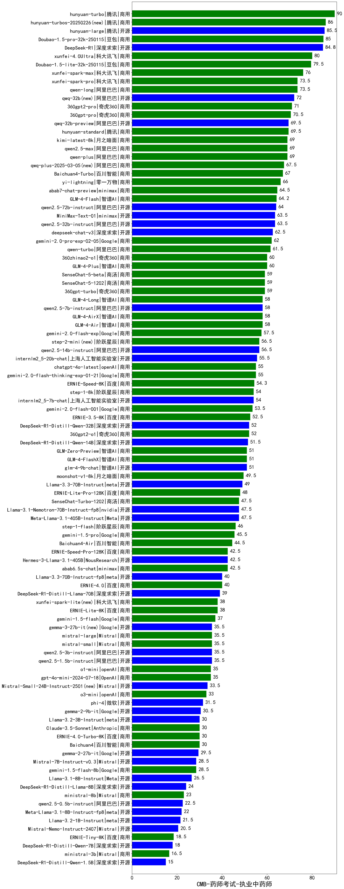

| 类别 | 大模型                         | CMB-药师考试-执业中药师 | 排名 |
|-----|------------------------------|---------|----|
|商用|hunyuan-turbo|90.0|1|
|商用|hunyuan-turbos-20250226(new)|86.0|2|
|商用|hunyuan-large|85.5|3|
|商用|Doubao-1.5-pro-32k-250115|85.0|4|
|开源|DeepSeek-R1|84.8|5|
|商用|xunfei-4.0Ultra|80.0|6|
|商用|Doubao-1.5-lite-32k-250115|79.5|7|
|商用|xunfei-spark-max|76.0|8|
|商用|xunfei-spark-pro|73.5|9|
|商用|qwen-long|73.5|10|
|开源|qwq-32b(new)|72.0|11|
|商用|360gpt2-pro|71.0|12|
|商用|360gpt-pro|70.5|13|
|开源|qwq-32b-preview|69.5|14|
|商用|hunyuan-standard|69.5|15|
|商用|kimi-latest-8k|69.0|16|
|商用|qwen2.5-max|69.0|17|
|商用|qwen-plus|69.0|18|
|商用|qwq-plus-2025-03-05(new)|67.5|19|
|商用|Baichuan4-Turbo|67.0|20|
|商用|yi-lightning|66.0|21|
|商用|abab7-chat-preview|64.5|22|
|商用|GLM-4-Flash|64.2|23|
|开源|qwen2.5-72b-instruct|64.0|24|
|开源|qwen2.5-32b-instruct|63.5|25|
|商用|MiniMax-Text-01|63.5|26|
|开源|deepseek-chat-v3|62.5|27|
|商用|gemini-2.0-pro-exp-02-05|62.0|28|
|商用|qwen-turbo|61.5|29|
|商用|GLM-4-Plus|60.0|30|
|商用|360zhinao2-o1|60.0|31|
|商用|360gpt-turbo|59.0|32|
|商用|SenseChat-5-1202|59.0|33|
|商用|SenseChat-5-beta|59.0|34|
|商用|GLM-4-AirX|58.0|35|
|商用|GLM-4-Long|58.0|36|
|商用|GLM-4-Air|58.0|37|
|开源|qwen2.5-7b-instruct|58.0|38|
|商用|gemini-2.0-flash-exp|57.5|39|
|商用|step-2-mini(new)|56.5|40|
|开源|qwen2.5-14b-instruct|56.5|41|
|开源|internlm2_5-20b-chat|55.5|42|
|商用|gemini-2.0-flash-thinking-exp-01-21|55.0|43|
|商用|chatgpt-4o-latest|55.0|44|
|商用|ERNIE-Speed-8K|54.3|45|
|商用|step-1-8k|54.0|46|
|开源|internlm2_5-7b-chat|54.0|47|
|商用|gemini-2.0-flash-001|53.5|48|
|商用|ERNIE-3.5-8K|52.5|49|
|开源|DeepSeek-R1-Distill-Qwen-32B|52.0|50|
|商用|360gpt2-o1|52.0|51|
|开源|DeepSeek-R1-Distill-Qwen-14B|51.5|52|
|商用|GLM-Zero-Preview|51.0|53|
|商用|GLM-4-FlashX|51.0|54|
|开源|glm-4-9b-chat|51.0|55|
|商用|moonshot-v1-8k|49.5|56|
|开源|Llama-3.3-70B-Instruct|49.0|57|
|商用|ERNIE-Lite-Pro-128K|48.0|58|
|开源|Llama-3.1-Nemotron-70B-Instruct-fp8|47.5|59|
|商用|SenseChat-Turbo-1202|47.5|60|
|开源|Meta-Llama-3.1-405B-Instruct|47.5|61|
|商用|step-1-flash|46.0|62|
|商用|gemini-1.5-pro|45.5|63|
|商用|Baichuan4-Air|44.5|64|
|开源|Hermes-3-Llama-3.1-405B|42.5|65|
|商用|abab6.5s-chat|42.5|66|
|商用|ERNIE-Speed-Pro-128K|42.5|67|
|开源|Llama-3.3-70B-Instruct-fp8|40.0|68|
|商用|ERNIE-4.0|40.0|69|
|开源|DeepSeek-R1-Distill-Llama-70B|39.0|70|
|商用|ERNIE-Lite-8K|38.0|71|
|商用|xunfei-spark-lite(new)|38.0|72|
|商用|gemini-1.5-flash|37.0|73|
|开源|qwen2.5-3b-instruct|35.5|74|
|开源|qwen2.5-1.5b-instruct|35.5|75|
|商用|mistral-small|35.5|76|
|开源|gemma-3-27b-it(new)|35.5|77|
|商用|mistral-large|35.5|78|
|商用|o1-mini|35.0|79|
|商用|gpt-4o-mini-2024-07-18|35.0|80|
|开源|Mistral-Small-24B-Instruct-2501(new)|33.5|81|
|商用|o3-mini|33.0|82|
|开源|phi-4|31.5|83|
|开源|gemma-2-9b-it|30.5|84|
|开源|Llama-3.2-3B-Instruct|30.0|85|
|商用|ERNIE-4.0-Turbo-8K|30.0|86|
|商用|Baichuan4|30.0|87|
|商用|Claude-3.5-Sonnet|30.0|88|
|开源|gemma-2-27b-it|29.5|89|
|商用|gemini-1.5-flash-8b|28.5|90|
|开源|Mistral-7B-Instruct-v0.3|28.5|91|
|开源|Llama-3.1-8B-Instruct|26.5|92|
|开源|DeepSeek-R1-Distill-Llama-8B|24.0|93|
|商用|ministral-8b|23.0|94|
|开源|qwen2.5-0.5b-instruct|22.5|95|
|开源|Meta-Llama-3.1-8B-Instruct-fp8|22.0|96|
|开源|Llama-3.2-1B-Instruct|21.5|97|
|开源|Mistral-Nemo-Instruct-2407|20.5|98|
|商用|ERNIE-Tiny-8K|18.5|99|
|开源|DeepSeek-R1-Distill-Qwen-7B|18.0|100|
|商用|ministral-3b|16.5|101|
|开源|DeepSeek-R1-Distill-Qwen-1.5B|15.0|102|
|开源|Yi-1.5-34B-Chat|/|103|
|开源|Yi-1.5-9B-Chat|/|104|
|开源|qwen2.5-math-72b-instruct|/|105|

