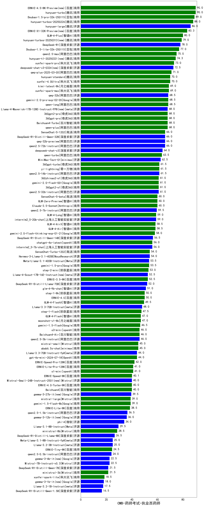

| 类别 | 大模型                         | CMB-药师考试-执业西药师 | 排名 |
|-----|------------------------------|---------|----|
|商用|hunyuan-turbo|90.0|1|
|商用|ERNIE-4.5-8K-Preview|90.0|2|
|商用|Doubao-1.5-pro-32k-250115|89.0|3|
|商用|hunyuan-turbos-20250226|88.0|4|
|开源|hunyuan-large|86.0|5|
|商用|ERNIE-X1-32K-Preview(new)|83.3|6|
|商用|GLM-4-Plus|80.0|7|
|商用|hunyuan-turbos-20250313|79.0|8|
|开源|DeepSeek-R1|78.0|9|
|商用|Doubao-1.5-lite-32k-250115|77.0|10|
|商用|qwen2.5-max|75.0|11|
|商用|hunyuan-t1-20250321(new)|74.3|12|
|商用|xunfei-spark-pro|73.0|13|
|开源|deepseek-chat-v3-0324(new)|72.5|14|
|商用|qwq-plus-2025-03-05|71.0|15|
|商用|xunfei-4.0Ultra|70.0|16|
|商用|hunyuan-standard|70.0|17|
|商用|kimi-latest-8k|69.0|18|
|商用|xunfei-spark-max|69.0|19|
|商用|qwen-long|68.5|20|
|开源|qwq-32b|68.5|21|
|商用|Baichuan4-Turbo|68.0|22|
|商用|360gpt2-pro|68.0|23|
|开源|Llama-4-Maverick-17B-128E-Instruct-FP8(new)|68.0|24|
|商用|qwen-plus|68.0|25|
|开源|qwen2.5-72b-instruct|66.0|26|
|商用|SenseChat-5-1202|66.0|27|
|开源|DeepSeek-R1-Distill-Qwen-32B|66.0|28|
|商用|qwen-turbo|63.5|29|
|开源|MiniMax-Text-01|62.5|30|
|商用|yi-lightning|61.5|31|
|商用|360gpt-turbo|61.5|32|
|开源|qwen2.5-14b-instruct|61.5|33|
|开源|qwen2.5-32b-instruct|61.0|34|
|商用|360gpt2-o1|61.0|35|
|商用|gemini-2.0-flash-001|61.0|36|
|商用|360zhinao2-o1|61.0|37|
|商用|GLM-Zero-Preview|60.0|38|
|商用|SenseChat-5-beta|60.0|39|
|商用|Claude-3.5-Sonnet|60.0|40|
|商用|gemini-2.5-pro-preview-03-25(new)|60.0|41|
|开源|qwen2.5-7b-instruct|59.5|42|
|开源|internlm2_5-20b-chat|59.0|43|
|商用|GLM-4-Long|59.0|44|
|商用|GLM-4-AirX|58.5|45|
|商用|GLM-4-Air|58.5|46|
|商用|gemini-2.0-flash-thinking-exp-01-21|58.0|47|
|开源|DeepSeek-R1-Distill-Qwen-14B|56.5|48|
|商用|chatgpt-4o-latest|56.0|49|
|开源|internlm2_5-7b-chat|56.0|50|
|商用|SenseChat-Turbo-1202|54.0|51|
|开源|Hermes-3-Llama-3.1-405B|54.0|52|
|商用|gemini-1.5-pro|53.5|53|
|开源|Meta-Llama-3.1-405B-Instruct|53.5|54|
|商用|step-2-mini|53.0|55|
|商用|ERNIE-3.5-8K|52.5|56|
|开源|Llama-4-Scout-17B-16E-Instruct(new)|52.5|57|
|开源|DeepSeek-R1-Distill-Llama-70B|52.0|58|
|开源|glm-4-9b-chat|51.0|59|
|商用|step-1-8k|50.0|60|
|商用|GLM-4-FlashX|49.5|61|
|开源|Llama-3.3-70B-Instruct|48.0|62|
|商用|moonshot-v1-8k|47.0|63|
|商用|GLM-4-Flash|47.0|64|
|商用|gemini-1.5-flash|46.5|65|
|商用|Baichuan4-Air|46.0|66|
|开源|qwen2.5-3b-instruct|46.0|67|
|商用|o3-mini|46.0|68|
|商用|abab6.5s-chat|45.0|69|
|商用|mistral-small|45.0|70|
|开源|Mistral-Small-3.1-24B-Instruct-2503(new)|45.0|71|
|商用|gpt-4o-mini-2024-07-18|44.0|72|
|开源|Llama-3.3-70B-Instruct-fp8|44.0|73|
|商用|ERNIE-Speed-Pro-128K|42.0|74|
|商用|ERNIE-Lite-Pro-128K|41.0|75|
|商用|ERNIE-Speed-8K|40.1|76|
|开源|Mistral-Small-24B-Instruct-2501|40.0|77|
|商用|ERNIE-4.0-Turbo-8K|40.0|78|
|开源|gemma-3-27b-it|39.5|79|
|商用|mistral-large|39.0|80|
|商用|gemini-1.5-flash-8b|39.0|81|
|商用|ERNIE-Lite-8K|38.5|82|
|开源|qwen2.5-1.5b-instruct|36.5|83|
|开源|gemma-3-12b-it|36.0|84|
|开源|phi-4|34.0|85|
|开源|Llama-3.1-8B-Instruct|29.5|86|
|商用|ministral-8b|28.5|87|
|开源|DeepSeek-R1-Distill-Llama-8B|26.5|88|
|开源|Meta-Llama-3.1-8B-Instruct-fp8|25.0|89|
|开源|Llama-3.2-3B-Instruct|25.0|90|
|商用|ERNIE-Tiny-8K|24.5|91|
|开源|qwen2.5-0.5b-instruct|24.0|92|
|开源|gemma-3-4b-it|22.5|93|
|商用|ministral-3b|21.5|94|
|开源|DeepSeek-R1-Distill-Qwen-7B|21.5|95|
|商用|xunfei-spark-lite|18.5|96|
|开源|gemma-3-1b-it|18.0|97|
|开源|Llama-3.2-1B-Instruct|17.5|98|
|开源|DeepSeek-R1-Distill-Qwen-1.5B|16.5|99|

