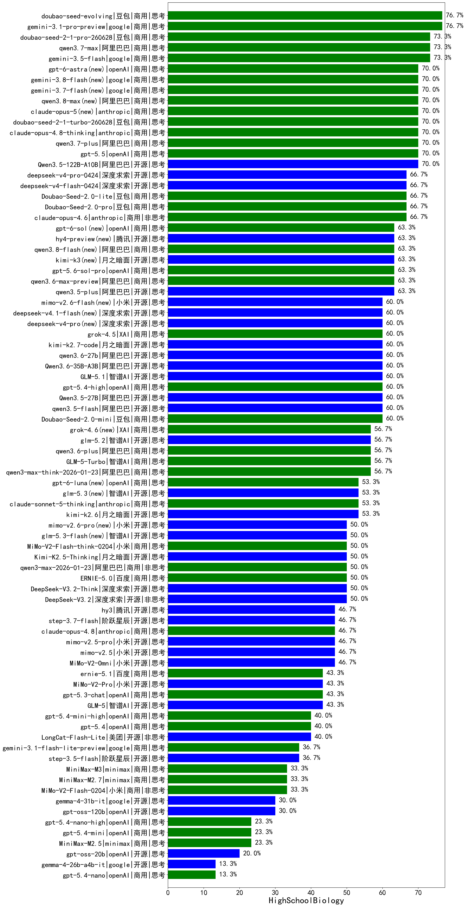

|类别|机构|大模型|【HighSchoolBiology】准确率|平均耗时|平均消耗token|花费/千次（元）|排名（准确率）|
|---|---|-----|-------------------|-------|-----------|-----------|-----------|
|商用|豆包|doubao-seed-evolving|76.7%|437s|18860|560.8|1|
|商用|google|gemini-3.1-pro-preview|76.7%|72s|4214|346.0|2|
|商用|google|gemini-3.5-flash|73.3%|21s|3305|198.6|3|
|商用|阿里巴巴|qwen3.7-max|73.3%|167s|10634|378.8|4|
|商用|豆包|doubao-seed-2-1-pro-260628|73.3%|395s|19257|572.7|5|
|商用|阿里巴巴|qwen3.8-max(new)|70.0%|194s|8378|296.7|6|
|商用|google|gemini-3.7-flash(new)|70.0%|6s|1200|27.6|7|
|商用|阿里巴巴|qwen3.7-plus|70.0%|245s|13217|104.7|8|
|商用|anthropic|claude-opus-4.8-thinking|70.0%|42s|3491|571.1|9|
|商用|豆包|doubao-seed-2-1-turbo-260628|70.0%|291s|14673|217.6|10|
|商用|anthropic|claude-opus-5(new)|70.0%|19s|1435|211.4|11|
|开源|阿里巴巴|Qwen3.5-122B-A10B|70.0%|148s|7683|48.2|12|
|商用|openAI|gpt-5.5|70.0%|22s|1473|271.5|13|
|商用|openAI|gpt-6-astra(new)|70.0%|23s|638|162.8|14|
|商用|google|gemini-3.8-flash(new)|70.0%|20s|1541|73.2|15|
|商用|豆包|Doubao-Seed-2.0-pro|66.7%|413s|1914|27.9|16|
|商用|豆包|Doubao-Seed-2.0-lite|66.7%|341s|1835|6.0|17|
|开源|深度求索|deepseek-v4-flash-0424|66.7%|99s|5106|10.0|18|
|开源|深度求索|deepseek-v4-pro-0424|66.7%|148s|4993|117.9|19|
|商用|anthropic|claude-opus-4.6|66.7%|34s|1119|156.4|20|
|开源|腾讯|hy4-preview(new)|63.3%|131s|8220|145.9|21|
|商用|openAI|gpt-5.6-sol-pro|63.3%|40s|6791|647.3|22|
|开源|月之暗面|kimi-k3(new)|63.3%|127s|3038|284.7|23|
|商用|openAI|gpt-6-sol(new)|63.3%|68s|673|35.0|24|
|商用|阿里巴巴|qwen3.8-flash(new)|63.3%|155s|9756|25.9|25|
|开源|阿里巴巴|qwen3.5-plus|63.3%|76s|6281|29.5|26|
|商用|阿里巴巴|qwen3.6-max-preview|63.3%|107s|3530|183.0|27|
|开源|月之暗面|kimi-k2.7-code|60.0%|121s|4975|131.0|28|
|开源|小米|mimo-v2.6-flash(new)|60.0%|197s|7914|15.6|29|
|开源|深度求索|deepseek-v4.1-flash(new)|60.0%|44s|5116|39.8|30|
|商用|openAI|gpt-5.4-high|60.0%|46s|2592|253.1|31|
|开源|深度求索|deepseek-v4-pro(new)|60.0%|120s|6100|160.4|32|
|商用|XAI|grok-4.5|60.0%|105s|6263|252.5|33|
|开源|阿里巴巴|Qwen3.6-35B-A3B|60.0%|168s|4003|41.7|34|
|开源|阿里巴巴|qwen3.6-27b|60.0%|63s|3954|68.6|35|
|开源|阿里巴巴|Qwen3.5-27B|60.0%|652s|11216|53.1|36|
|开源|阿里巴巴|qwen3.5-flash|60.0%|608s|8681|17.1|37|
|商用|豆包|Doubao-Seed-2.0-mini|60.0%|418s|6989|13.6|38|
|开源|智谱AI|GLM-5.1|60.0%|294s|8365|197.8|39|
|商用|XAI|grok-4.6(new)|56.7%|183s|4998|199.4|40|
|商用|阿里巴巴|qwen3.6-plus|56.7%|76s|3606|41.6|41|
|开源|智谱AI|glm-5.2|56.7%|157s|7468|205.6|42|
|商用|阿里巴巴|qwen3-max-think-2026-01-23|56.7%|278s|9867|97.3|43|
|商用|智谱AI|GLM-5-Turbo|56.7%|79s|4587|98.1|44|
|商用|openAI|gpt-6-luna(new)|53.3%|95s|1668|5.2|45|
|开源|智谱AI|glm-5.3(new)|53.3%|274s|10410|288.0|46|
|商用|anthropic|claude-sonnet-5-thinking|53.3%|55s|4694|312.7|47|
|开源|月之暗面|kimi-k2.6|53.3%|336s|10559|281.8|48|
|开源|深度求索|DeepSeek-V3.2|50.0%|125s|1294|3.7|49|
|开源|深度求索|DeepSeek-V3.2-Think|50.0%|333s|5605|16.7|50|
|开源|小米|mimo-v2.6-pro(new)|50.0%|227s|11002|65.5|51|
|商用|百度|ERNIE-5.0|50.0%|313s|7661|181.1|52|
|商用|小米|MiMo-V2-Flash-think-0204|50.0%|502s|7544|15.6|53|
|商用|阿里巴巴|qwen3-max-2026-01-23|50.0%|166s|1899|17.6|54|
|开源|月之暗面|Kimi-K2.5-Thinking|50.0%|565s|9666|200.2|55|
|开源|智谱AI|glm-5.3-flash(new)|50.0%|420s|14588|40.5|56|
|开源|小米|MiMo-V2-Omni|46.7%|300s|4485|58.1|57|
|开源|小米|mimo-v2.5|46.7%|126s|8009|107.4|58|
|商用|anthropic|claude-opus-4.8|46.7%|12s|1005|136.2|59|
|开源|阶跃星辰|step-3.7-flash|46.7%|133s|9635|76.9|60|
|开源|小米|mimo-v2.5-pro|46.7%|130s|7315|147.7|61|
|开源|腾讯|hy3|46.7%|83s|626|2.0|62|
|开源|智谱AI|GLM-5|43.3%|226s|6134|108.2|63|
|商用|百度|ernie-5.1|43.3%|83s|3414|59.1|64|
|开源|小米|MiMo-V2-Pro|43.3%|383s|5496|109.5|65|
|商用|openAI|gpt-5.3-chat|43.3%|14s|1040|83.4|66|
|开源|美团|LongCat-Flash-Lite|40.0%|153s|2436|0.0|67|
|商用|openAI|gpt-5.4|40.0%|32s|631|47.5|68|
|商用|openAI|gpt-5.4-mini-high|40.0%|141s|4511|136.4|69|
|商用|google|gemini-3.1-flash-lite-preview|36.7%|4s|669|5.4|70|
|开源|阶跃星辰|step-3.5-flash|36.7%|55s|11005|22.9|71|
|商用|小米|MiMo-V2-Flash-0204|33.3%|575s|2152|4.2|72|
|商用|minimax|MiniMax-M2.7|33.3%|209s|8649|71.4|73|
|商用|minimax|MiniMax-M3|33.3%|205s|6792|110.0|74|
|开源|google|gemma-4-31b-it|30.0%|64s|925|2.2|75|
|开源|openAI|gpt-oss-120b|30.0%|70s|1674|4.8|76|
|商用|openAI|gpt-5.4-mini|23.3%|23s|448|8.4|77|
|商用|minimax|MiniMax-M2.5|23.3%|121s|7298|60.1|78|
|商用|openAI|gpt-5.4-nano-high|23.3%|143s|5544|46.9|79|
|开源|openAI|gpt-oss-20b|20.0%|15s|3473|3.8|80|
|商用|openAI|gpt-5.4-nano|13.3%|110s|588|3.6|81|
|开源|google|gemma-4-26b-a4b-it|13.3%|122s|1503|3.8|82|

