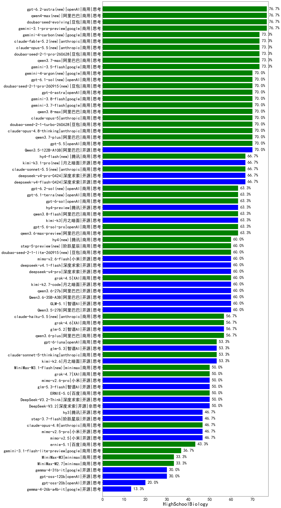

|类别|机构|大模型|【HighSchoolBiology】准确率|平均耗时|平均消耗token|花费/千次（元）|排名（准确率）|
|---|---|-----|-------------------|-------|-----------|-----------|-----------|
|商用|openAI|gpt-6.2-astra(new)|76.7%|7s|429|71.7|1|
|商用|阿里巴巴|qwen4-max(new)|76.7%|33s|1251|33.9|2|
|商用|google|gemini-3.1-pro-preview|76.7%|72s|4214|346.0|3|
|商用|豆包|doubao-seed-evolving|76.7%|437s|18860|560.8|4|
|商用|anthropic|claude-opus-5.5(new)|73.3%|16s|1045|114.3|5|
|商用|google|gemini-3.5-flash|73.3%|21s|3305|198.6|6|
|商用|google|gemini-4-carbon(new)|73.3%|67s|2154|278.8|7|
|商用|anthropic|claude-fable-5.2(new)|73.3%|34s|1015|220.3|8|
|商用|阿里巴巴|qwen3.7-max|73.3%|167s|10634|378.8|9|
|商用|豆包|doubao-seed-2-1-pro-260628|73.3%|395s|19257|572.7|10|
|商用|anthropic|claude-opus-4.8-thinking|70.0%|42s|3491|571.1|11|
|商用|阿里巴巴|qwen3.7-plus|70.0%|245s|13217|104.7|12|
|商用|openAI|gpt-5.5|70.0%|22s|1473|271.5|13|
|商用|openAI|gpt-6-astra|70.0%|23s|638|162.8|14|
|商用|google|gemini-3.8-flash|70.0%|20s|1541|73.2|15|
|商用|阿里巴巴|qwen3.8-max|70.0%|194s|8378|296.7|16|
|商用|google|gemini-3.7-flash|70.0%|6s|1200|27.6|17|
|商用|豆包|doubao-seed-2-1-turbo-260628|70.0%|291s|14673|217.6|18|
|商用|anthropic|claude-opus-5|70.0%|19s|1435|211.4|19|
|商用|openAI|gpt-6.1-sol(new)|70.0%|9s|563|27.3|20|
|商用|豆包|doubao-seed-2-1-pro-260915(new)|70.0%|164s|3410|97.2|21|
|开源|阿里巴巴|Qwen3.5-122B-A10B|70.0%|148s|7683|48.2|22|
|商用|google|gemini-4-argon(new)|70.0%|22s|833|93.9|23|
|开源|深度求索|deepseek-v4-flash-0424|66.7%|99s|5106|10.0|24|
|商用|腾讯|hy4-flash(new)|66.7%|31s|4177|8.1|25|
|开源|月之暗面|kimi-k3.1-pro(new)|66.7%|171s|5496|360.6|26|
|开源|深度求索|deepseek-v4-pro-0424|66.7%|148s|4993|117.9|27|
|商用|anthropic|claude-sonnet-5.5(new)|66.7%|9s|988|53.2|28|
|开源|腾讯|hy4-preview|63.3%|131s|8220|145.9|29|
|商用|阿里巴巴|qwen3.6-max-preview|63.3%|107s|3530|183.0|30|
|商用|openAI|gpt-6.1-terra(new)|63.3%|8s|746|20.1|31|
|商用|openAI|gpt-6-sol|63.3%|68s|673|35.0|32|
|商用|阿里巴巴|qwen3.8-flash|63.3%|155s|9756|25.9|33|
|商用|openAI|gpt-5.6-sol-pro|63.3%|40s|6791|647.3|34|
|开源|月之暗面|kimi-k3|63.3%|127s|3038|284.7|35|
|商用|openAI|gpt-6.2-sol(new)|63.3%|5s|482|21.7|36|
|开源|深度求索|deepseek-v4.1-flash|60.0%|44s|5116|39.8|37|
|开源|小米|mimo-v2.6-flash|60.0%|197s|7914|15.6|38|
|商用|阶跃星辰|step-5-preview(new)|60.0%|76s|6202|121.8|39|
|商用|腾讯|hy4(new)|60.0%|225s|10532|187.5|40|
|商用|豆包|doubao-seed-2-1-lite-260915(new)|60.0%|102s|4653|12.2|41|
|开源|深度求索|deepseek-v4-pro|60.0%|120s|6100|160.4|42|
|商用|XAI|grok-4.5|60.0%|105s|6263|252.5|43|
|开源|阿里巴巴|Qwen3.5-27B|60.0%|652s|11216|53.1|44|
|开源|月之暗面|kimi-k2.7-code|60.0%|121s|4975|131.0|45|
|开源|智谱AI|GLM-5.1|60.0%|294s|8365|197.8|46|
|开源|阿里巴巴|Qwen3.6-35B-A3B|60.0%|168s|4003|41.7|47|
|开源|阿里巴巴|qwen3.6-27b|60.0%|63s|3954|68.6|48|
|商用|XAI|grok-4.6|56.7%|183s|4998|199.4|49|
|商用|阿里巴巴|qwen3.6-plus|56.7%|76s|3606|41.6|50|
|开源|智谱AI|glm-5.2|56.7%|157s|7468|205.6|51|
|商用|anthropic|claude-haiku-5.5(new)|56.7%|16s|2363|7.5|52|
|开源|智谱AI|glm-5.3|53.3%|274s|10410|288.0|53|
|商用|anthropic|claude-sonnet-5-thinking|53.3%|55s|4694|312.7|54|
|商用|openAI|gpt-6-luna|53.3%|95s|1668|5.2|55|
|开源|月之暗面|kimi-k2.6|53.3%|336s|10559|281.8|56|
|开源|深度求索|DeepSeek-V3.2-Think|50.0%|333s|5605|16.7|57|
|商用|minimax|MiniMax-M3.1-Flash(new)|50.0%|112s|7567|29.2|58|
|开源|深度求索|DeepSeek-V3.2|50.0%|125s|1294|3.7|59|
|商用|XAI|grok-4.7|50.0%|267s|13690|535.5|60|
|商用|百度|ERNIE-5.0|50.0%|313s|7661|181.1|61|
|开源|小米|mimo-v2.6-pro|50.0%|227s|11002|65.5|62|
|开源|智谱AI|glm-5.3-flash|50.0%|420s|14588|40.5|63|
|开源|小米|mimo-v2.5|46.7%|126s|8009|107.4|64|
|商用|anthropic|claude-opus-4.8|46.7%|12s|1005|136.2|65|
|开源|阶跃星辰|step-3.7-flash|46.7%|133s|9635|76.9|66|
|开源|腾讯|hy3|46.7%|83s|626|2.0|67|
|开源|小米|mimo-v2.5-pro|46.7%|130s|7315|147.7|68|
|商用|百度|ernie-5.1|43.3%|83s|3414|59.1|69|
|商用|google|gemini-3.1-flash-lite-preview|36.7%|4s|669|5.4|70|
|商用|minimax|MiniMax-M3|33.3%|205s|6792|110.0|71|
|商用|minimax|MiniMax-M2.7|33.3%|209s|8649|71.4|72|
|开源|openAI|gpt-oss-120b|30.0%|70s|1674|4.8|73|
|开源|google|gemma-4-31b-it|30.0%|64s|925|2.2|74|
|开源|openAI|gpt-oss-20b|20.0%|15s|3473|3.8|75|
|开源|google|gemma-4-26b-a4b-it|13.3%|122s|1503|3.8|76|

