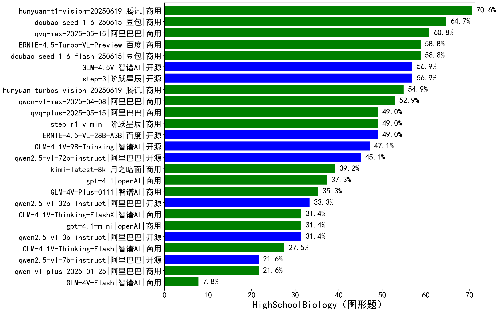

|类别|机构|大模型|【HighSchoolBiology（图形题）】准确率|平均耗时|平均消耗token|花费/千次（元）|排名（准确率）|
|---|---|-----|-------------------|-------|-----------|-----------|-----------|
|商用|腾讯|hunyuan-t1-vision-20250619|70.6%|72s|3960|31.8|1|
|商用|豆包|doubao-seed-1-6-250615|64.7%|/|1218|5.1|2|
|商用|阿里巴巴|qvq-max-2025-05-15|60.8%|99s|2864|76.6|3|
|商用|豆包|doubao-seed-1-6-flash-250615|58.8%|/|1077|0.8|4|
|商用|百度|ERNIE-4.5-Turbo-VL-Preview|58.8%|54s|2432|12.5|5|
|开源|阶跃星辰|step-3|56.9%|212s|4065|15.5|6|
|开源|智谱AI|GLM-4.5V|56.9%|70s|3814|20.4|7|
|商用|腾讯|hunyuan-turbos-vision-20250619|54.9%|28s|1021|5.8|8|
|商用|阿里巴巴|qwen-vl-max-2025-04-08|52.9%|59s|1290|7.9|9|
|商用|阶跃星辰|step-r1-v-mini|49.0%|90s|6511|48.7|10|
|开源|百度|ERNIE-4.5-VL-28B-A3B|49.0%|35s|1319|3.4|11|
|商用|阿里巴巴|qvq-plus-2025-05-15|49.0%|286s|5076|23.5|12|
|开源|智谱AI|GLM-4.1V-9B-Thinking|47.1%|123s|3375|2.9|13|
|开源|阿里巴巴|qwen2.5-vl-72b-instruct|45.1%|47s|878|3.6|14|
|商用|月之暗面|kimi-latest-8k|39.2%|21s|1463|17.6|15|
|商用|openAI|gpt-4.1|37.3%|35s|1270|45.0|16|
|商用|智谱AI|GLM-4V-Plus-0111|35.3%|23s|949|3.8|17|
|开源|阿里巴巴|qwen2.5-vl-32b-instruct|33.3%|67s|1635|3.1|18|
|商用|智谱AI|GLM-4.1V-Thinking-FlashX|31.4%|34s|1961|3.9|19|
|开源|阿里巴巴|qwen2.5-vl-3b-instruct|31.4%|40s|853|1.5|20|
|商用|openAI|gpt-4.1-mini|31.4%|35s|1203|9.1|21|
|商用|智谱AI|GLM-4.1V-Thinking-Flash|27.5%|11s|1788|0.0|22|
|开源|阿里巴巴|qwen2.5-vl-7b-instruct|21.6%|7s|890|0.3|23|
|商用|阿里巴巴|qwen-vl-plus-2025-01-25|21.6%|43s|1021|2.7|24|
|商用|智谱AI|GLM-4V-Flash|7.8%|7s|953|0.0|25|

