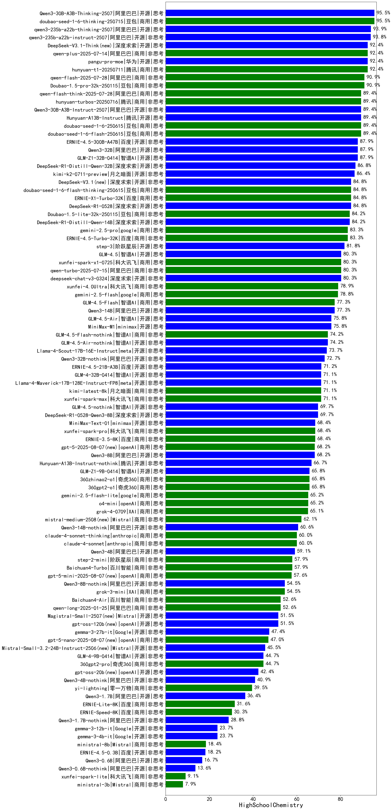

| 类别 | 大模型                         | HighSchoolChemistry | 排名 |
|-----|------------------------------|---------|----|
|商用|hunyuan-t1-20250529(new)|100.0%|1|
|商用|Doubao-1.5-thinking-pro(new)|95.5%|2|
|开源|DeepSeek-R1|92.1%|3|
|商用|Doubao-1.5-pro-32k-250115|90.9%|4|
|商用|gemini-2.5-pro-preview-03-25|89.5%|5|
|商用|hunyuan-turbos-20250313|89.5%|6|
|开源|Qwen3-235B-A22B|89.4%|7|
|商用|GLM-Z1-Air|88.0%|8|
|开源|GLM-Z1-32B-0414|87.9%|9|
|开源|Qwen3-32B|87.9%|10|
|商用|hunyuan-turbo|86.8%|11|
|开源|Qwen3-30B-A3B|86.8%|12|
|开源|DeepSeek-R1-Distill-Qwen-32B|86.8%|13|
|开源|DeepSeek-R1-0528(new)|86.4%|14|
|开源|DeepSeek-R1-Distill-Qwen-14B|84.2%|15|
|商用|Doubao-1.5-lite-32k-250115|84.2%|16|
|商用|xunfei-spark-x1(new)|84.2%|17|
|商用|ERNIE-X1-Turbo-32K(new)|83.3%|18|
|商用|ERNIE-4.5-Turbo-32K(new)|83.3%|19|
|开源|deepseek-chat-v3-0324|81.8%|20|
|开源|qwq-32b|81.8%|21|
|商用|gemini-2.5-pro-preview-05-06(new)|81.8%|22|
|商用|GLM-Z1-AirX|80.0%|23|
|商用|hunyuan-turbos-20250604(new)|80.0%|24|
|商用|step-r1-v-mini(new)|80.0%|25|
|商用|xunfei-4.0Ultra|78.9%|26|
|商用|hunyuan-t1-20250321|78.8%|27|
|商用|GLM-Z1-Flash|77.3%|28|
|商用|qwq-plus-2025-03-05|77.3%|29|
|开源|Qwen3-14B|76.3%|30|
|商用|gemini-2.5-flash-preview-05-20(new)|75.8%|31|
|商用|GLM-4-Plus|75.8%|32|
|开源|hunyuan-large|73.7%|33|
|开源|Llama-4-Scout-17B-16E-Instruct|73.7%|34|
|开源|Qwen3-8B|73.7%|35|
|开源|Llama-4-Maverick-17B-128E-Instruct-FP8|71.1%|36|
|商用|kimi-latest-8k|71.1%|37|
|商用|xunfei-spark-max|71.1%|38|
|开源|GLM-4-32B-0414|71.1%|39|
|商用|xunfei-spark-pro|68.4%|40|
|开源|DeepSeek-R1-0528-Qwen3-8B(new)|68.4%|41|
|开源|MiniMax-Text-01|68.4%|42|
|商用|ERNIE-3.5-8K|68.4%|43|
|商用|GLM-4-Air|66.7%|44|
|商用|SenseChat-5-beta|65.8%|45|
|商用|360gpt2-o1|65.8%|46|
|开源|Qwen3-4B|65.8%|47|
|商用|360zhinao2-o1|65.8%|48|
|开源|GLM-Z1-9B-0414|65.8%|49|
|商用|gemini-2.5-flash-preview-04-17|65.8%|50|
|开源|DeepSeek-R1-Distill-Llama-70B|65.8%|51|
|商用|qwen-plus|63.2%|52|
|开源|qwen2.5-14b-instruct|60.5%|53|
|开源|qwen2.5-32b-instruct|60.5%|54|
|商用|GLM-4-AirX|60.0%|55|
|商用|claude-4-sonnet-thinking(new)|60.0%|56|
|商用|o4-mini(new)|59.1%|57|
|商用|GLM-4-FlashX|58.0%|58|
|商用|Baichuan4-Turbo|57.9%|59|
|商用|step-2-mini|57.9%|60|
|开源|qwen2.5-72b-instruct|55.3%|61|
|商用|GLM-Z1-FlashX|53.3%|62|
|商用|hunyuan-standard|52.6%|63|
|商用|qwen-long|52.6%|64|
|商用|Baichuan4-Air|52.6%|65|
|商用|claude-4-sonnet(new)|50.0%|66|
|开源|qwen2.5-7b-instruct|47.4%|67|
|开源|gemma-3-27b-it|47.4%|68|
|商用|SenseChat-5-1202|47.4%|69|
|商用|GLM-4-Flash|47.0%|70|
|商用|GLM-4-Long|46.7%|71|
|商用|qwen-turbo|44.7%|72|
|开源|GLM-4-9B-0414|44.7%|73|
|商用|360gpt2-pro|44.7%|74|
|商用|360gpt-turbo|44.7%|75|
|开源|Meta-Llama-3.1-8B-Instruct-fp8|42.1%|76|
|开源|Llama-3.3-70B-Instruct|42.1%|77|
|商用|qwen2.5-max|42.1%|78|
|开源|DeepSeek-R1-Distill-Llama-8B|42.1%|79|
|商用|SenseChat-Turbo-1202|42.1%|80|
|商用|gpt-4.1-mini(new)|40.0%|81|
|商用|gpt-4.1(new)|40.0%|82|
|商用|yi-lightning|39.5%|83|
|开源|Qwen3-1.7B|39.5%|84|
|开源|GLM-Z1-Rumination-32B-0414|39.5%|85|
|开源|Mistral-Small-3.1-24B-Instruct-2503|39.5%|86|
|开源|Llama-3.1-8B-Instruct|36.8%|87|
|开源|Meta-Llama-3.1-405B-Instruct|36.8%|88|
|开源|DeepSeek-R1-Distill-Qwen-7B|34.2%|89|
|商用|chatgpt-4o-latest|31.6%|90|
|商用|ERNIE-Lite-8K|31.6%|91|
|开源|phi-4|31.6%|92|
|开源|qwen2.5-3b-instruct|31.6%|93|
|开源|Llama-3.3-70B-Instruct-fp8|31.6%|94|
|商用|moonshot-v1-8k|31.6%|95|
|商用|ERNIE-Speed-8K|30.3%|96|
|商用|mistral-small|28.9%|97|
|商用|mistral-large|28.9%|98|
|开源|Llama-3.2-1B-Instruct|28.9%|99|
|开源|qwen2.5-1.5b-instruct|26.3%|100|
|开源|internlm2_5-7b-chat|26.3%|101|
|开源|Qwen3-0.6B|26.3%|102|
|开源|Llama-3.2-3B-Instruct|23.7%|103|
|开源|gemma-3-4b-it|23.7%|104|
|开源|gemma-3-12b-it|23.7%|105|
|商用|gpt-4o-mini|18.4%|106|
|开源|qwen2.5-0.5b-instruct|18.4%|107|
|商用|ERNIE-Tiny-8K|18.4%|108|
|商用|ministral-8b|18.4%|109|
|商用|xunfei-spark-lite|9.1%|110|
|商用|ministral-3b|7.9%|111|

