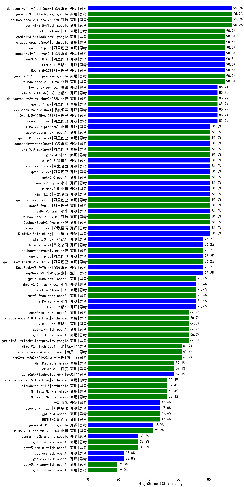

|类别|机构|大模型|【HighSchoolChemistry】准确率|平均耗时|平均消耗token|花费/千次（元）|排名（准确率）|
|---|---|-----|-------------------|-------|-----------|-----------|-----------|
|商用|google|gemini-3.5-flash|95.2%|20s|2972|178.5|1|
|商用|google|gemini-3.7-flash(new)|95.2%|26s|1280|30.1|2|
|商用|豆包|doubao-seed-2-1-pro-260628(new)|95.2%|494s|15763|467.9|3|
|商用|阿里巴巴|qwen3.7-plus(new)|90.5%|155s|8167|64.3|4|
|商用|anthropic|claude-opus-5(new)|90.5%|17s|1076|151.6|5|
|开源|阿里巴巴|Qwen3.5-27B|90.5%|213s|8560|40.4|6|
|商用|豆包|Doubao-Seed-2.0-lite|90.5%|307s|1530|4.9|7|
|开源|深度求索|deepseek-v4-flash-0424|90.5%|75s|2304|4.5|8|
|商用|google|gemini-3.8-flash(new)|90.5%|22s|1385|65.8|9|
|开源|阿里巴巴|Qwen3.6-35B-A3B|90.5%|21s|3850|40.0|10|
|开源|智谱AI|GLM-5.1|90.5%|394s|4290|99.9|11|
|商用|google|gemini-3.1-pro-preview|90.5%|57s|2714|219.4|12|
|开源|智谱AI|glm-5.3-flash(new)|85.7%|270s|6783|18.6|13|
|商用|豆包|doubao-seed-2-1-turbo-260628(new)|85.7%|262s|11978|177.2|14|
|开源|深度求索|deepseek-v4-pro-0424|85.7%|102s|3475|81.6|15|
|商用|阿里巴巴|qwen3.7-max|85.7%|79s|3947|137.9|16|
|开源|阿里巴巴|Qwen3.5-122B-A10B|85.7%|617s|5946|37.1|17|
|商用|google|gemini-3-flash-preview|85.7%|28s|3550|72.7|18|
|开源|阿里巴巴|qwen3.5-flash|85.7%|634s|7032|13.7|19|
|商用|豆包|Doubao-Seed-2.0-mini|81.0%|719s|3685|7.0|20|
|商用|豆包|Doubao-Seed-2.0-pro|81.0%|258s|1456|20.6|21|
|商用|openAI|gpt-6-astra(new)|81.0%|14s|561|141.0|22|
|开源|月之暗面|kimi-k2.7-code(new)|81.0%|86s|4035|105.6|23|
|商用|openAI|gpt-5.5|81.0%|20s|1383|255.8|24|
|开源|小米|mimo-v2.5-pro|81.0%|112s|5602|111.7|25|
|开源|小米|mimo-v2.5|81.0%|138s|3976|50.9|26|
|开源|月之暗面|kimi-k2.6|81.0%|365s|10287|274.4|27|
|商用|阿里巴巴|qwen3.6-max-preview|81.0%|96s|3258|168.1|28|
|开源|阿里巴巴|qwen3.6-27b|81.0%|68s|4467|77.8|29|
|开源|月之暗面|Kimi-K2.5-Thinking|81.0%|807s|9279|192.1|30|
|开源|阶跃星辰|step-3.5-flash|81.0%|54s|8285|17.2|31|
|商用|XAI|grok-4.5(new)|81.0%|107s|7847|319.3|32|
|商用|阿里巴巴|qwen3.8-flash(new)|81.0%|172s|10825|28.8|33|
|商用|腾讯|hunyuan-2.0-instruct-20251111|81.0%|33s|1246|2.3|34|
|开源|深度求索|deepseek-v4-pro(new)|81.0%|239s|3221|82.8|35|
|商用|阿里巴巴|qwen3.8-max(new)|81.0%|236s|9544|338.5|36|
|开源|小米|MiMo-V2-Omni|81.0%|29s|3944|50.4|37|
|开源|智谱AI|glm-5.2(new)|81.0%|105s|4776|130.1|38|
|商用|阿里巴巴|qwen3.6-plus|81.0%|59s|4041|46.7|39|
|商用|阿里巴巴|qwen3-max-preview-think|76.2%|420s|5760|134.9|40|
|开源|深度求索|DeepSeek-V3.2|76.2%|36s|1155|3.3|41|
|开源|深度求索|DeepSeek-V3.2-Think|76.2%|321s|4207|12.5|42|
|开源|阿里巴巴|qwen3-next-80b-a3b-thinking|76.2%|63s|6833|26.8|43|
|开源|智谱AI|glm-5.3(new)|76.2%|115s|3941|106.8|44|
|商用|腾讯|hunyuan-2.0-thinking-20251109|76.2%|48s|3017|11.6|45|
|商用|豆包|doubao-seed-evolving(new)|76.2%|303s|14551|431.6|46|
|商用|阿里巴巴|qwen-plus-think-2025-12-01|76.2%|110s|5586|43.4|47|
|商用|阿里巴巴|qwen3-max-think-2026-01-23|76.2%|517s|8290|81.5|48|
|商用|豆包|doubao-seed-1-8-251215|76.2%|39s|1176|7.9|49|
|开源|月之暗面|kimi-k3(new)|76.2%|92s|2004|181.0|50|
|开源|阿里巴巴|qwen3.5-plus|76.2%|61s|5611|26.2|51|
|开源|智谱AI|GLM-5|71.4%|195s|6283|110.7|52|
|商用|openAI|gpt-5.6-sol-pro(new)|71.4%|38s|6842|667.0|53|
|开源|小米|MiMo-V2-Pro|71.4%|405s|2628|49.2|54|
|商用|XAI|grok-4.6(new)|71.4%|88s|4445|176.5|55|
|商用|anthropic|claude-opus-4.8-thinking(new)|66.7%|27s|2177|344.4|56|
|商用|智谱AI|GLM-5-Turbo|66.7%|74s|3310|69.9|57|
|开源|智谱AI|GLM-4.7|66.7%|207s|5491|75.0|58|
|商用|阿里巴巴|qwen-plus-2025-12-01|66.7%|67s|2606|5.0|59|
|商用|openAI|gpt-5.4-high|66.7%|31s|2027|195.6|60|
|商用|openAI|gpt-5.3-chat|66.7%|22s|1059|86.9|61|
|商用|google|gemini-3.1-flash-lite-preview|66.7%|6s|752|6.4|62|
|商用|anthropic|claude-opus-4.6|61.9%|39s|1046|149.6|63|
|商用|阿里巴巴|qwen3-max-2026-01-23|61.9%|51s|2032|18.9|64|
|开源|小米|MiMo-V2-Flash|61.9%|172s|2487|0.0|65|
|商用|小米|MiMo-V2-Flash-0204|61.9%|658s|1872|3.6|66|
|商用|openAI|gpt-5.2-high|57.1%|82s|2666|247.8|67|
|开源|美团|LongCat-Flash-Lite|57.1%|211s|1777|0.0|68|
|商用|百度|ernie-5.1|57.1%|99s|4131|72.1|69|
|商用|minimax|MiniMax-M3(new)|57.1%|170s|3187|49.5|70|
|商用|anthropic|claude-opus-4.8(new)|52.4%|11s|808|104.8|71|
|商用|minimax|MiniMax-M2.5|52.4%|91s|5479|44.9|72|
|商用|anthropic|claude-sonnet-5-thinking(new)|52.4%|40s|2023|126.9|73|
|开源|Mistral|mistral-large-2512|52.4%|23s|1225|11.6|74|
|商用|minimax|MiniMax-M2.7|52.4%|171s|7239|59.6|75|
|开源|腾讯|hy3(new)|47.6%|63s|612|2.0|76|
|商用|openAI|gpt-5.4|47.6%|8s|669|52.9|77|
|开源|阶跃星辰|step-3.7-flash(new)|47.6%|126s|18610|149.7|78|
|商用|openAI|gpt-5.2-medium|47.6%|37s|1997|181.3|79|
|商用|百度|ERNIE-5.0|47.6%|580s|9497|225.3|80|
|开源|美团|LongCat-Flash-Thinking-2601|47.6%|448s|7760|0.0|81|
|开源|小米|MiMo-V2-Flash-think|47.6%|73s|6649|0.0|82|
|商用|minimax|MiniMax-M2.1|42.9%|276s|7147|58.9|83|
|开源|google|gemma-4-31b-it|42.9%|94s|991|2.5|84|
|商用|小米|MiMo-V2-Flash-think-0204|42.9%|690s|5638|11.6|85|
|开源|google|gemma-4-26b-a4b-it|33.3%|45s|1299|3.3|86|
|商用|openAI|gpt-5.4-mini-high|33.3%|81s|4189|126.8|87|
|商用|openAI|gpt-5.4-nano|33.3%|122s|800|5.5|88|
|开源|智谱AI|GLM-4.7-Flash|28.6%|2853s|16717|0.0|89|
|商用|openAI|gpt-5.2|28.6%|8s|596|42.1|90|
|开源|Mistral|Ministral-3-3B-Instruct-2512|28.6%|8s|1995|1.4|91|
|开源|openAI|gpt-oss-20b|23.8%|229s|3357|3.7|92|
|开源|openAI|gpt-oss-120b|23.8%|10s|1667|4.8|93|
|商用|openAI|gpt-5.4-mini|19.0%|12s|545|12.0|94|
|开源|Mistral|Ministral-3-14B-Instruct-2512|19.0%|44s|4041|5.8|95|
|商用|openAI|gpt-5.4-nano-high|19.0%|201s|3435|28.6|96|
|开源|Mistral|Ministral-3-8B-Instruct-2512|4.8%|14s|2704|2.9|97|

