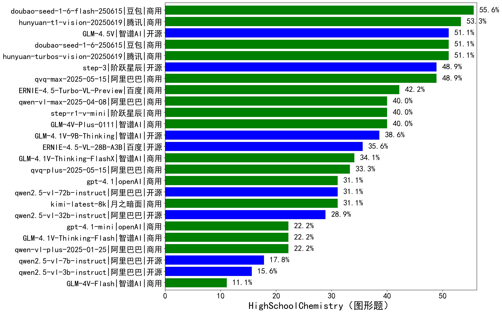

|类别|机构|大模型|【HighSchoolChemistry（图形题）】准确率|平均耗时|平均消耗token|花费/千次（元）|排名（准确率）|
|---|---|-----|-------------------|-------|-----------|-----------|-----------|
|商用|openAI|gpt-5-2025-08-07|60.0%|179s|4449|278.8|1|
|商用|google|gemini-2.5-pro|57.8%|191s|8424|582.0|2|
|商用|豆包|doubao-seed-1-6-flash-250615|55.6%|/|1145|0.8|3|
|商用|google|gemini-2.5-flash|55.6%|151s|7942|136.7|4|
|商用|腾讯|hunyuan-t1-vision-20250619|53.3%|70s|3595|28.2|5|
|商用|腾讯|hunyuan-turbos-vision-20250619|51.1%|28s|1134|6.4|6|
|开源|智谱AI|GLM-4.5V|51.1%|70s|3761|19.2|7|
|商用|豆包|doubao-seed-1-6-250615|51.1%|/|1294|5.5|8|
|商用|阿里巴巴|qwen-vl-max-2025-08-13|51.1%|141s|3989|14.6|9|
|开源|阶跃星辰|step-3|48.9%|377s|7129|27.7|10|
|商用|openAI|gpt-5-mini-2025-08-07|48.9%|166s|3446|43.0|11|
|商用|阿里巴巴|qvq-max-2025-05-15|48.9%|120s|3142|85.1|12|
|商用|百度|ERNIE-4.5-Turbo-VL-Preview|42.2%|49s|2441|10.9|13|
|商用|阿里巴巴|qwen-vl-plus-2025-08-15|42.2%|9s|1324|2.0|14|
|商用|智谱AI|GLM-4V-Plus-0111|40.0%|25s|1071|4.3|15|
|商用|阿里巴巴|qwen-vl-max-2025-04-08|40.0%|59s|1308|7.9|16|
|商用|阶跃星辰|step-r1-v-mini|40.0%|88s|6590|48.6|17|
|开源|智谱AI|GLM-4.1V-9B-Thinking|37.8%|119s|3402|2.9|18|
|开源|百度|ERNIE-4.5-VL-28B-A3B|35.6%|36s|1225|2.7|19|
|商用|阿里巴巴|qvq-plus-2025-05-15|33.3%|252s|4546|20.8|20|
|商用|智谱AI|GLM-4.1V-Thinking-FlashX|33.3%|31s|1995|4.0|21|
|商用|openAI|gpt-5-nano-2025-08-07|31.1%|172s|5597|14.8|22|
|开源|阿里巴巴|qwen2.5-vl-72b-instruct|31.1%|49s|990|4.1|23|
|商用|月之暗面|kimi-latest-8k|31.1%|20s|1654|19.9|24|
|商用|openAI|gpt-4.1|31.1%|34s|1211|41.4|25|
|开源|阿里巴巴|qwen2.5-vl-32b-instruct|28.9%|68s|1694|3.2|26|
|商用|openAI|gpt-4.1-mini|22.2%|33s|1183|8.9|27|
|商用|智谱AI|GLM-4.1V-Thinking-Flash|22.2%|10s|1790|0.0|28|
|商用|阿里巴巴|qwen-vl-plus-2025-01-25|22.2%|44s|1027|2.7|29|
|开源|阿里巴巴|qwen2.5-vl-7b-instruct|17.8%|9s|979|0.3|30|
|开源|阿里巴巴|qwen2.5-vl-3b-instruct|15.6%|40s|913|1.7|31|
|商用|google|gemini-2.5-flash-lite|15.6%|157s|8449|23.5|32|
|商用|智谱AI|GLM-4V-Flash|11.1%|7s|994|0.0|33|

