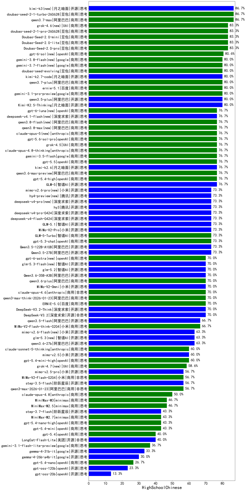

|类别|机构|大模型|【HighSchoolChinese】准确率|平均耗时|平均消耗token|花费/千次（元）|排名（准确率）|
|---|---|-----|-------------------|-------|-----------|-----------|-----------|
|商用|阿里巴巴|qwen3.7-max|86.7%|71s|3645|122.3|1|
|商用|豆包|doubao-seed-2-1-turbo-260628|86.7%|206s|9191|132.7|2|
|开源|月之暗面|kimi-k3(new)|86.7%|127s|3298|295.1|3|
|商用|豆包|Doubao-Seed-2.0-pro|83.3%|210s|1309|15.4|4|
|商用|豆包|doubao-seed-2-1-pro-260628|83.3%|216s|10269|297.7|5|
|商用|XAI|grok-4.6(new)|83.3%|99s|3957|149.0|6|
|商用|豆包|Doubao-Seed-2.0-mini|83.3%|131s|2793|4.8|7|
|商用|豆包|Doubao-Seed-2.0-lite|83.3%|211s|1425|3.8|8|
|商用|openAI|gpt-6-sol(new)|80.6%|142s|719|24.0|9|
|商用|百度|ernie-5.1|80.0%|44s|2013|30.5|10|
|商用|阿里巴巴|qwen3.7-plus|80.0%|96s|5433|41.2|11|
|开源|月之暗面|kimi-k2.7-code|80.0%|58s|2470|59.4|12|
|商用|google|gemini-3.1-pro-preview|80.0%|52s|2647|194.6|13|
|开源|阿里巴巴|qwen3.5-plus|80.0%|59s|4704|21.1|14|
|商用|豆包|doubao-seed-evolving|80.0%|326s|9733|281.6|15|
|开源|月之暗面|Kimi-K2.5-Thinking|80.0%|579s|3180|60.7|16|
|商用|google|gemini-3.7-flash(new)|80.0%|5s|1145|20.9|17|
|商用|google|gemini-3.8-flash(new)|80.0%|18s|1283|49.1|18|
|商用|阿里巴巴|qwen3.6-max-preview|76.7%|127s|2990|144.7|19|
|商用|XAI|grok-4.5|76.7%|98s|5841|228.1|20|
|商用|openAI|gpt-5.6-sol-pro|76.7%|28s|6620|539.9|21|
|商用|anthropic|claude-opus-5(new)|76.7%|16s|1308|137.8|22|
|商用|阿里巴巴|qwen3.8-max(new)|76.7%|69s|3111|102.1|23|
|商用|阿里巴巴|qwen3.8-flash(new)|76.7%|46s|2687|6.5|24|
|商用|anthropic|claude-opus-4.8-thinking|76.7%|17s|1647|197.2|25|
|开源|深度求索|deepseek-v4.1-flash(new)|76.7%|36s|4409|32.9|26|
|商用|google|gemini-3.5-flash|76.7%|11s|2461|132.2|27|
|商用|openAI|gpt-6-luna(new)|76.7%|286s|1352|3.4|28|
|商用|openAI|gpt-5.5|76.7%|16s|1401|210.1|29|
|开源|月之暗面|kimi-k2.6|76.7%|149s|2918|71.5|30|
|开源|智谱AI|GLM-5|76.7%|173s|3385|55.6|31|
|商用|openAI|gpt-5.4-high|76.7%|26s|1827|149.7|32|
|开源|阿里巴巴|Qwen3.5-122B-A10B|73.3%|544s|4920|29.4|33|
|开源|深度求索|deepseek-v4-flash-0424|73.3%|37s|1413|2.5|34|
|开源|腾讯|hy4-preview(new)|73.3%|193s|14161|250.4|35|
|开源|深度求索|deepseek-v4-pro(new)|73.3%|56s|3511|86.8|36|
|开源|腾讯|hy3|73.3%|69s|720|1.8|37|
|开源|阿里巴巴|Qwen3.5-27B|73.3%|596s|5633|25.5|38|
|商用|openAI|gpt-5.3-chat|73.3%|7s|961|53.0|39|
|商用|智谱AI|GLM-5-Turbo|73.3%|49s|3003|59.6|40|
|开源|深度求索|deepseek-v4-pro-0424|73.3%|68s|1684|36.0|41|
|开源|小米|mimo-v2.6-pro(new)|73.3%|74s|3842|21.9|42|
|开源|小米|MiMo-V2-Pro|73.3%|722s|2273|38.7|43|
|开源|智谱AI|GLM-5.1|73.3%|105s|3807|84.5|44|
|开源|智谱AI|glm-5.3-flash(new)|70.0%|181s|9244|25.1|45|
|商用|百度|ERNIE-5.0|70.0%|162s|1565|31.2|46|
|开源|小米|MiMo-V2-Omni|70.0%|716s|2488|27.6|47|
|开源|智谱AI|glm-5.2|70.0%|65s|3199|81.8|48|
|商用|anthropic|claude-opus-4.6|70.0%|15s|1300|136.6|49|
|商用|阿里巴巴|qwen3-max-think-2026-01-23|70.0%|137s|4945|46.3|50|
|商用|阿里巴巴|qwen3.6-plus|70.0%|68s|2945|31.5|51|
|开源|阿里巴巴|Qwen3.6-35B-A3B|70.0%|159s|3095|30.1|52|
|商用|openAI|gpt-6-astra(new)|70.0%|18s|725|119.0|53|
|开源|深度求索|DeepSeek-V3.2-Think|70.0%|48s|1758|4.9|54|
|开源|深度求索|DeepSeek-V3.2|70.0%|119s|686|1.7|55|
|开源|阿里巴巴|qwen3.5-flash|66.7%|172s|5939|11.2|56|
|商用|小米|MiMo-V2-Flash-think-0204|66.7%|790s|3555|6.9|57|
|开源|智谱AI|glm-5.3(new)|63.3%|154s|6021|160.8|58|
|开源|小米|mimo-v2.6-flash(new)|63.3%|79s|3166|5.9|59|
|开源|阿里巴巴|qwen3.6-27b|63.3%|47s|3175|51.6|60|
|商用|anthropic|claude-sonnet-5-thinking|60.0%|16s|1443|63.6|61|
|开源|小米|mimo-v2.5|60.0%|60s|3372|40.0|62|
|商用|openAI|gpt-5.4-mini-high|60.0%|22s|3177|87.4|63|
|开源|小米|mimo-v2.5-pro|56.7%|54s|2734|48.4|64|
|商用|阿里巴巴|qwen3-max-2026-01-23|56.7%|22s|1154|8.5|65|
|开源|阶跃星辰|step-3.5-flash|56.7%|30s|3441|6.7|66|
|商用|小米|MiMo-V2-Flash-0204|56.7%|341s|977|1.5|67|
|商用|anthropic|claude-opus-4.8|50.0%|8s|987|81.8|68|
|商用|minimax|MiniMax-M2.5|46.7%|60s|3670|28.4|69|
|商用|minimax|MiniMax-M3|46.7%|69s|2232|30.9|70|
|商用|minimax|MiniMax-M2.7|43.3%|124s|5780|46.1|71|
|商用|openAI|gpt-5.4-mini|43.3%|93s|682|8.8|72|
|开源|阶跃星辰|step-3.7-flash|43.3%|310s|4164|31.2|73|
|商用|openAI|gpt-5.4-nano-high|43.3%|37s|1991|13.9|74|
|商用|openAI|gpt-5.4|40.0%|6s|717|33.2|75|
|开源|美团|LongCat-Flash-Lite|40.0%|384s|1144|0.0|76|
|商用|google|gemini-3.1-flash-lite-preview|36.7%|3s|784|4.4|77|
|开源|google|gemma-4-31b-it|33.3%|100s|841|1.5|78|
|开源|google|gemma-4-26b-a4b-it|30.0%|80s|925|1.7|79|
|商用|openAI|gpt-5.4-nano|26.7%|45s|705|2.6|80|
|开源|openAI|gpt-oss-120b|23.3%|145s|1583|4.1|81|
|开源|openAI|gpt-oss-20b|13.3%|341s|4664|5.1|82|

