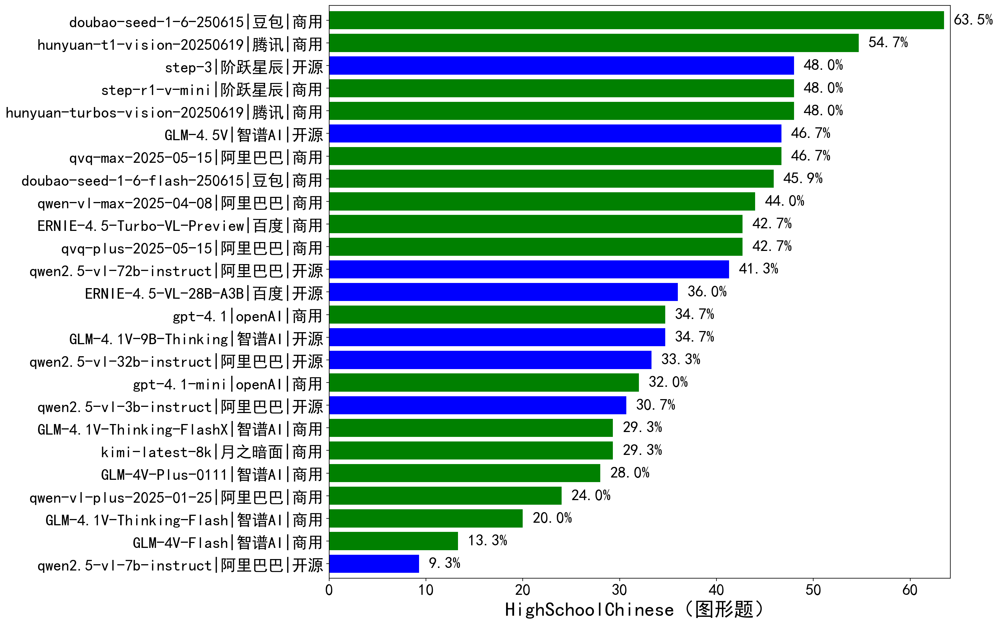

|类别|机构|大模型|【HighSchoolChinese（图形题）】准确率|平均耗时|平均消耗token|花费/千次（元）|排名（准确率）|
|---|---|-----|-------------------|-------|-----------|-----------|-----------|
|商用|豆包|doubao-seed-1-6-250615|63.5%|/|1555|1.8|1|
|商用|腾讯|hunyuan-t1-vision-20250619|54.7%|102s|2638|/|2|
|商用|腾讯|hunyuan-turbos-vision-20250619|48.0%|86s|1735|6.8|3|
|商用|阶跃星辰|step-r1-v-mini|48.0%|74s|3410|18.9|4|
|开源|阶跃星辰|step-3|48.0%|118s|2764|8.3|5|
|商用|阿里巴巴|qvq-max-2025-05-15|46.7%|100s|2474|43.8|6|
|商用|豆包|doubao-seed-1-6-flash-250615|45.9%|/|1669|0.5|7|
|商用|阿里巴巴|qwen-vl-max-2025-04-08|44.0%|94s|1950|8.7|8|
|商用|百度|ERNIE-4.5-Turbo-VL-Preview|42.7%|/|/|/|9|
|商用|阿里巴巴|qvq-plus-2025-05-15|42.7%|119s|2736|9.3|10|
|开源|阿里巴巴|qwen2.5-vl-72b-instruct|41.3%|82s|1706|7.0|11|
|开源|百度|ERNIE-4.5-VL-28B-A3B|36.0%|70s|1845|2.8|12|
|开源|智谱AI|GLM-4.1V-9B-Thinking|34.7%|129s|3497|2.4|13|
|商用|openAI|gpt-4.1|34.7%|11s|2014|42.9|14|
|开源|阿里巴巴|qwen2.5-vl-32b-instruct|33.3%|91s|2172|4.1|15|
|商用|openAI|gpt-4.1-mini|32.0%|8s|1880|8.2|16|
|开源|阿里巴巴|qwen2.5-vl-3b-instruct|30.7%|83s|1594|2.2|17|
|商用|月之暗面|kimi-latest-8k|29.3%|78s|2467|29.6|18|
|商用|智谱AI|GLM-4.1V-Thinking-FlashX|29.3%|83s|2755|5.4|19|
|商用|智谱AI|GLM-4V-Plus-0111|28.0%|67s|1710|6.8|20|
|商用|阿里巴巴|qwen-vl-plus-2025-01-25|24.0%|87s|1707|3.3|21|
|商用|智谱AI|GLM-4.1V-Thinking-Flash|20.0%|11s|3185|0.0|22|
|商用|智谱AI|GLM-4V-Flash|13.3%|5s|2208|0.0|23|
|开源|阿里巴巴|qwen2.5-vl-7b-instruct|9.3%|8s|2207|0.8|24|

