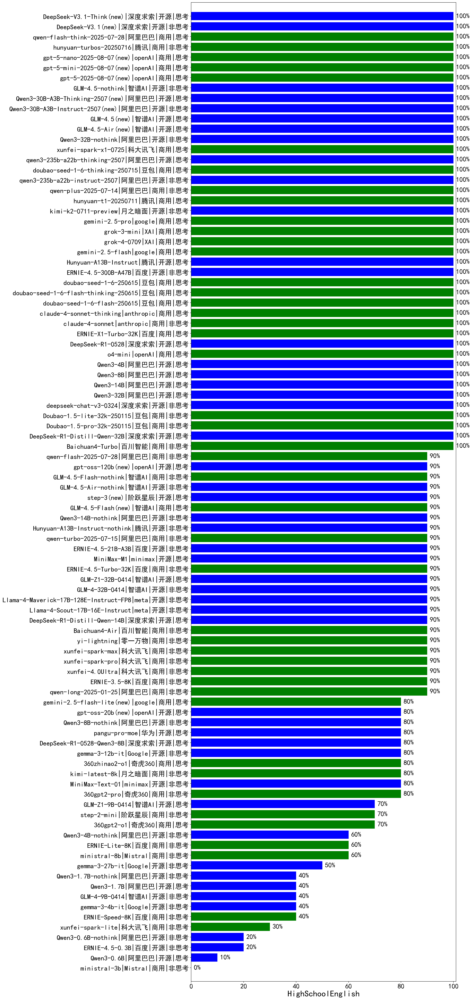

|类别|机构|大模型|【HighSchoolEnglish】准确率|平均耗时|平均消耗token|排名（准确率）|
|---|---|-----|-------------------|-------|-----------|------------|
|开源|阿里巴巴|qwen2.5-14b-instruct|100.0%|2s|177|1|
|商用|商汤|SenseChat-5-1202|100.0%|/|/|2|
|商用|阿里巴巴|qwen2.5-max|100.0%|36s|375|3|
|商用|商汤|SenseChat-Turbo-1202|100.0%|/|/|4|
|商用|豆包|Doubao-1.5-pro-32k-250115|100.0%|8s|361|5|
|商用|百川智能|Baichuan4-Turbo|100.0%|/|/|6|
|商用|腾讯|hunyuan-standard|100.0%|/|/|7|
|商用|豆包|Doubao-1.5-lite-32k-250115|100.0%|4s|236|8|
|开源|深度求索|DeepSeek-R1-Distill-Qwen-32B|100.0%|42s|644|9|
|开源|腾讯|hunyuan-large|100.0%|3s|139|10|
|开源|阿里巴巴|Qwen3-32B|100.0%|29s|1099|11|
|开源|阿里巴巴|Qwen3-235B-A22B|100.0%|74s|1830|12|
|商用|智谱AI|GLM-Z1-Air|100.0%|67s|1524|13|
|开源|深度求索|deepseek-chat-v3-0324|100.0%|111s|304|14|
|商用|google|gemini-2.5-pro(new)|100.0%|27s|1656|15|
|商用|XAI|grok-3-mini(new)|100.0%|291s|1361|16|
|商用|openAI|o4-mini|100.0%|26s|703|17|
|开源|深度求索|DeepSeek-R1-0528|100.0%|181s|1975|18|
|商用|百度|ERNIE-X1-Turbo-32K|100.0%|60s|1363|19|
|商用|anthropic|claude-4-sonnet|100.0%|45s|378|20|
|商用|anthropic|claude-4-sonnet-thinking|100.0%|51s|796|21|
|商用|豆包|doubao-seed-1-6-flash-250615(new)|100.0%|3s|248|22|
|商用|腾讯|hunyuan-t1-20250529|100.0%|16s|1020|23|
|商用|腾讯|hunyuan-turbos-20250604(new)|100.0%|5s|382|24|
|商用|豆包|doubao-seed-1-6-250615(new)|100.0%|60s|327|25|
|商用|豆包|doubao-seed-1-6-thinking-250615(new)|100.0%|494s|1019|26|
|商用|阿里巴巴|qwen-plus-think-2025-04-28|100.0%|62s|981|27|
|商用|豆包|doubao-seed-1-6-flash-thinking-250615(new)|100.0%|6s|456|28|
|开源|百度|ERNIE-4.5-300B-A47B(new)|100.0%|20s|420|29|
|开源|腾讯|Hunyuan-A13B-Instruct(new)|100.0%|35s|981|30|
|商用|阿里巴巴|qwen-turbo-think-2025-04-28|100.0%|183s|1146|31|
|商用|阿里巴巴|qwen-turbo-2025-04-28|100.0%|7s|398|32|
|商用|腾讯|hunyuan-t1-20250711(new)|100.0%|18s|1120|33|
|开源|阿里巴巴|Qwen3-235B-A22B-nothink|100.0%|20s|458|34|
|开源|月之暗面|kimi-k2-0711-preview(new)|100.0%|22s|394|35|
|商用|XAI|grok-4-0709(new)|100.0%|212s|1909|36|
|商用|google|gemini-2.5-flash(new)|100.0%|8s|1438|37|
|开源|阿里巴巴|Qwen3-4B|100.0%|19s|1644|38|
|开源|阿里巴巴|Qwen3-8B|100.0%|175s|1405|39|
|商用|豆包|Doubao-1.5-thinking-pro|100.0%|586s|883|40|
|开源|阿里巴巴|Qwen3-14B|100.0%|26s|1511|41|
|开源|阿里巴巴|Qwen3-30B-A3B|100.0%|24s|1463|42|
|商用|阿里巴巴|qwq-plus-2025-03-05|100.0%|51s|1573|43|
|开源|阿里巴巴|qwq-32b|100.0%|32s|1533|44|
|商用|科大讯飞|xunfei-spark-max|90.0%|2s|102|45|
|商用|科大讯飞|xunfei-4.0Ultra|90.0%|3s|103|46|
|商用|科大讯飞|xunfei-spark-pro|90.0%|/|/|47|
|商用|阿里巴巴|qwen-long-2025-01-25|90.0%|9s|397|48|
|商用|百度|ERNIE-3.5-8K|90.0%|25s|406|49|
|开源|深度求索|DeepSeek-R1-Distill-Qwen-14B|90.0%|/|/|50|
|商用|openAI|gpt-4.1|90.0%|10s|237|51|
|开源|meta|Llama-4-Scout-17B-16E-Instruct|90.0%|132s|375|52|
|开源|智谱AI|GLM-Z1-32B-0414|90.0%|140s|1373|53|
|商用|科大讯飞|xunfei-spark-x1|90.0%|34s|952|54|
|开源|meta|Llama-4-Maverick-17B-128E-Instruct-FP8|90.0%|27s|496|55|
|商用|百度|ERNIE-4.5-Turbo-32K|90.0%|21s|471|56|
|开源|百度|ERNIE-4.5-21B-A3B(new)|90.0%|4s|336|57|
|商用|阿里巴巴|qwen-plus-2025-04-28|90.0%|54s|439|58|
|商用|阶跃星辰|step-r1-v-mini|90.0%|84s|1095|59|
|开源|minimax|MiniMax-M1(new)|90.0%|114s|1403|60|
|开源|智谱AI|GLM-4-32B-0414|90.0%|11s|320|61|
|商用|openAI|chatgpt-4o-latest|90.0%|/|/|62|
|商用|百川智能|Baichuan4-Air|90.0%|/|/|63|
|商用|商汤|SenseChat-5-beta|90.0%|12s|215|64|
|开源|阿里巴巴|qwen2.5-72b-instruct|90.0%|32s|170|65|
|商用|奇虎360|360gpt-turbo|90.0%|/|/|66|
|商用|零一万物|yi-lightning|90.0%|/|/|67|
|商用|智谱AI|GLM-4-Plus|90.0%|15s|219|68|
|开源|阿里巴巴|qwen2.5-7b-instruct|80.0%|13s|156|69|
|商用|月之暗面|kimi-latest-8k|80.0%|29s|383|70|
|商用|智谱AI|GLM-4-Air|80.0%|11s|144|71|
|商用|OpenAI|gpt-4o-mini|80.0%|/|/|72|
|开源|minimax|MiniMax-Text-01|80.0%|8s|853|73|
|商用|智谱AI|GLM-4-AirX|80.0%|9s|153|74|
|开源|上海人工智能实验室|internlm2_5-7b-chat|80.0%|/|/|75|
|商用|Mistral|mistral-large|80.0%|/|/|76|
|商用|奇虎360|360zhinao2-o1|80.0%|/|/|77|
|开源|阿里巴巴|qwen2.5-32b-instruct|80.0%|20s|165|78|
|商用|奇虎360|360gpt2-pro|80.0%|26s|182|79|
|商用|智谱AI|GLM-4-Long|80.0%|43s|145|80|
|开源|深度求索|DeepSeek-R1-0528-Qwen3-8B|80.0%|412s|2420|81|
|商用|google|gemini-2.5-flash-lite-preview-06-17(new)|80.0%|2s|354|82|
|开源|华为|pangu-pro-moe(new)|80.0%|90s|1591|83|
|商用|智谱AI|GLM-Z1-AirX|80.0%|46s|1111|84|
|商用|智谱AI|GLM-Z1-Flash|80.0%|40s|1167|85|
|商用|openAI|gpt-4.1-mini|80.0%|8s|284|86|
|开源|Google|gemma-3-12b-it|80.0%|/|/|87|
|商用|阶跃星辰|step-2-mini|70.0%|116s|286|88|
|开源|微软|phi-4|70.0%|/|/|89|
|商用|Mistral|mistral-small|70.0%|/|/|90|
|商用|智谱AI|GLM-4-FlashX|70.0%|98s|164|91|
|开源|阿里巴巴|qwen2.5-3b-instruct|70.0%|8s|210|92|
|商用|奇虎360|360gpt2-o1|70.0%|19s|437|93|
|商用|智谱AI|GLM-Z1-FlashX|70.0%|55s|1813|94|
|开源|智谱AI|GLM-Z1-9B-0414|70.0%|53s|2010|95|
|开源|智谱AI|GLM-Z1-Rumination-32B-0414|70.0%|48s|1916|96|
|开源|Mistral|Mistral-Small-3.1-24B-Instruct-2503|60.0%|/|/|97|
|商用|智谱AI|GLM-4-Flash|60.0%|78s|160|98|
|商用|Mistral|ministral-8b|60.0%|/|/|99|
|商用|百度|ERNIE-Lite-8K|60.0%|/|/|100|
|开源|Google|gemma-3-27b-it|50.0%|/|/|101|
|商用|百度|ERNIE-Speed-8K|40.0%|/|/|102|
|开源|Google|gemma-3-4b-it|40.0%|/|/|103|
|开源|阿里巴巴|qwen2.5-1.5b-instruct|40.0%|3s|115|104|
|开源|智谱AI|GLM-4-9B-0414|40.0%|9s|301|105|
|开源|阿里巴巴|Qwen3-1.7B|40.0%|31s|2109|106|
|开源|阿里巴巴|qwen2.5-0.5b-instruct|30.0%|12s|248|107|
|商用|百度|ERNIE-Tiny-8K|30.0%|/|/|108|
|商用|科大讯飞|xunfei-spark-lite|30.0%|4s|164|109|
|开源|百度|ERNIE-4.5-0.3B(new)|20.0%|1s|236|110|
|开源|阿里巴巴|Qwen3-0.6B|10.0%|4s|991|111|
|商用|Mistral|ministral-3b|/%|/|/|112|

