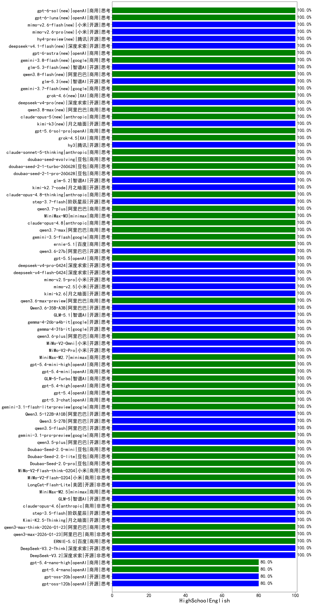

|类别|机构|大模型|【HighSchoolEnglish】准确率|平均耗时|平均消耗token|花费/千次（元）|排名（准确率）|
|---|---|-----|-------------------|-------|-----------|-----------|-----------|
|开源|月之暗面|kimi-k2.6|100.0%|40s|796|20.5|1|
|开源|小米|mimo-v2.5|100.0%|11s|1207|13.6|2|
|商用|豆包|doubao-seed-evolving|100.0%|77s|3217|94.4|3|
|商用|豆包|doubao-seed-2-1-turbo-260628|100.0%|45s|1843|26.6|4|
|商用|豆包|doubao-seed-2-1-pro-260628|100.0%|62s|2298|66.8|5|
|开源|智谱AI|glm-5.2|100.0%|23s|880|23.5|6|
|开源|月之暗面|kimi-k2.7-code|100.0%|10s|324|7.7|7|
|商用|anthropic|claude-opus-4.8-thinking|100.0%|8s|459|70.6|8|
|开源|阶跃星辰|step-3.7-flash|100.0%|15s|1033|8.0|9|
|商用|阿里巴巴|qwen3.7-plus|100.0%|21s|980|7.5|10|
|商用|minimax|MiniMax-M3|100.0%|23s|643|8.1|11|
|商用|anthropic|claude-opus-4.8|100.0%|8s|437|66.7|12|
|商用|阿里巴巴|qwen3.7-max|100.0%|16s|650|22.1|13|
|商用|google|gemini-3.5-flash|100.0%|5s|918|55.2|14|
|商用|百度|ernie-5.1|100.0%|28s|670|11.4|15|
|开源|阿里巴巴|qwen3.6-27b|100.0%|26s|1467|25.6|16|
|商用|openAI|gpt-5.5|100.0%|4s|191|31.3|17|
|开源|深度求索|deepseek-v4-pro-0424|100.0%|24s|398|9.0|18|
|开源|深度求索|deepseek-v4-flash-0424|100.0%|17s|445|0.8|19|
|商用|anthropic|claude-sonnet-5-thinking|100.0%|13s|340|19.9|20|
|开源|腾讯|hy3|100.0%|30s|173|0.5|21|
|商用|XAI|grok-4.5|100.0%|14s|717|23.1|22|
|开源|智谱AI|glm-5.3-flash(new)|100.0%|19s|687|1.8|23|
|商用|openAI|gpt-6-luna(new)|100.0%|107s|177|0.5|24|
|开源|小米|mimo-v2.6-flash(new)|100.0%|27s|553|1.1|25|
|开源|小米|mimo-v2.6-pro(new)|100.0%|14s|478|2.7|26|
|开源|腾讯|hy4-preview(new)|100.0%|34s|2401|42.4|27|
|开源|深度求索|deepseek-v4.1-flash(new)|100.0%|3s|299|2.0|28|
|商用|openAI|gpt-6-astra(new)|100.0%|10s|166|44.0|29|
|商用|google|gemini-3.8-flash(new)|100.0%|9s|506|24.5|30|
|商用|阿里巴巴|qwen3.8-flash(new)|100.0%|12s|638|1.5|31|
|商用|openAI|gpt-5.6-sol-pro|100.0%|8s|2694|191.1|32|
|开源|智谱AI|glm-5.3(new)|100.0%|28s|723|19.1|33|
|商用|google|gemini-3.7-flash(new)|100.0%|4s|483|11.6|34|
|商用|XAI|grok-4.6(new)|100.0%|14s|708|22.7|35|
|开源|深度求索|deepseek-v4-pro(new)|100.0%|11s|408|8.8|36|
|商用|阿里巴巴|qwen3.8-max(new)|100.0%|36s|1331|45.7|37|
|商用|anthropic|claude-opus-5(new)|100.0%|9s|441|67.3|38|
|开源|月之暗面|kimi-k3(new)|100.0%|20s|412|31.0|39|
|开源|小米|mimo-v2.5-pro|100.0%|15s|1063|18.2|40|
|商用|openAI|gpt-6-sol(new)|100.0%|111s|123|5.8|41|
|开源|阿里巴巴|Qwen3.5-27B|100.0%|240s|1567|7.3|42|
|开源|阿里巴巴|Qwen3.5-122B-A10B|100.0%|253s|1444|8.9|43|
|开源|阿里巴巴|qwen3.5-flash|100.0%|58s|1395|2.7|44|
|商用|google|gemini-3.1-pro-preview|100.0%|20s|779|62.8|45|
|开源|阿里巴巴|qwen3.5-plus|100.0%|15s|1108|5.1|46|
|商用|豆包|Doubao-Seed-2.0-mini|100.0%|23s|586|1.0|47|
|商用|豆包|Doubao-Seed-2.0-lite|100.0%|142s|586|1.8|48|
|商用|豆包|Doubao-Seed-2.0-pro|100.0%|120s|623|8.8|49|
|商用|小米|MiMo-V2-Flash-think-0204|100.0%|524s|984|2.0|50|
|商用|小米|MiMo-V2-Flash-0204|100.0%|112s|352|0.6|51|
|开源|美团|LongCat-Flash-Lite|100.0%|63s|267|0.0|52|
|商用|minimax|MiniMax-M2.5|100.0%|10s|514|3.8|53|
|开源|智谱AI|GLM-5|100.0%|44s|1354|23.7|54|
|商用|anthropic|claude-opus-4.6|100.0%|9s|361|54.5|55|
|开源|阶跃星辰|step-3.5-flash|100.0%|9s|784|1.6|56|
|开源|月之暗面|Kimi-K2.5-Thinking|100.0%|167s|889|17.8|57|
|商用|阿里巴巴|qwen3-max-think-2026-01-23|100.0%|90s|1519|14.8|58|
|商用|阿里巴巴|qwen3.6-max-preview|100.0%|39s|1178|61.2|59|
|商用|google|gemini-3.1-flash-lite-preview|100.0%|34s|292|2.6|60|
|商用|百度|ERNIE-5.0|100.0%|75s|690|15.7|61|
|商用|openAI|gpt-5.3-chat|100.0%|65s|218|17.1|62|
|开源|阿里巴巴|Qwen3.6-35B-A3B|100.0%|8s|1177|12.2|63|
|开源|智谱AI|GLM-5.1|100.0%|117s|817|18.7|64|
|开源|google|gemma-4-26b-a4b-it|100.0%|78s|428|1.1|65|
|开源|google|gemma-4-31b-it|100.0%|48s|418|1.1|66|
|商用|阿里巴巴|qwen3.6-plus|100.0%|26s|1293|15.0|67|
|开源|小米|MiMo-V2-Omni|100.0%|8s|1186|13.3|68|
|开源|小米|MiMo-V2-Pro|100.0%|10s|731|11.2|69|
|商用|minimax|MiniMax-M2.7|100.0%|16s|537|4.0|70|
|开源|深度求索|DeepSeek-V3.2|100.0%|90s|242|0.7|71|
|开源|深度求索|DeepSeek-V3.2-Think|100.0%|138s|512|1.5|72|
|商用|openAI|gpt-5.4-mini-high|100.0%|98s|272|7.2|73|
|商用|openAI|gpt-5.4-mini|100.0%|11s|192|4.7|74|
|商用|智谱AI|GLM-5-Turbo|100.0%|34s|820|17.2|75|
|商用|openAI|gpt-5.4-high|100.0%|7s|333|30.6|76|
|商用|openAI|gpt-5.4|100.0%|14s|183|14.9|77|
|商用|阿里巴巴|qwen3-max-2026-01-23|100.0%|30s|563|5.2|78|
|开源|openAI|gpt-oss-20b|80.0%|35s|595|0.6|79|
|商用|openAI|gpt-5.4-nano|80.0%|16s|123|0.7|80|
|商用|openAI|gpt-5.4-nano-high|80.0%|10s|132|0.8|81|
|开源|openAI|gpt-oss-120b|80.0%|220s|439|1.1|82|

