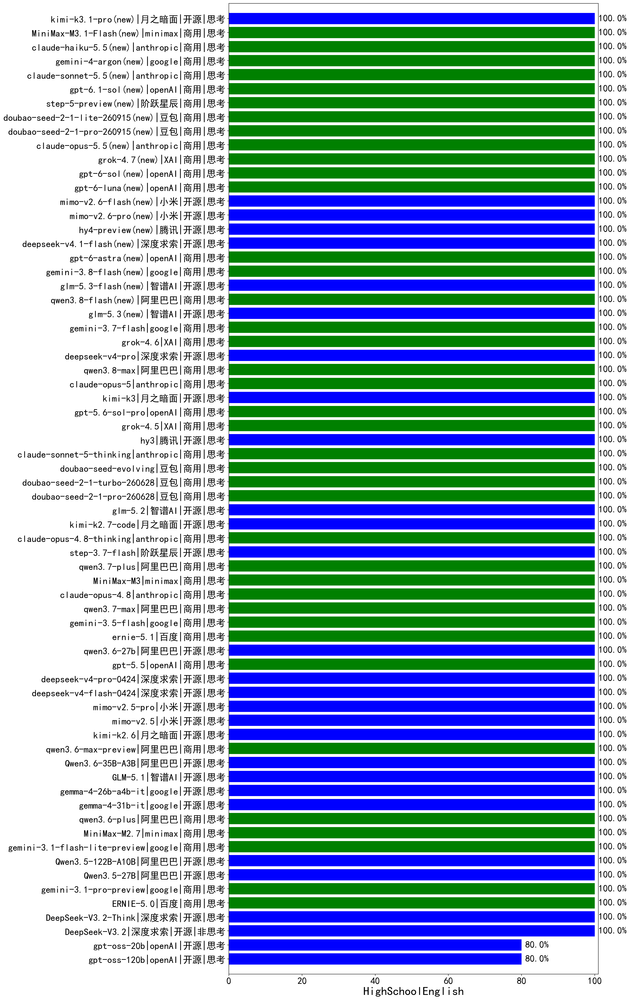

|类别|机构|大模型|【HighSchoolEnglish】准确率|平均耗时|平均消耗token|花费/千次（元）|排名（准确率）|
|---|---|-----|-------------------|-------|-----------|-----------|-----------|
|商用|豆包|doubao-seed-2-1-pro-260628|100.0%|62s|2298|66.8|1|
|商用|openAI|gpt-6-astra(new)|100.0%|10s|166|44.0|2|
|商用|anthropic|claude-sonnet-5-thinking|100.0%|13s|340|19.9|3|
|开源|腾讯|hy3|100.0%|30s|173|0.5|4|
|商用|XAI|grok-4.5|100.0%|14s|717|23.1|5|
|商用|openAI|gpt-5.6-sol-pro|100.0%|8s|2694|191.1|6|
|开源|月之暗面|kimi-k3|100.0%|20s|412|31.0|7|
|商用|anthropic|claude-opus-5|100.0%|9s|441|67.3|8|
|商用|阿里巴巴|qwen3.8-max|100.0%|36s|1331|45.7|9|
|开源|深度求索|deepseek-v4-pro|100.0%|11s|408|8.8|10|
|商用|XAI|grok-4.6|100.0%|14s|708|22.7|11|
|商用|google|gemini-3.7-flash|100.0%|4s|483|11.6|12|
|开源|智谱AI|glm-5.3(new)|100.0%|28s|723|19.1|13|
|商用|阿里巴巴|qwen3.8-flash(new)|100.0%|12s|638|1.5|14|
|开源|智谱AI|glm-5.3-flash(new)|100.0%|19s|687|1.8|15|
|商用|google|gemini-3.8-flash(new)|100.0%|9s|506|24.5|16|
|开源|深度求索|deepseek-v4.1-flash(new)|100.0%|3s|299|2.0|17|
|商用|豆包|doubao-seed-2-1-turbo-260628|100.0%|45s|1843|26.6|18|
|开源|腾讯|hy4-preview(new)|100.0%|34s|2401|42.4|19|
|开源|小米|mimo-v2.6-pro(new)|100.0%|14s|478|2.7|20|
|开源|小米|mimo-v2.6-flash(new)|100.0%|27s|553|1.1|21|
|商用|openAI|gpt-6-luna(new)|100.0%|107s|177|0.5|22|
|商用|openAI|gpt-6-sol(new)|100.0%|111s|123|5.8|23|
|商用|XAI|grok-4.7(new)|100.0%|24s|1875|42.7|24|
|商用|anthropic|claude-opus-5.5(new)|100.0%|15s|349|40.8|25|
|商用|豆包|doubao-seed-2-1-pro-260915(new)|100.0%|27s|933|25.8|26|
|商用|豆包|doubao-seed-2-1-lite-260915(new)|100.0%|9s|434|1.0|27|
|商用|阶跃星辰|step-5-preview(new)|100.0%|15s|293|5.2|28|
|商用|openAI|gpt-6.1-sol(new)|100.0%|4s|151|7.8|29|
|商用|anthropic|claude-sonnet-5.5(new)|100.0%|6s|326|18.8|30|
|商用|google|gemini-4-argon(new)|100.0%|9s|265|28.3|31|
|商用|anthropic|claude-haiku-5.5(new)|100.0%|4s|439|1.3|32|
|商用|豆包|doubao-seed-evolving|100.0%|77s|3217|94.4|33|
|商用|minimax|MiniMax-M3.1-Flash(new)|100.0%|21s|1327|4.6|34|
|开源|小米|mimo-v2.5|100.0%|11s|1207|13.6|35|
|开源|智谱AI|glm-5.2|100.0%|23s|880|23.5|36|
|商用|百度|ERNIE-5.0|100.0%|75s|690|15.7|37|
|商用|google|gemini-3.1-pro-preview|100.0%|20s|779|62.8|38|
|开源|阿里巴巴|Qwen3.5-27B|100.0%|240s|1567|7.3|39|
|开源|阿里巴巴|Qwen3.5-122B-A10B|100.0%|253s|1444|8.9|40|
|商用|google|gemini-3.1-flash-lite-preview|100.0%|34s|292|2.6|41|
|商用|minimax|MiniMax-M2.7|100.0%|16s|537|4.0|42|
|商用|阿里巴巴|qwen3.6-plus|100.0%|26s|1293|15.0|43|
|开源|google|gemma-4-31b-it|100.0%|48s|418|1.1|44|
|开源|google|gemma-4-26b-a4b-it|100.0%|78s|428|1.1|45|
|开源|智谱AI|GLM-5.1|100.0%|117s|817|18.7|46|
|开源|阿里巴巴|Qwen3.6-35B-A3B|100.0%|8s|1177|12.2|47|
|商用|阿里巴巴|qwen3.6-max-preview|100.0%|39s|1178|61.2|48|
|开源|月之暗面|kimi-k2.6|100.0%|40s|796|20.5|49|
|开源|小米|mimo-v2.5-pro|100.0%|15s|1063|18.2|50|
|开源|深度求索|DeepSeek-V3.2|100.0%|90s|242|0.7|51|
|开源|深度求索|deepseek-v4-flash-0424|100.0%|17s|445|0.8|52|
|开源|深度求索|deepseek-v4-pro-0424|100.0%|24s|398|9.0|53|
|商用|openAI|gpt-5.5|100.0%|4s|191|31.3|54|
|开源|阿里巴巴|qwen3.6-27b|100.0%|26s|1467|25.6|55|
|商用|百度|ernie-5.1|100.0%|28s|670|11.4|56|
|商用|google|gemini-3.5-flash|100.0%|5s|918|55.2|57|
|商用|阿里巴巴|qwen3.7-max|100.0%|16s|650|22.1|58|
|商用|anthropic|claude-opus-4.8|100.0%|8s|437|66.7|59|
|商用|minimax|MiniMax-M3|100.0%|23s|643|8.1|60|
|商用|阿里巴巴|qwen3.7-plus|100.0%|21s|980|7.5|61|
|开源|阶跃星辰|step-3.7-flash|100.0%|15s|1033|8.0|62|
|商用|anthropic|claude-opus-4.8-thinking|100.0%|8s|459|70.6|63|
|开源|月之暗面|kimi-k2.7-code|100.0%|10s|324|7.7|64|
|开源|深度求索|DeepSeek-V3.2-Think|100.0%|138s|512|1.5|65|
|开源|openAI|gpt-oss-20b|80.0%|35s|595|0.6|66|
|开源|openAI|gpt-oss-120b|80.0%|220s|439|1.1|67|

