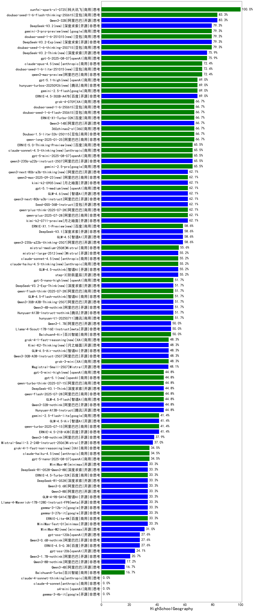

| 类别 | 大模型                         | HighSchoolGeography | 排名 |
|-----|------------------------------|---------|----|
|开源|hunyuan-large|100.0|1|
|商用|hunyuan-turbos-20250313|100.0|2|
|商用|hunyuan-turbos-20250226|100.0|3|
|开源|DeepSeek-R1|100.0|4|
|商用|ERNIE-4.5-8K-Preview|100.0|5|
|商用|Doubao-1.5-lite-32k-250115|100.0|6|
|商用|Doubao-1.5-pro-32k-250115|100.0|7|
|商用|qwq-plus-2025-03-05|100.0|8|
|商用|gemini-2.5-flash-preview-04-17(new)|96.7|9|
|商用|hunyuan-t1-20250321(new)|96.0|10|
|开源|deepseek-chat-v3-0324(new)|95.0|11|
|商用|xunfei-4.0Ultra|94.4|12|
|商用|GLM-4-AirX|94.4|13|
|商用|360gpt-turbo|94.4|14|
|商用|Baichuan4-Turbo|94.4|15|
|商用|gemini-2.0-flash-thinking-exp-01-21|94.4|16|
|商用|kimi-latest-8k|94.4|17|
|商用|gemini-2.0-flash-001|94.4|18|
|商用|GLM-4-Air|94.4|19|
|商用|hunyuan-turbo|94.4|20|
|商用|ERNIE-X1-32K-Preview(new)|93.3|21|
|商用|GLM-Z1-AirX(new)|93.3|22|
|商用|GLM-Z1-Air(new)|92.0|23|
|开源|GLM-4-32B-0414(new)|90.8|24|
|商用|gemini-2.5-pro-preview-03-25(new)|90.0|25|
|商用|SenseChat-5-1202|88.9|26|
|开源|qwq-32b|88.9|27|
|商用|360gpt2-pro|88.9|28|
|商用|yi-lightning|88.9|29|
|商用|Claude-3.5-Sonnet|88.9|30|
|开源|qwen2.5-72b-instruct|88.9|31|
|开源|qwen2.5-32b-instruct|88.9|32|
|商用|xunfei-spark-max|88.9|33|
|商用|ERNIE-3.5-8K|88.9|34|
|商用|qwen-long|88.9|35|
|开源|MiniMax-Text-01|88.9|36|
|商用|SenseChat-5-beta|88.9|37|
|开源|DeepSeek-R1-Distill-Qwen-32B|88.9|38|
|商用|mistral-large|88.9|39|
|商用|xunfei-spark-pro|88.9|40|
|开源|Llama-4-Maverick-17B-128E-Instruct-FP8(new)|87.0|41|
|开源|Llama-4-Scout-17B-16E-Instruct(new)|85.8|42|
|开源|GLM-Z1-9B-0414(new)|83.7|43|
|商用|GLM-4-Plus|83.3|44|
|开源|DeepSeek-R1-Distill-Qwen-14B|83.3|45|
|商用|qwen-plus|83.3|46|
|商用|qwen-turbo|83.3|47|
|开源|glm-4-9b-chat|83.3|48|
|商用|qwen2.5-max|83.3|49|
|开源|GLM-Z1-32B-0414(new)|83.3|50|
|商用|step-1-8k|83.3|51|
|开源|GLM-Z1-Rumination-32B-0414(new)|80.0|52|
|开源|GLM-4-9B-0414(new)|79.4|53|
|商用|abab6.5s-chat|77.8|54|
|商用|step-2-mini|77.8|55|
|开源|qwen2.5-7b-instruct|77.8|56|
|商用|gemini-1.5-pro|77.8|57|
|开源|internlm2_5-20b-chat|77.8|58|
|开源|qwen2.5-14b-instruct|77.8|59|
|商用|gemini-1.5-flash|77.8|60|
|商用|GLM-Z1-Flash(new)|76.6|61|
|开源|Mistral-Small-3.1-24B-Instruct-2503(new)|75.9|62|
|商用|GLM-Z1-FlashX(new)|73.0|63|
|商用|Baichuan4-Air|72.2|64|
|商用|GLM-4-Long|72.2|65|
|商用|ERNIE-4.0-Turbo-8K|72.2|66|
|商用|360gpt2-o1|72.2|67|
|商用|360zhinao2-o1|72.2|68|
|商用|hunyuan-standard|72.2|69|
|开源|DeepSeek-R1-Distill-Llama-70B|66.7|70|
|商用|SenseChat-Turbo-1202|66.7|71|
|开源|Llama-3.3-70B-Instruct|66.7|72|
|商用|chatgpt-4o-latest|66.7|73|
|商用|GLM-4-FlashX|66.7|74|
|开源|Meta-Llama-3.1-405B-Instruct|66.7|75|
|开源|Hermes-3-Llama-3.1-405B|61.1|76|
|商用|GLM-4-Flash|61.1|77|
|开源|internlm2_5-7b-chat|61.1|78|
|开源|qwen2.5-0.5b-instruct|61.1|79|
|商用|moonshot-v1-8k|61.1|80|
|商用|ministral-8b|61.1|81|
|商用|o3-mini|61.1|82|
|商用|ERNIE-Lite-Pro-128K|61.1|83|
|商用|ERNIE-Lite-8K|55.6|84|
|商用|gpt-4o-mini-2024-07-18|55.6|85|
|商用|ERNIE-Speed-Pro-128K|55.6|86|
|开源|Mistral-Small-24B-Instruct-2501|55.6|87|
|开源|phi-4|55.6|88|
|开源|Llama-3.1-8B-Instruct|50.0|89|
|开源|Meta-Llama-3.1-8B-Instruct-fp8|50.0|90|
|商用|ERNIE-Speed-8K|50.0|91|
|开源|gemma-3-12b-it|50.0|92|
|开源|gemma-3-27b-it|50.0|93|
|商用|ERNIE-Tiny-8K|50.0|94|
|商用|mistral-small|50.0|95|
|开源|DeepSeek-R1-Distill-Qwen-7B|50.0|96|
|开源|Llama-3.2-3B-Instruct|44.4|97|
|开源|gemma-3-1b-it|44.4|98|
|开源|qwen2.5-3b-instruct|44.4|99|
|商用|gemini-1.5-flash-8b|44.4|100|
|商用|ministral-3b|44.4|101|
|开源|Llama-3.3-70B-Instruct-fp8|44.4|102|
|开源|Llama-3.2-1B-Instruct|38.9|103|
|开源|qwen2.5-1.5b-instruct|38.9|104|
|开源|gemma-3-4b-it|38.9|105|
|商用|xunfei-spark-lite|33.3|106|
|开源|DeepSeek-R1-Distill-Qwen-1.5B|27.8|107|
|开源|DeepSeek-R1-Distill-Llama-8B|27.8|108|

