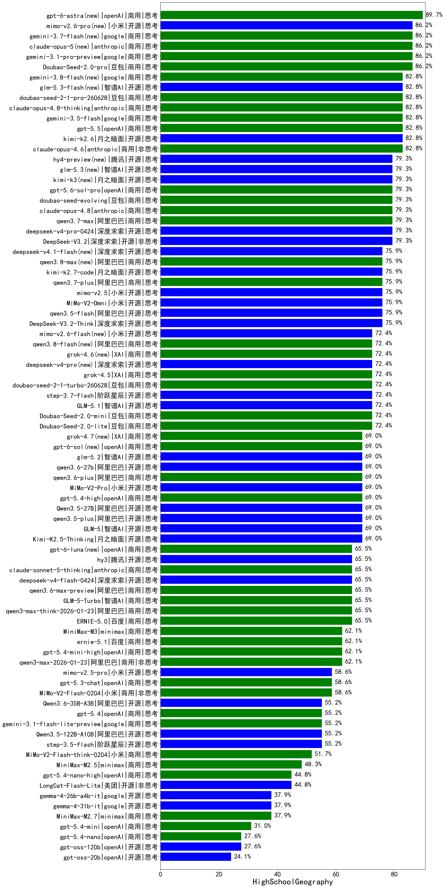

|类别|机构|大模型|【HighSchoolGeography】准确率|平均耗时|平均消耗token|花费/千次（元）|排名（准确率）|
|---|---|-----|-------------------|-------|-----------|-----------|-----------|
|商用|openAI|gpt-6-astra(new)|89.7%|13s|411|94.6|1|
|开源|小米|mimo-v2.6-pro(new)|86.2%|72s|3091|18.1|2|
|商用|anthropic|claude-opus-5(new)|86.2%|14s|833|113.7|3|
|商用|google|gemini-3.1-pro-preview|86.2%|34s|2235|178.4|4|
|商用|google|gemini-3.7-flash(new)|86.2%|5s|877|19.5|5|
|商用|豆包|Doubao-Seed-2.0-pro|86.2%|289s|1469|21.0|6|
|开源|月之暗面|kimi-k2.6|82.8%|298s|5026|132.8|7|
|商用|anthropic|claude-opus-4.8-thinking|82.8%|16s|1266|189.4|8|
|商用|openAI|gpt-5.5|82.8%|14s|876|153.1|9|
|商用|google|gemini-3.5-flash|82.8%|14s|2423|143.7|10|
|商用|豆包|doubao-seed-2-1-pro-260628|82.8%|323s|14403|427.5|11|
|商用|anthropic|claude-opus-4.6|82.8%|31s|875|120.8|12|
|商用|google|gemini-3.8-flash(new)|82.8%|11s|999|45.3|13|
|开源|智谱AI|glm-5.3-flash(new)|82.8%|174s|4369|11.9|14|
|开源|月之暗面|kimi-k3(new)|79.3%|89s|1819|164.4|15|
|开源|深度求索|deepseek-v4-pro-0424|79.3%|72s|1775|40.9|16|
|开源|智谱AI|glm-5.3(new)|79.3%|125s|2917|78.6|17|
|商用|豆包|doubao-seed-evolving|79.3%|348s|13640|404.6|18|
|商用|anthropic|claude-opus-4.8|79.3%|17s|717|93.3|19|
|商用|阿里巴巴|qwen3.7-max|79.3%|49s|2390|82.3|20|
|开源|腾讯|hy4-preview(new)|79.3%|102s|6346|112.4|21|
|开源|深度求索|DeepSeek-V3.2|79.3%|18s|643|1.8|22|
|商用|openAI|gpt-5.6-sol-pro|79.3%|20s|4268|348.9|23|
|开源|小米|MiMo-V2-Omni|75.9%|55s|2707|33.4|24|
|商用|阿里巴巴|qwen3.7-plus|75.9%|100s|5507|43.1|25|
|开源|月之暗面|kimi-k2.7-code|75.9%|56s|2231|57.3|26|
|开源|小米|mimo-v2.5|75.9%|42s|2554|31.3|27|
|商用|阿里巴巴|qwen3.8-max(new)|75.9%|97s|4193|146.3|28|
|开源|阿里巴巴|qwen3.5-flash|75.9%|172s|5823|11.4|29|
|开源|深度求索|deepseek-v4.1-flash(new)|75.9%|11s|1828|13.6|30|
|开源|深度求索|DeepSeek-V3.2-Think|75.9%|222s|2775|8.2|31|
|商用|XAI|grok-4.5|72.4%|63s|3874|152.8|32|
|商用|豆包|doubao-seed-2-1-turbo-260628|72.4%|245s|13429|199.1|33|
|商用|XAI|grok-4.6(new)|72.4%|166s|3800|149.7|34|
|开源|阶跃星辰|step-3.7-flash|72.4%|4348s|4398|34.6|35|
|商用|豆包|Doubao-Seed-2.0-mini|72.4%|116s|3826|7.3|36|
|商用|豆包|Doubao-Seed-2.0-lite|72.4%|233s|1311|4.1|37|
|商用|阿里巴巴|qwen3.8-flash(new)|72.4%|110s|5326|14.0|38|
|开源|智谱AI|GLM-5.1|72.4%|224s|3017|69.8|39|
|开源|小米|mimo-v2.6-flash(new)|72.4%|405s|4081|8.0|40|
|开源|深度求索|deepseek-v4-pro(new)|72.4%|151s|2509|63.8|41|
|开源|智谱AI|glm-5.2|69.0%|128s|6053|166.4|42|
|开源|阿里巴巴|qwen3.6-27b|69.0%|44s|2644|45.3|43|
|商用|openAI|gpt-6-sol(new)|69.0%|408s|401|18.2|44|
|商用|openAI|gpt-5.4-high|69.0%|20s|1058|95.7|45|
|开源|月之暗面|Kimi-K2.5-Thinking|69.0%|513s|5528|113.7|46|
|开源|智谱AI|GLM-5|69.0%|139s|3735|65.2|47|
|开源|阿里巴巴|qwen3.5-plus|69.0%|55s|4493|20.9|48|
|开源|阿里巴巴|Qwen3.5-27B|69.0%|571s|5262|24.6|49|
|商用|阿里巴巴|qwen3.6-plus|69.0%|42s|2313|26.3|50|
|开源|小米|MiMo-V2-Pro|69.0%|634s|2743|51.9|51|
|商用|智谱AI|GLM-5-Turbo|65.5%|51s|2744|57.9|52|
|商用|openAI|gpt-6-luna(new)|65.5%|182s|607|1.6|53|
|商用|百度|ERNIE-5.0|65.5%|282s|4011|93.8|54|
|商用|阿里巴巴|qwen3-max-think-2026-01-23|65.5%|334s|6319|61.9|55|
|开源|腾讯|hy3|65.5%|47s|435|1.3|56|
|商用|anthropic|claude-sonnet-5-thinking|65.5%|16s|1159|68.3|57|
|开源|深度求索|deepseek-v4-flash-0424|65.5%|58s|2715|5.3|58|
|商用|阿里巴巴|qwen3.6-max-preview|65.5%|75s|2315|118.1|59|
|商用|openAI|gpt-5.4-mini-high|62.1%|137s|1484|42.1|60|
|商用|阿里巴巴|qwen3-max-2026-01-23|62.1%|32s|1190|10.7|61|
|商用|百度|ernie-5.1|62.1%|71s|2625|45.1|62|
|商用|minimax|MiniMax-M3|62.1%|79s|2433|37.0|63|
|商用|小米|MiMo-V2-Flash-0204|58.6%|425s|1033|1.9|64|
|开源|小米|mimo-v2.5-pro|58.6%|96s|5124|101.9|65|
|商用|openAI|gpt-5.3-chat|58.6%|61s|578|41.5|66|
|商用|openAI|gpt-5.4|55.2%|15s|389|25.5|67|
|商用|google|gemini-3.1-flash-lite-preview|55.2%|17s|606|4.9|68|
|开源|阿里巴巴|Qwen3.5-122B-A10B|55.2%|181s|5730|35.8|69|
|开源|阿里巴巴|Qwen3.6-35B-A3B|55.2%|154s|2494|25.5|70|
|开源|阶跃星辰|step-3.5-flash|55.2%|63s|7801|16.2|71|
|商用|小米|MiMo-V2-Flash-think-0204|51.7%|364s|4393|9.0|72|
|商用|minimax|MiniMax-M2.5|48.3%|58s|2921|23.5|73|
|开源|美团|LongCat-Flash-Lite|44.8%|176s|754|0.0|74|
|商用|openAI|gpt-5.4-nano-high|44.8%|90s|2064|16.8|75|
|开源|google|gemma-4-26b-a4b-it|37.9%|107s|848|2.0|76|
|开源|google|gemma-4-31b-it|37.9%|110s|727|1.7|77|
|商用|minimax|MiniMax-M2.7|37.9%|86s|3518|28.5|78|
|商用|openAI|gpt-5.4-mini|31.0%|4s|381|7.4|79|
|商用|openAI|gpt-5.4-nano|27.6%|98s|400|2.2|80|
|开源|openAI|gpt-oss-120b|27.6%|295s|901|2.3|81|
|开源|openAI|gpt-oss-20b|24.1%|284s|2106|2.2|82|

