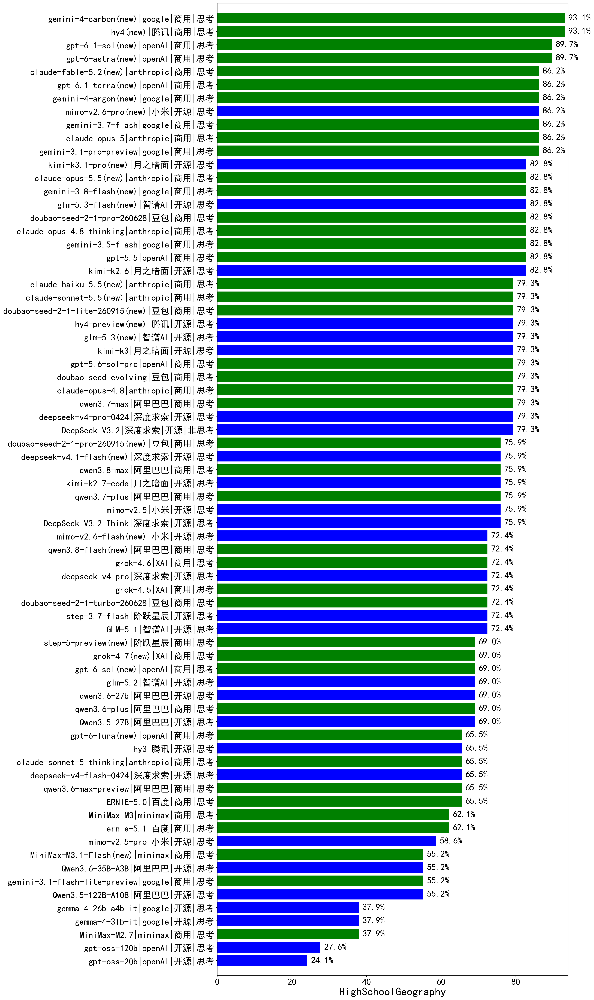

|类别|机构|大模型|【HighSchoolGeography】准确率|平均耗时|平均消耗token|花费/千次（元）|排名（准确率）|
|---|---|-----|-------------------|-------|-----------|-----------|-----------|
|商用|腾讯|hy4(new)|93.1%|145s|7161|127.0|1|
|商用|google|gemini-4-carbon(new)|93.1%|39s|1695|215.8|2|
|商用|openAI|gpt-6.1-sol(new)|89.7%|8s|382|16.9|3|
|商用|openAI|gpt-6-astra|89.7%|13s|411|94.6|4|
|商用|anthropic|claude-fable-5.2(new)|86.2%|16s|789|169.1|5|
|开源|小米|mimo-v2.6-pro|86.2%|72s|3091|18.1|6|
|商用|google|gemini-4-argon(new)|86.2%|17s|579|59.5|7|
|商用|openAI|gpt-6.1-terra(new)|86.2%|6s|422|9.8|8|
|商用|openAI|gpt-6.2-sol(new)|86.2%|8s|331|13.3|9|
|商用|google|gemini-3.1-pro-preview|86.2%|34s|2235|178.4|10|
|商用|anthropic|claude-opus-5|86.2%|14s|833|113.7|11|
|商用|google|gemini-3.7-flash|86.2%|5s|877|19.5|12|
|商用|openAI|gpt-5.5|82.8%|14s|876|153.1|13|
|商用|豆包|doubao-seed-2-1-pro-260628|82.8%|323s|14403|427.5|14|
|商用|anthropic|claude-opus-4.8-thinking|82.8%|16s|1266|189.4|15|
|商用|google|gemini-3.8-flash|82.8%|11s|999|45.3|16|
|开源|智谱AI|glm-5.3-flash|82.8%|174s|4369|11.9|17|
|商用|google|gemini-3.5-flash|82.8%|14s|2423|143.7|18|
|商用|anthropic|claude-opus-5.5(new)|82.8%|15s|831|90.3|19|
|商用|openAI|gpt-6.2-astra(new)|82.8%|5s|308|46.9|20|
|开源|月之暗面|kimi-k3.1-pro(new)|82.8%|125s|4113|267.6|21|
|开源|月之暗面|kimi-k2.6|82.8%|298s|5026|132.8|22|
|开源|腾讯|hy4-preview|79.3%|102s|6346|112.4|23|
|商用|豆包|doubao-seed-evolving|79.3%|348s|13640|404.6|24|
|商用|阿里巴巴|qwen4-max(new)|79.3%|70s|822|21.3|25|
|商用|openAI|gpt-5.6-sol-pro|79.3%|20s|4268|348.9|26|
|开源|深度求索|deepseek-v4-pro-0424|79.3%|72s|1775|40.9|27|
|商用|anthropic|claude-haiku-5.5(new)|79.3%|8s|1128|3.3|28|
|开源|智谱AI|glm-5.3|79.3%|125s|2917|78.6|29|
|商用|anthropic|claude-sonnet-5.5(new)|79.3%|9s|802|43.1|30|
|商用|anthropic|claude-opus-4.8|79.3%|17s|717|93.3|31|
|商用|阿里巴巴|qwen3.7-max|79.3%|49s|2390|82.3|32|
|开源|深度求索|DeepSeek-V3.2|79.3%|18s|643|1.8|33|
|商用|豆包|doubao-seed-2-1-lite-260915(new)|79.3%|102s|4563|12.0|34|
|开源|月之暗面|kimi-k3|79.3%|89s|1819|164.4|35|
|开源|深度求索|DeepSeek-V3.2-Think|75.9%|222s|2775|8.2|36|
|商用|阿里巴巴|qwen3.8-max|75.9%|97s|4193|146.3|37|
|商用|豆包|doubao-seed-2-1-pro-260915(new)|75.9%|103s|3334|95.4|38|
|开源|深度求索|deepseek-v4.1-flash|75.9%|11s|1828|13.6|39|
|商用|阿里巴巴|qwen3.7-plus|75.9%|100s|5507|43.1|40|
|开源|小米|mimo-v2.5|75.9%|42s|2554|31.3|41|
|开源|月之暗面|kimi-k2.7-code|75.9%|56s|2231|57.3|42|
|商用|阿里巴巴|qwen3.8-flash|72.4%|110s|5326|14.0|43|
|开源|小米|mimo-v2.6-flash|72.4%|405s|4081|8.0|44|
|商用|XAI|grok-4.5|72.4%|63s|3874|152.8|45|
|商用|XAI|grok-4.6|72.4%|166s|3800|149.7|46|
|开源|智谱AI|GLM-5.1|72.4%|224s|3017|69.8|47|
|商用|豆包|doubao-seed-2-1-turbo-260628|72.4%|245s|13429|199.1|48|
|开源|阶跃星辰|step-3.7-flash|72.4%|4348s|4398|34.6|49|
|开源|深度求索|deepseek-v4-pro|72.4%|151s|2509|63.8|50|
|开源|阿里巴巴|Qwen3.5-27B|69.0%|571s|5262|24.6|51|
|开源|智谱AI|glm-5.2|69.0%|128s|6053|166.4|52|
|商用|阶跃星辰|step-5-preview(new)|69.0%|52s|3789|73.9|53|
|商用|阿里巴巴|qwen3.6-plus|69.0%|42s|2313|26.3|54|
|商用|openAI|gpt-6-sol|69.0%|408s|401|18.2|55|
|商用|XAI|grok-4.7|69.0%|111s|6949|252.8|56|
|开源|阿里巴巴|qwen3.6-27b|69.0%|44s|2644|45.3|57|
|开源|深度求索|deepseek-v4-flash-0424|65.5%|58s|2715|5.3|58|
|商用|阿里巴巴|qwen3.6-max-preview|65.5%|75s|2315|118.1|59|
|商用|openAI|gpt-6-luna|65.5%|182s|607|1.6|60|
|商用|anthropic|claude-sonnet-5-thinking|65.5%|16s|1159|68.3|61|
|开源|腾讯|hy3|65.5%|47s|435|1.3|62|
|商用|百度|ERNIE-5.0|65.5%|282s|4011|93.8|63|
|商用|腾讯|hy4-flash(new)|65.5%|15s|2768|5.3|64|
|商用|百度|ernie-5.1|62.1%|71s|2625|45.1|65|
|商用|minimax|MiniMax-M3|62.1%|79s|2433|37.0|66|
|开源|小米|mimo-v2.5-pro|58.6%|96s|5124|101.9|67|
|商用|minimax|MiniMax-M3.1-Flash(new)|55.2%|43s|1930|6.7|68|
|商用|google|gemini-3.1-flash-lite-preview|55.2%|17s|606|4.9|69|
|开源|阿里巴巴|Qwen3.5-122B-A10B|55.2%|181s|5730|35.8|70|
|开源|阿里巴巴|Qwen3.6-35B-A3B|55.2%|154s|2494|25.5|71|
|开源|google|gemma-4-31b-it|37.9%|110s|727|1.7|72|
|商用|minimax|MiniMax-M2.7|37.9%|86s|3518|28.5|73|
|开源|google|gemma-4-26b-a4b-it|37.9%|107s|848|2.0|74|
|开源|openAI|gpt-oss-120b|27.6%|295s|901|2.3|75|
|开源|openAI|gpt-oss-20b|24.1%|284s|2106|2.2|76|

