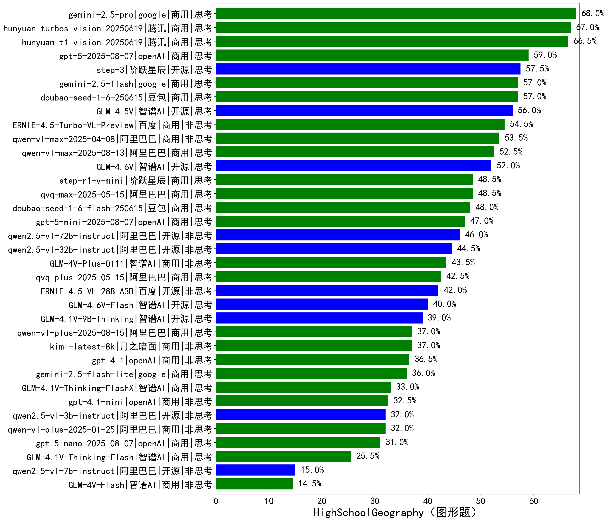

|类别|机构|大模型|【HighSchoolGeography（图形题）】准确率|平均耗时|平均消耗token|花费/千次（元）|排名（准确率）|
|---|---|-----|-------------------|-------|-----------|-----------|-----------|
|商用|google|gemini-2.5-pro|68.0%|109s|3809|248.7|1|
|商用|腾讯|hunyuan-turbos-vision-20250619|67.0%|37s|1078|5.3|2|
|商用|腾讯|hunyuan-t1-vision-20250619|66.5%|53s|2067|13.8|3|
|商用|openAI|gpt-5-2025-08-07|59.0%|57s|2772|151.7|4|
|开源|阶跃星辰|step-3|57.5%|154s|3005|11.2|5|
|商用|google|gemini-2.5-flash|57.0%|98s|4609|76.6|6|
|商用|豆包|doubao-seed-1-6-250615|57.0%|/|1101|2.3|7|
|开源|智谱AI|GLM-4.5V|56.0%|20s|2187|9.1|8|
|商用|百度|ERNIE-4.5-Turbo-VL-Preview|54.5%|13s|2035|8.3|9|
|商用|阿里巴巴|qwen-vl-max-2025-04-08|53.5%|62s|1302|6.5|10|
|商用|阿里巴巴|qwen-vl-max-2025-08-13|52.5%|50s|1923|5.9|11|
|开源|智谱AI|GLM-4.6V|52.0%|24s|1891|3.7|12|
|商用|阿里巴巴|qvq-max-2025-05-15|48.5%|83s|2317|53.4|13|
|商用|阶跃星辰|step-r1-v-mini|48.5%|70s|4045|28.7|14|
|商用|豆包|doubao-seed-1-6-flash-250615|48.0%|/|1173|0.6|15|
|商用|openAI|gpt-5-mini-2025-08-07|47.0%|67s|2027|20.3|16|
|开源|阿里巴巴|qwen2.5-vl-72b-instruct|46.0%|56s|1213|5.0|17|
|开源|阿里巴巴|qwen2.5-vl-32b-instruct|44.5%|71s|1642|3.1|18|
|商用|智谱AI|GLM-4V-Plus-0111|43.5%|33s|1267|5.0|19|
|商用|阿里巴巴|qvq-plus-2025-05-15|42.5%|116s|2846|11.6|20|
|开源|百度|ERNIE-4.5-VL-28B-A3B|42.0%|47s|1364|2.4|21|
|开源|智谱AI|GLM-4.6V-Flash|40.0%|22s|2978|0.0|22|
|开源|智谱AI|GLM-4.1V-9B-Thinking|39.0%|90s|2708|2.0|23|
|商用|月之暗面|kimi-latest-8k|37.0%|50s|1392|16.7|24|
|商用|阿里巴巴|qwen-vl-plus-2025-08-15|37.0%|7s|1245|1.6|25|
|商用|openAI|gpt-4.1|36.5%|14s|1072|28.7|26|
|商用|google|gemini-2.5-flash-lite|36.0%|97s|3784|10.0|27|
|商用|智谱AI|GLM-4.1V-Thinking-FlashX|33.0%|50s|2028|4.0|28|
|商用|openAI|gpt-4.1-mini|32.5%|11s|1014|5.5|29|
|商用|阿里巴巴|qwen-vl-plus-2025-01-25|32.0%|53s|1085|2.3|30|
|开源|阿里巴巴|qwen2.5-vl-3b-instruct|32.0%|52s|984|1.4|31|
|商用|openAI|gpt-5-nano-2025-08-07|31.0%|95s|3231|7.5|32|
|商用|智谱AI|GLM-4.1V-Thinking-Flash|25.5%|7s|1858|0.0|33|
|开源|阿里巴巴|qwen2.5-vl-7b-instruct|15.0%|4s|1189|0.4|34|
|商用|智谱AI|GLM-4V-Flash|14.5%|3s|1221|0.0|35|

