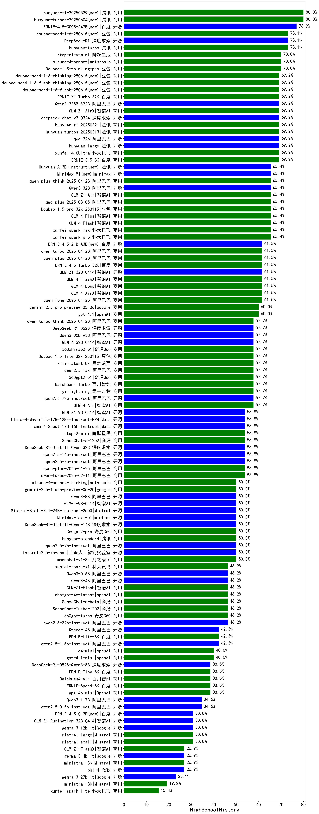

|类别|机构|大模型|【HighSchoolHistory】准确率|平均耗时|平均消耗token|花费/千次（元）|排名（准确率）|
|---|---|-----|-------------------|-------|-----------|-----------|-----------|
|商用|腾讯|hunyuan-2.0-thinking-20251109(new)|64.3%|32s|1178|4.4|1|
|商用|阿里巴巴|qwen-plus-think-2025-12-01(new)|57.1%|75s|3321|25.6|2|
|商用|阿里巴巴|qwen-plus-think-2025-12-01(new)|57.1%|75s|3321|25.6|3|
|商用|腾讯|hunyuan-t1-20250711|57.1%|124s|1093|3.9|4|
|商用|腾讯|hunyuan-turbos-20250926(new)|57.1%|10s|509|0.8|5|
|商用|豆包|doubao-seed-1-6-lite-251015(new)|57.1%|22s|949|2.0|6|
|开源|百度|ERNIE-4.5-300B-A47B|57.1%|170s|365|2.2|7|
|商用|anthropic|claude-opus-4.5(new)|57.1%|27s|861|125.4|8|
|商用|google|gemini-3-pro-preview(new)|57.1%|126s|2247|181.7|9|
|开源|阿里巴巴|Qwen3-0.6B|50.0%|22s|1493|4.2|10|
|商用|阿里巴巴|qwen-plus-think-2025-07-28|50.0%|27s|2740|21.0|11|
|开源|阿里巴巴|qwen3-235b-a22b-thinking-2507|50.0%|129s|2741|51.6|12|
|商用|google|gemini-2.5-pro|50.0%|122s|2622|181.8|13|
|开源|minimax|MiniMax-M1|50.0%|263s|2592|17.3|14|
|商用|豆包|doubao-seed-1-6-250615|50.0%|98s|313|1.4|15|
|商用|豆包|doubao-seed-1-6-flash-250615|50.0%|4s|382|0.4|16|
|商用|豆包|doubao-seed-1-6-thinking-250715|42.9%|23s|1576|11.7|17|
|开源|豆包|Seed-OSS-36B-Instruct|42.9%|142s|1687|6.4|18|
|开源|深度求索|DeepSeek-V3.2-Exp(new)|42.9%|17s|403|1.1|19|
|商用|百度|ERNIE-5.0-Thinking-Preview(new)|42.9%|290s|1207|27.0|20|
|开源|阿里巴巴|qwen3-next-80b-a3b-thinking(new)|42.9%|53s|4104|16.0|21|
|商用|豆包|doubao-seed-1-6-251015(new)|42.9%|70s|866|5.8|22|
|开源|腾讯|Hunyuan-A13B-Instruct|42.9%|181s|999|3.6|23|
|商用|百度|ERNIE-4.5-Turbo-32K|41.7%|16s|460|1.2|24|
|商用|百川智能|Baichuan4-Turbo|41.7%|19s|303|4.6|25|
|商用|豆包|doubao-seed-1-6-flash-thinking-250615|41.7%|6s|843|1.0|26|
|开源|阿里巴巴|Qwen3-32B|41.7%|47s|1526|5.7|27|
|商用|anthropic|claude-4-sonnet|40.0%|45s|652|56.3|28|
|开源|深度求索|DeepSeek-V3.2-Exp-Think(new)|35.7%|41s|1012|2.9|29|
|开源|Mistral|mistral-large-2512(new)|35.7%|18s|668|6.0|30|
|开源|深度求索|DeepSeek-V3.2-Think(new)|35.7%|188s|1356|4.0|31|
|商用|anthropic|claude-sonnet-4.5-thinking(new)|35.7%|26s|1774|173.4|32|
|开源|百度|ERNIE-4.5-21B-A3B|35.7%|78s|410|0.1|33|
|商用|腾讯|hunyuan-2.0-instruct-20251111(new)|35.7%|26s|411|0.6|34|
|商用|智谱AI|GLM-4.5-Flash-nothink|35.7%|23s|1004|0.0|35|
|商用|XAI|grok-4-1-fast-non-reasoning(new)|35.7%|118s|667|1.8|36|
|开源|深度求索|DeepSeek-V3.1|35.7%|17s|374|3.6|37|
|开源|百度|ERNIE-4.5-0.3B|35.7%|118s|445|0.0|38|
|开源|阿里巴巴|Qwen3-1.7B|33.3%|27s|2322|6.6|39|
|商用|百度|ERNIE-X1-Turbo-32K|33.3%|97s|2257|8.7|40|
|商用|360|360zhinao2-o1|33.3%|40s|1824|17.4|41|
|商用|科大讯飞|xunfei-spark-x1-0725|33.3%|/|1122|11.9|42|
|商用|阿里巴巴|qwen3-max-preview|28.6%|13s|597|11.5|43|
|商用|阿里巴巴|qwen-plus-2025-07-28|28.6%|18s|653|1.1|44|
|商用|anthropic|claude-haiku-4.5(new)|28.6%|50s|718|19.9|45|
|开源|阿里巴巴|qwen3-next-80b-a3b-instruct|28.6%|15s|722|2.5|46|
|开源|深度求索|DeepSeek-V3.2(new)|28.6%|11s|394|1.1|47|
|商用|阿里巴巴|qwen3-max-2025-09-23(new)|28.6%|20s|557|11.0|48|
|商用|anthropic|claude-haiku-4.5-thinking(new)|28.6%|62s|3429|117.4|49|
|商用|anthropic|claude-sonnet-4.5(new)|28.6%|10s|726|61.9|50|
|商用|百度|ERNIE-X1.1-Preview(new)|28.6%|95s|826|3.0|51|
|商用|阿里巴巴|qwen-flash-think-2025-07-28|28.6%|124s|2976|4.3|52|
|开源|智谱AI|GLM-4.5-Air-nothink|28.6%|19s|973|5.2|53|
|商用|阿里巴巴|qwen-turbo-2025-07-15|28.6%|62s|422|0.2|54|
|开源|阿里巴巴|qwen3-235b-a22b-instruct-2507|28.6%|51s|667|4.6|55|
|开源|阿里巴巴|Qwen3-0.6B-nothink|28.6%|12s|296|0.5|56|
|开源|阿里巴巴|Qwen3-1.7B-nothink|28.6%|15s|552|1.3|57|
|开源|阿里巴巴|Qwen3-4B-nothink|28.6%|17s|517|1.2|58|
|开源|meta|Llama-4-Maverick-17B-128E-Instruct-FP8|25.0%|11s|599|2.3|59|
|开源|meta|Llama-4-Scout-17B-16E-Instruct|25.0%|13s|609|1.2|60|
|开源|深度求索|DeepSeek-V3.1-Think|21.4%|51s|991|11.0|61|
|商用|openAI|gpt-5.1-medium(new)|21.4%|72s|734|43.1|62|
|商用|google|gemini-2.5-flash|21.4%|48s|1928|32.8|63|
|开源|智谱AI|GLM-4.6(new)|21.4%|47s|2336|31.2|64|
|开源|腾讯|Hunyuan-A13B-Instruct-nothink|21.4%|70s|443|1.4|65|
|开源|月之暗面|kimi-k2-0905(new)|21.4%|98s|418|5.0|66|
|商用|openAI|gpt-5.1-high(new)|21.4%|23s|1260|80.4|67|
|商用|openAI|gpt-5.1(new)|21.4%|108s|320|13.7|68|
|开源|minimax|MiniMax-M2(new)|21.4%|24s|1592|12.5|69|
|商用|openAI|gpt-5-mini-high(new)|21.4%|69s|2322|31.8|70|
|开源|阿里巴巴|Qwen3-32B-nothink|21.4%|92s|591|2.0|71|
|开源|阿里巴巴|Qwen3-30B-A3B-Instruct-2507|21.4%|47s|632|1.6|72|
|开源|阿里巴巴|Qwen3-30B-A3B-Thinking-2507|21.4%|147s|2531|6.8|73|
|开源|阶跃星辰|step-3|21.4%|105s|2050|7.9|74|
|商用|阿里巴巴|qwen-plus-2025-12-01(new)|21.4%|24s|1044|1.9|75|
|商用|阿里巴巴|qwen-plus-2025-12-01(new)|21.4%|24s|1044|1.9|76|
|商用|智谱AI|GLM-4.5-Flash|21.4%|33s|1603|0.0|77|
|开源|智谱AI|GLM-4.5|21.4%|41s|1687|21.6|78|
|商用|openAI|gpt-5-nano-high(new)|21.4%|796s|4846|13.7|79|
|商用|阿里巴巴|qwen-flash-2025-07-28|21.4%|60s|665|0.8|80|
|商用|anthropic|claude-4-sonnet-thinking|20.0%|52s|1246|120.9|81|
|商用|豆包|Doubao-1.5-lite-32k-250115|16.7%|11s|287|0.1|82|
|开源|深度求索|DeepSeek-R1-0528|16.7%|213s|1837|28.1|83|
|开源|google|gemma-3-4b-it|16.7%|21s|486|0.0|84|
|开源|阿里巴巴|Qwen3-14B|16.7%|54s|2133|4.1|85|
|开源|智谱AI|GLM-4-9B-0414|16.7%|22s|515|0.0|86|
|商用|百度|ERNIE-Lite-8K|16.7%|30s|379|0.0|87|
|商用|阿里巴巴|qwen-long-2025-01-25|16.7%|33s|396|0.6|88|
|商用|百川智能|Baichuan4-Air|16.7%|26s|287|0.3|89|
|商用|XAI|grok-4-0709|16.7%|82s|1206|120.6|90|
|开源|月之暗面|Kimi-K2-Thinking(new)|14.3%|191s|2325|35.8|91|
|开源|Mistral|Magistral-Small-2507|14.3%|529s|4553|48.3|92|
|商用|openAI|gpt-5.2(new)|14.3%|8s|281|15.3|93|
|开源|openAI|gpt-oss-120b|14.3%|11s|678|1.7|94|
|开源|Mistral|Ministral-3-8B-Instruct-2512(new)|14.3%|3s|548|0.6|95|
|商用|openAI|gpt-5-2025-08-07|14.3%|33s|423|22.1|96|
|商用|openAI|gpt-5-nano-2025-08-07|14.3%|199s|1838|5.0|97|
|商用|google|gemini-2.5-flash-lite|14.3%|8s|663|1.6|98|
|商用|Mistral|mistral-medium-2508|14.3%|43s|539|5.9|99|
|开源|阿里巴巴|Qwen3-14B-nothink|14.3%|78s|635|1.1|100|
|开源|智谱AI|GLM-4.5-Air|14.3%|30s|1629|8.8|101|
|商用|阿里巴巴|qwen-turbo-think-2025-07-15|14.3%|/|2458|7.0|102|
|开源|月之暗面|kimi-k2-0711-preview|14.3%|70s|611|8.4|103|
|商用|XAI|grok-4-1-fast-reasoning(new)|14.3%|121s|1342|4.2|104|
|开源|minimax|MiniMax-Text-01|8.3%|7s|916|7.3|105|
|开源|阿里巴巴|Qwen3-4B|8.3%|33s|1794|5.1|106|
|开源|阿里巴巴|Qwen3-8B|8.3%|115s|3046|0.0|107|
|开源|google|gemma-3-12b-it|8.3%|36s|473|0.0|108|
|商用|openAI|gpt-5-mini-2025-08-07|7.1%|86s|1014|12.9|109|
|开源|Mistral|Ministral-3-3B-Instruct-2512(new)|7.1%|3s|583|0.4|110|
|开源|openAI|gpt-oss-20b|7.1%|16s|1149|1.2|111|
|开源|阿里巴巴|Qwen3-8B-nothink|7.1%|24s|536|0.0|112|
|开源|Mistral|Mistral-Small-3.2-24B-Instruct-2506|7.1%|769s|585|1.0|113|
|商用|XAI|grok-3-mini|7.1%|274s|1158|4.0|114|
|开源|智谱AI|GLM-4.5-nothink|7.1%|85s|1039|13.2|115|
|开源|Mistral|Ministral-3-14B-Instruct-2512(new)|7.1%|4s|662|0.9|116|
|开源|google|gemma-3-27b-it|/%|39s|523|0.7|117|
|开源|深度求索|DeepSeek-R1-0528-Qwen3-8B|/%|302s|1443|0.0|118|
|商用|openAI|o4-mini|/%|21s|766|21.6|119|

