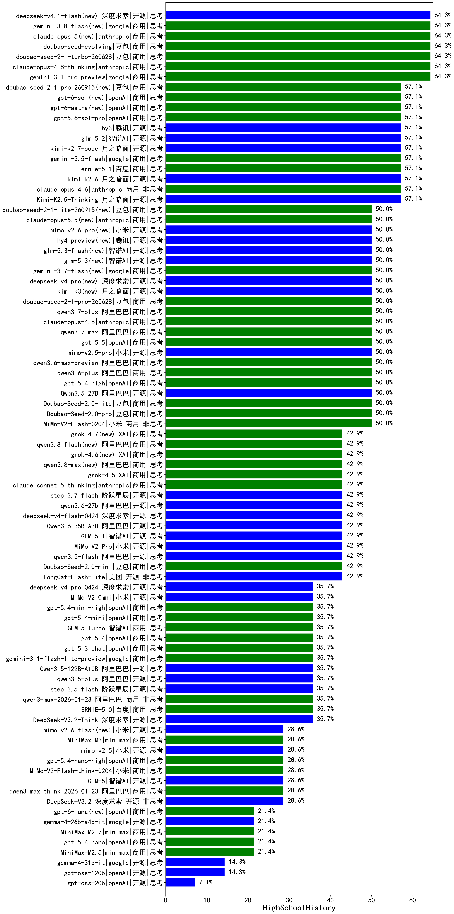

|类别|机构|大模型|【HighSchoolHistory】准确率|平均耗时|平均消耗token|花费/千次（元）|排名（准确率）|
|---|---|-----|-------------------|-------|-----------|-----------|-----------|
|开源|深度求索|deepseek-v4.1-flash(new)|64.3%|12s|1177|8.6|1|
|商用|豆包|doubao-seed-evolving|64.3%|287s|11664|346.0|2|
|商用|anthropic|claude-opus-4.8-thinking|64.3%|13s|970|142.5|3|
|商用|豆包|doubao-seed-2-1-turbo-260628|64.3%|180s|7168|105.6|4|
|商用|google|gemini-3.1-pro-preview|64.3%|53s|2550|207.6|5|
|商用|google|gemini-3.8-flash(new)|64.3%|13s|916|42.4|6|
|商用|anthropic|claude-opus-5(new)|64.3%|13s|775|108.5|7|
|开源|腾讯|hy3|57.1%|61s|341|1.0|8|
|商用|openAI|gpt-6-sol(new)|57.1%|161s|388|19.0|9|
|开源|月之暗面|Kimi-K2.5-Thinking|57.1%|396s|1998|40.0|10|
|商用|openAI|gpt-5.6-sol-pro|57.1%|25s|3854|314.7|11|
|开源|月之暗面|kimi-k2.6|57.1%|221s|2327|60.4|12|
|商用|百度|ernie-5.1|57.1%|28s|1115|18.4|13|
|开源|智谱AI|glm-5.2|57.1%|88s|4112|112.7|14|
|开源|月之暗面|kimi-k2.7-code|57.1%|44s|1926|49.6|15|
|商用|openAI|gpt-6-astra(new)|57.1%|11s|340|78.3|16|
|商用|google|gemini-3.5-flash|57.1%|11s|2043|121.6|17|
|商用|anthropic|claude-opus-4.6|57.1%|17s|810|114.4|18|
|商用|阿里巴巴|qwen3.6-plus|50.0%|48s|1891|21.5|19|
|商用|阿里巴巴|qwen3.6-max-preview|50.0%|69s|2020|103.5|20|
|开源|智谱AI|glm-5.3-flash(new)|50.0%|115s|3936|10.8|21|
|开源|小米|mimo-v2.5-pro|50.0%|37s|1645|29.3|22|
|开源|智谱AI|glm-5.3(new)|50.0%|-114s|5365|147.8|23|
|商用|anthropic|claude-opus-5.5(new)|50.0%|15s|800|90.1|24|
|商用|openAI|gpt-5.5|50.0%|13s|794|141.4|25|
|商用|阿里巴巴|qwen3.7-max|50.0%|29s|1556|53.1|26|
|商用|anthropic|claude-opus-4.8|50.0%|10s|690|93.6|27|
|商用|google|gemini-3.7-flash(new)|50.0%|6s|817|18.6|28|
|商用|豆包|doubao-seed-2-1-pro-260628|50.0%|309s|10629|314.9|29|
|开源|月之暗面|kimi-k3(new)|50.0%|72s|1474|131.8|30|
|商用|阿里巴巴|qwen3.7-plus|50.0%|41s|2039|15.6|31|
|开源|深度求索|deepseek-v4-pro(new)|50.0%|66s|1346|32.9|32|
|开源|小米|mimo-v2.6-pro(new)|50.0%|93s|5855|34.7|33|
|商用|openAI|gpt-5.4-high|50.0%|11s|662|56.8|34|
|商用|豆包|Doubao-Seed-2.0-lite|50.0%|266s|1488|4.9|35|
|开源|阿里巴巴|Qwen3.5-27B|50.0%|194s|4432|20.8|36|
|开源|腾讯|hy4-preview(new)|50.0%|104s|6498|115.4|37|
|商用|小米|MiMo-V2-Flash-0204|50.0%|366s|648|1.2|38|
|商用|豆包|Doubao-Seed-2.0-pro|50.0%|268s|1251|17.9|39|
|开源|阿里巴巴|Qwen3.6-35B-A3B|42.9%|164s|2028|20.8|40|
|开源|智谱AI|GLM-5.1|42.9%|59s|1734|39.5|41|
|开源|美团|LongCat-Flash-Lite|42.9%|314s|589|0.0|42|
|商用|阿里巴巴|qwen3.8-flash(new)|42.9%|37s|2295|5.9|43|
|开源|阶跃星辰|step-3.7-flash|42.9%|23s|2558|19.9|44|
|开源|深度求索|deepseek-v4-flash-0424|42.9%|21s|822|1.5|45|
|商用|XAI|grok-4.7(new)|42.9%|116s|8102|302.1|46|
|商用|anthropic|claude-sonnet-5-thinking|42.9%|16s|1037|61.7|47|
|开源|阿里巴巴|qwen3.6-27b|42.9%|40s|2297|39.5|48|
|商用|阿里巴巴|qwen3.8-max(new)|42.9%|53s|1930|65.6|49|
|开源|阿里巴巴|qwen3.5-flash|42.9%|636s|4457|8.7|50|
|开源|小米|MiMo-V2-Pro|42.9%|115s|1317|22.5|51|
|商用|豆包|Doubao-Seed-2.0-mini|42.9%|523s|3297|6.3|52|
|商用|XAI|grok-4.6(new)|42.9%|59s|2817|109.2|53|
|商用|XAI|grok-4.5|42.9%|177s|2190|82.8|54|
|商用|openAI|gpt-5.4-mini-high|35.7%|13s|1261|35.9|55|
|开源|阶跃星辰|step-3.5-flash|35.7%|18s|2270|4.6|56|
|商用|百度|ERNIE-5.0|35.7%|114s|1225|27.4|57|
|开源|深度求索|DeepSeek-V3.2-Think|35.7%|188s|1356|4.0|58|
|商用|阿里巴巴|qwen3-max-2026-01-23|35.7%|191s|558|4.6|59|
|开源|阿里巴巴|qwen3.5-plus|35.7%|50s|3998|18.7|60|
|开源|阿里巴巴|Qwen3.5-122B-A10B|35.7%|617s|4268|26.6|61|
|开源|深度求索|deepseek-v4-pro-0424|35.7%|59s|1141|26.0|62|
|商用|google|gemini-3.1-flash-lite-preview|35.7%|74s|543|4.5|63|
|商用|openAI|gpt-5.3-chat|35.7%|6s|462|32.9|64|
|商用|openAI|gpt-5.4|35.7%|8s|336|22.6|65|
|商用|智谱AI|GLM-5-Turbo|35.7%|46s|1628|33.8|66|
|商用|openAI|gpt-5.4-mini|35.7%|18s|331|6.6|67|
|开源|小米|MiMo-V2-Omni|35.7%|133s|2139|25.8|68|
|开源|小米|mimo-v2.6-flash(new)|28.6%|168s|1004|1.9|69|
|开源|小米|mimo-v2.5|28.6%|39s|1516|17.1|70|
|商用|minimax|MiniMax-M3|28.6%|36s|1036|13.8|71|
|商用|openAI|gpt-5.4-nano-high|28.6%|27s|559|3.8|72|
|商用|小米|MiMo-V2-Flash-think-0204|28.6%|507s|2623|5.3|73|
|开源|智谱AI|GLM-5|28.6%|68s|2257|39.0|74|
|商用|阿里巴巴|qwen3-max-think-2026-01-23|28.6%|106s|3361|32.6|75|
|开源|深度求索|DeepSeek-V3.2|28.6%|11s|394|1.1|76|
|开源|google|gemma-4-26b-a4b-it|21.4%|31s|724|1.7|77|
|商用|minimax|MiniMax-M2.7|21.4%|39s|1578|12.3|78|
|商用|openAI|gpt-5.4-nano|21.4%|3s|267|1.3|79|
|商用|minimax|MiniMax-M2.5|21.4%|30s|1234|9.4|80|
|商用|openAI|gpt-6-luna(new)|21.4%|170s|468|1.2|81|
|开源|google|gemma-4-31b-it|14.3%|136s|647|1.5|82|
|开源|openAI|gpt-oss-120b|14.3%|11s|678|1.7|83|
|开源|openAI|gpt-oss-20b|7.1%|16s|1149|1.2|84|

