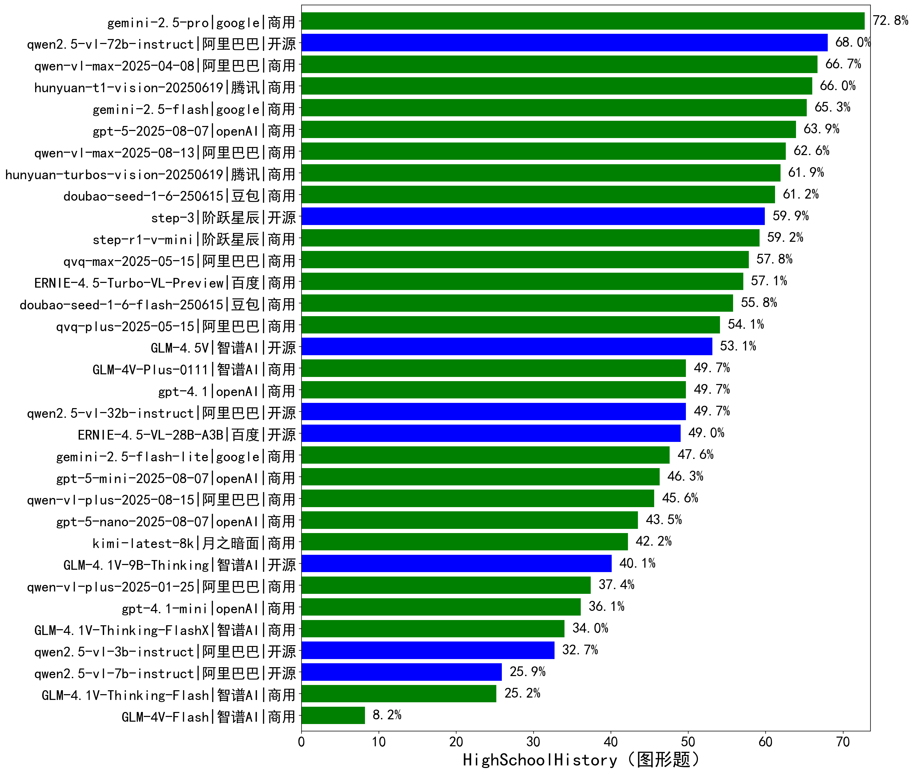

|类别|机构|大模型|【HighSchoolHistory（图形题）】准确率|平均耗时|平均消耗token|花费/千次（元）|排名（准确率）|
|---|---|-----|-------------------|-------|-----------|-----------|-----------|
|开源|阿里巴巴|qwen2.5-vl-72b-instruct|68.0%|71s|664|2.7|1|
|商用|阿里巴巴|qwen-vl-max-2025-04-08|66.7%|75s|903|5.2|2|
|商用|腾讯|hunyuan-t1-vision-20250619|66.0%|61s|1582|/|3|
|商用|腾讯|hunyuan-turbos-vision-20250619|61.9%|53s|866|4.5|4|
|商用|豆包|doubao-seed-1-6-250615|61.2%|/|530|0.7|5|
|开源|阶跃星辰|step-3|59.9%|117s|2022|7.2|6|
|商用|阶跃星辰|step-r1-v-mini|59.2%|65s|2548|17.4|7|
|商用|阿里巴巴|qvq-max-2025-05-15|57.8%|83s|1598|39.4|8|
|商用|百度|ERNIE-4.5-Turbo-VL-Preview|57.1%|/|/|/|9|
|商用|豆包|doubao-seed-1-6-flash-250615|55.8%|/|752|0.5|10|
|商用|阿里巴巴|qvq-plus-2025-05-15|54.1%|113s|1884|7.9|11|
|开源|智谱AI|GLM-4.5V|53.1%|14s|1267|5.5|12|
|商用|openAI|gpt-4.1|49.7%|11s|822|24.4|13|
|开源|阿里巴巴|qwen2.5-vl-32b-instruct|49.7%|76s|1099|2.1|14|
|商用|智谱AI|GLM-4V-Plus-0111|49.7%|42s|733|2.8|15|
|开源|百度|ERNIE-4.5-VL-28B-A3B|49.0%|48s|787|1.7|16|
|商用|月之暗面|kimi-latest-8k|42.2%|64s|1406|16.8|17|
|开源|智谱AI|GLM-4.1V-9B-Thinking|40.1%|87s|1645|1.3|18|
|商用|阿里巴巴|qwen-vl-plus-2025-01-25|37.4%|70s|623|1.4|19|
|商用|openAI|gpt-4.1-mini|36.1%|10s|690|4.4|20|
|商用|智谱AI|GLM-4.1V-Thinking-FlashX|34.0%|63s|1381|2.6|21|
|开源|阿里巴巴|qwen2.5-vl-3b-instruct|32.7%|64s|724|1.4|22|
|开源|阿里巴巴|qwen2.5-vl-7b-instruct|25.9%|5s|556|0.2|23|
|商用|智谱AI|GLM-4.1V-Thinking-Flash|25.2%|6s|1124|0.0|24|
|商用|智谱AI|GLM-4V-Flash|8.2%|3s|610|0.0|25|

