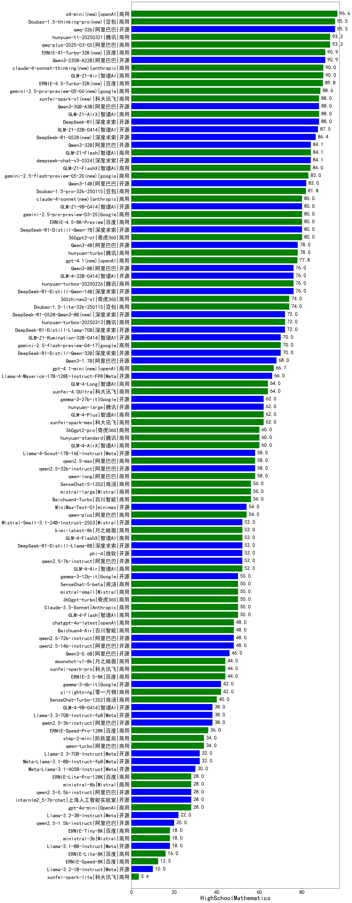

|类别|机构|大模型|【HighSchoolMathematics】准确率|平均耗时|平均消耗token|花费/千次（元）|排名（准确率）|
|---|---|-----|-------------------|-------|-----------|-----------|-----------|
|开源|豆包|Seed-OSS-36B-Instruct|81.8%|284s|4804|18.9|1|
|商用|豆包|doubao-seed-1-6-thinking-250715|72.7%|57s|4056|31.5|2|
|商用|腾讯|hunyuan-t1-20250711|72.7%|77s|5124|20.0|3|
|商用|openAI|gpt-5.1-high(new)|72.7%|142s|7281|506.4|4|
|开源|深度求索|DeepSeek-V3.2-Exp-Think(new)|72.7%|333s|3277|9.7|5|
|开源|深度求索|DeepSeek-V3.2-Think(new)|63.6%|332s|7778|23.2|6|
|商用|阿里巴巴|qwen3-max-2025-09-23(new)|63.6%|260s|3803|88.2|7|
|开源|月之暗面|Kimi-K2-Thinking(new)|63.6%|944s|16029|254.6|8|
|商用|anthropic|claude-sonnet-4.5-thinking(new)|63.6%|130s|10917|1166.2|9|
|商用|豆包|doubao-seed-1-6-251015(new)|63.6%|477s|4123|31.7|10|
|开源|深度求索|DeepSeek-V3.1-Think|63.6%|179s|3600|42.2|11|
|开源|openAI|gpt-oss-120b|54.5%|131s|2226|6.8|12|
|商用|openAI|gpt-5-mini-2025-08-07|54.5%|53s|1926|26.1|13|
|开源|深度求索|DeepSeek-V3.1|54.5%|66s|1438|16.3|14|
|开源|腾讯|Hunyuan-A13B-Instruct|54.5%|286s|3070|11.9|15|
|商用|openAI|gpt-5.1-medium(new)|54.5%|130s|5203|358.9|16|
|商用|anthropic|claude-haiku-4.5(new)|54.5%|15s|1316|41.1|17|
|商用|openAI|o4-mini|54.5%|24s|1866|56.2|18|
|开源|阿里巴巴|qwen3-next-80b-a3b-instruct|54.5%|34s|2329|8.9|19|
|商用|google|gemini-3-pro-preview(new)|54.5%|119s|11484|967.0|20|
|开源|腾讯|Hunyuan-A13B-Instruct-nothink|54.5%|371s|1204|4.4|21|
|商用|openAI|gpt-5-2025-08-07|54.5%|43s|1012|64.8|22|
|商用|科大讯飞|xunfei-spark-x1-0725|54.5%|/|6256|75.1|23|
|商用|腾讯|hunyuan-turbos-20250926(new)|54.5%|55s|2124|4.0|24|
|商用|openAI|gpt-5-mini-high(new)|54.5%|346s|6004|84.9|25|
|商用|anthropic|claude-4-sonnet-thinking|50.0%|61s|1758|180.9|26|
|商用|阿里巴巴|qwen-plus-think-2025-07-28|45.5%|/|4812|37.5|27|
|商用|阿里巴巴|qwen-flash-think-2025-07-28|45.5%|43s|4464|6.5|28|
|开源|月之暗面|kimi-k2-0711-preview|45.5%|131s|1734|26.2|29|
|开源|Mistral|Magistral-Small-2507|45.5%|104s|10047|108.3|30|
|开源|智谱AI|GLM-4.5-nothink|45.5%|222s|3802|51.1|31|
|商用|openAI|gpt-5-nano-2025-08-07|45.5%|47s|3943|11.1|32|
|商用|豆包|doubao-seed-1-6-lite-251015(new)|45.5%|78s|3096|7.0|33|
|开源|阿里巴巴|qwen3-235b-a22b-thinking-2507|45.5%|156s|4829|94.0|34|
|商用|XAI|grok-4-1-fast-reasoning(new)|45.5%|172s|7724|26.8|35|
|开源|阿里巴巴|Qwen3-8B|45.5%|644s|18313|0.0|36|
|开源|openAI|gpt-oss-20b|45.5%|179s|2977|3.3|37|
|商用|anthropic|claude-opus-4.5(new)|45.5%|43s|1395|218.1|38|
|商用|openAI|gpt-5-nano-high(new)|45.5%|275s|13310|38.2|39|
|开源|深度求索|DeepSeek-V3.2(new)|45.5%|72s|2238|6.6|40|
|开源|阿里巴巴|qwen3-next-80b-a3b-thinking(new)|45.5%|330s|7417|29.1|41|
|商用|智谱AI|GLM-4.5-Flash-nothink|45.5%|86s|4948|0.0|42|
|商用|openAI|gpt-5.1(new)|45.5%|134s|1292|81.1|43|
|商用|XAI|grok-4-0709|40.0%|562s|4822|513.3|44|
|商用|阿里巴巴|qwen-long-2025-01-25|37.5%|13s|726|1.3|45|
|商用|豆包|Doubao-1.5-lite-32k-250115|37.5%|12s|592|0.3|46|
|商用|百川智能|Baichuan4-Turbo|37.5%|38s|973|14.6|47|
|商用|Mistral|mistral-medium-2508|36.4%|21s|1601|21.7|48|
|商用|阿里巴巴|qwen-turbo-think-2025-07-15|36.4%|/|7282|21.5|49|
|开源|阶跃星辰|step-3|36.4%|531s|8816|34.9|50|
|商用|anthropic|claude-haiku-4.5-thinking(new)|36.4%|103s|13505|482.1|51|
|商用|anthropic|claude-sonnet-4.5(new)|36.4%|16s|1337|126.9|52|
|商用|百度|ERNIE-X1.1-Preview(new)|36.4%|533s|10116|40.0|53|
|开源|智谱AI|GLM-4.6(new)|36.4%|142s|7022|96.4|54|
|开源|阿里巴巴|Qwen3-30B-A3B-Thinking-2507|36.4%|90s|4264|11.6|55|
|商用|百度|ERNIE-4.5-Turbo-32K|36.4%|53s|1558|4.7|56|
|商用|豆包|doubao-seed-1-6-flash-250615|36.4%|34s|1247|1.7|57|
|开源|百度|ERNIE-4.5-21B-A3B|36.4%|82s|1916|0.0|58|
|开源|智谱AI|GLM-4.5-Air|36.4%|102s|8543|50.5|59|
|商用|阿里巴巴|qwen-turbo-2025-07-15|36.4%|23s|1641|0.9|60|
|开源|阿里巴巴|Qwen3-32B|36.4%|188s|7956|31.4|61|
|商用|豆包|doubao-seed-1-6-250615|36.4%|107s|1263|8.9|62|
|商用|百度|ERNIE-X1-Turbo-32K|36.4%|245s|5451|21.4|63|
|开源|深度求索|DeepSeek-V3.2-Exp(new)|27.3%|45s|1297|3.8|64|
|开源|minimax|MiniMax-M1|27.3%|321s|9946|78.2|65|
|商用|豆包|doubao-seed-1-6-flash-thinking-250615|27.3%|20s|2926|4.1|66|
|商用|XAI|grok-3-mini|27.3%|212s|2920|10.4|67|
|开源|阿里巴巴|Qwen3-1.7B|27.3%|140s|7651|22.6|68|
|开源|月之暗面|kimi-k2-0905(new)|27.3%|145s|2015|30.1|69|
|开源|Mistral|mistral-large-2512(new)|27.3%|45s|2423|24.8|70|
|开源|Mistral|Ministral-3-8B-Instruct-2512(new)|27.3%|24s|2746|2.9|71|
|开源|百度|ERNIE-4.5-300B-A47B|27.3%|311s|1822|13.8|72|
|开源|Mistral|Ministral-3-3B-Instruct-2512(new)|27.3%|28s|4832|3.4|73|
|商用|阿里巴巴|qwen-flash-2025-07-28|27.3%|26s|2477|3.5|74|
|开源|智谱AI|GLM-4.5-Air-nothink|27.3%|65s|4862|28.4|75|
|商用|智谱AI|GLM-4.5-Flash|27.3%|122s|8005|0.0|76|
|开源|阿里巴巴|qwen3-235b-a22b-instruct-2507|27.3%|64s|2690|20.7|77|
|开源|阿里巴巴|Qwen3-32B-nothink|27.3%|70s|1732|6.5|78|
|商用|google|gemini-2.5-pro|27.3%|67s|7131|508.6|79|
|开源|智谱AI|GLM-4.5|27.3%|191s|7285|100.5|80|
|开源|minimax|MiniMax-Text-01|25.0%|17s|1212|9.7|81|
|商用|360|360zhinao2-o1|25.0%|92s|6690|65.8|82|
|开源|google|gemma-3-27b-it|25.0%|57s|1161|1.6|83|
|开源|google|gemma-3-4b-it|25.0%|54s|2232|0.0|84|
|开源|meta|Llama-4-Scout-17B-16E-Instruct|25.0%|18s|1087|2.2|85|
|开源|智谱AI|GLM-4-9B-0414|25.0%|15s|744|0.0|86|
|开源|Mistral|Ministral-3-14B-Instruct-2512(new)|18.2%|21s|2917|4.2|87|
|商用|阿里巴巴|qwen-plus-2025-07-28|18.2%|69s|2603|5.0|88|
|商用|百度|ERNIE-5.0-Thinking-Preview(new)|18.2%|1543s|13680|325.6|89|
|开源|阿里巴巴|Qwen3-14B|18.2%|575s|17454|34.7|90|
|开源|Mistral|Mistral-Small-3.2-24B-Instruct-2506|18.2%|25s|2285|4.8|91|
|开源|阿里巴巴|Qwen3-14B-nothink|18.2%|35s|1979|3.7|92|
|开源|阿里巴巴|Qwen3-0.6B|18.2%|100s|9268|27.5|93|
|开源|深度求索|DeepSeek-R1-0528-Qwen3-8B|18.2%|582s|9079|0.0|94|
|商用|阿里巴巴|qwen3-max-preview|18.2%|38s|1805|40.7|95|
|开源|阿里巴巴|Qwen3-1.7B-nothink|18.2%|15s|1473|4.0|96|
|开源|minimax|MiniMax-M2(new)|18.2%|85s|6522|53.7|97|
|开源|阿里巴巴|Qwen3-30B-A3B-Instruct-2507|18.2%|22s|2380|6.8|98|
|开源|深度求索|DeepSeek-R1-0528|18.2%|358s|8404|133.0|99|
|商用|百川智能|Baichuan4-Air|12.5%|36s|857|0.8|100|
|商用|百度|ERNIE-Lite-8K|12.5%|34s|653|0.0|101|
|开源|阿里巴巴|Qwen3-8B-nothink|9.1%|74s|1871|0.0|102|
|商用|XAI|grok-4-1-fast-non-reasoning(new)|9.1%|112s|948|2.7|103|
|商用|google|gemini-2.5-flash-lite|9.1%|29s|6670|19.1|104|
|开源|阿里巴巴|Qwen3-4B|9.1%|226s|6477|19.1|105|
|商用|google|gemini-2.5-flash|9.1%|22s|5331|94.5|106|
|开源|阿里巴巴|Qwen3-4B-nothink|/%|33s|1420|3.9|107|
|开源|meta|Llama-4-Maverick-17B-128E-Instruct-FP8|/%|13s|785|3.1|108|
|商用|anthropic|claude-4-sonnet|/%|49s|791|75.7|109|
|开源|阿里巴巴|Qwen3-0.6B-nothink|/%|10s|995|2.6|110|
|开源|百度|ERNIE-4.5-0.3B|/%|102s|1198|0.0|111|
|开源|google|gemma-3-12b-it|/%|95s|1237|0.0|112|

